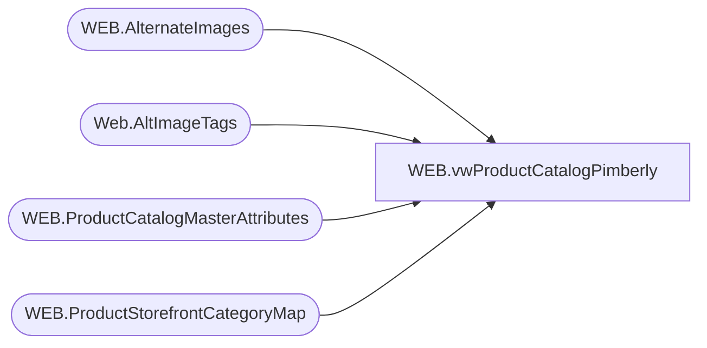

# WEB.vwProductCatalogPimberly

**Database:** IntegrationStaging  
**Server:** STL-SSIS-P-01  

## Architecture Diagram



## Table Dependencies

| Referenced Table |
|---|
| WEB.AlternateImages |
| Web.AltImageTags |
| WEB.ProductCatalogMasterAttributes |
| WEB.ProductStorefrontCategoryMap |

## View Code

```sql
CREATE view [WEB].[vwProductCatalogPimberly]

as

--------------------------------------------------------------------------------------------------
-- vwProductCatalogMasterPimberly - produces data for Pimberly merged into ProductCatalogMasterPimberly table
--- 2022-11-05 - Dan Tweedie - Created View
--------------------------------------------------------------------------------------------------


with
ViewTypes as
	(
		select
			m.BABWProductID,
			case 
				when left(m.BABWProductID,1) = 4 and m.BABWProductID not in ('424925','424974','490501','090502', '490502','028284','028285','028287','028288','428284','428285','428287','428288','487179','487180','430376','430383','430396','430986','430438','430393','030383','030396','030986','030438','030393')
					then '/' + cast(cast(right(m.BABWProductID,5) as int) as varchar)+'x.jpg' 
				when m.BABWProductID in ('424925','424974','490501','090502', '490502','028284','028285','028287','028288','428284','428285','428287','428288','487179','487180','430376','030376','430383','430396','430986','430438','430393','030383','030396','030986','030438','030393')
					then '/' + cast(cast(m.BABWProductID as int) as varchar)+'x.jpg' 
				when left(m.BABWProductID,1) in (2,3,5,6) and exists (select x.BABWProductID from web.ProductCatalogMasterAttributes x where x.BABWProductID=m.BABWProductID and (x.SAC='True' or x.SNC='True')) 
					then '/' + cast(right(m.BABWProductID,5) as varchar)+'x.jpg' 
				else '/' + cast(cast(right(m.BABWProductID,6) as int) as varchar)+'x.jpg' 
			end as 'imagePath',
			1 as PrimaryImage,
			a.AltText,
			a.TitleText
		from WEB.ProductCatalogMasterAttributes m
		left join Web.AltImageTags a 
			on m.BABWProductID=a.BABWProductID
			and case 
					when left(m.BABWProductID,1) = 4 and m.BABWProductID not in ('424925','424974','490501','090502', '490502','028284','028285','028287','028288','428284','428285','428287','428288','487179','487180','430376','030376','430383','430396','430986','430438','430393','030383','030396','030986','030438','030393')
						then '/' + cast(cast(right(m.BABWProductID,5) as int) as varchar)+'x.jpg' 
					when m.BABWProductID in ('424925','424974','490501','090502', '490502','028284','028285','028287','028288','428284','428285','428287','428288','487179','487180','430376','030376','430383','430396','430986','430438','430393','030383','030396','030986','030438','030393')
						then '/' + cast(cast(m.BABWProductID as int) as varchar)+'x.jpg' 
					when left(m.BABWProductID,1) in (2,3,5,6) and exists (select x.BABWProductID from web.ProductCatalogMasterAttributes x where x.BABWProductID=m.BABWProductID and (x.SAC='True' or x.SNC='True')) 
						then '/' + cast(right(m.BABWProductID,5) as varchar)+'x.jpg' 
					else '/' + cast(cast(right(m.BABWProductID,6) as int) as varchar)+'x.jpg' 
				end = a.ImagePath
		UNION
		select 
			m.BABWProductID,
			'/' + ImageName as 'imagePath',
			0 as PrimaryImage,
			a.AltText,
			a.TitleText
		from WEB.AlternateImages m
		left join Web.AltImageTags a 
			on m.BABWProductID=a.BABWProductID
			and case 
					when left(m.BABWProductID,1) = 4 and m.BABWProductID not in ('424925','424974','490501','090502', '490502','028284','028285','028287','028288','428284','428285','428287','428288','487179','487180','430376','030376','430383','430396','430986','430438','430393','030383','030396','030986','030438','030393')
						then '/' + cast(cast(right(m.BABWProductID,5) as int) as varchar)+'x.jpg' 
					when m.BABWProductID in ('424925','424974','490501','090502', '490502','028284','028285','028287','028288','428284','428285','428287','428288','487179','487180','430376','030376','430383','430396','430986','430438','430393','030383','030396','030986','030438','030393')
						then '/' + cast(cast(m.BABWProductID as int) as varchar)+'x.jpg' 
					when left(m.BABWProductID,1) in (2,3,5,6) and exists (select x.BABWProductID from web.ProductCatalogMasterAttributes x where x.BABWProductID=m.BABWProductID and (x.SAC='True' or x.SNC='True')) 
						then '/' + cast(right(m.BABWProductID,5) as varchar)+'x.jpg' 
					else '/' + cast(cast(right(m.BABWProductID,6) as int) as varchar)+'x.jpg' 
				end = a.ImagePath
	),
CatalogCountry as
	(
		select 
			Style,
			left(CategoryID,2) CatalogCountry
		from WEB.ProductStorefrontCategoryMap
		where PrimaryCategory = 1
	),
ProductStage as
	(
		select 
		--case 
		--		when left(pa.Style_Code, 1) in ('2','3') then pa.Style_Code
		--		when left(pa.Style_Code, 1) in ('0','4') then right(pa.Style_Code,5)
		--		when left(pa.Style_Code, 1) in ('5') then '2' + right(pa.Style_Code,5)
		--		when left(pa.Style_Code, 1) in ('6') then '3' + right(pa.Style_Code,5)
		--		else pa.Style_Code end as 'BaseID', 
			pa.BaseID,
			
			pa.Style_Code,
                                                         left(REPLACE(REPLACE(REPLACE(pa.DisplayName, CHAR(13), ''), CHAR(10), ''),',',''),50) as DisplayName,


                                  --                      left(REPLACE(REPLACE(REPLACE(pa.ShortDescription, CHAR(13), ''), CHAR(10), ''),',',''),2000) as ShortDescription,
			pa.UPC,
			pa.AccessoryType,
			pa.ColorCode,
                                                        left(REPLACE(REPLACE(REPLACE(pa.LicensedCollection, CHAR(13), ''), CHAR(10), ''),',',''),6) as LicensedCollection,
			pa.BirthCertificateRequired,
			pa.BodyType,
			pa.ClassName,
			pa.CommodityCode,
			pa.Department,
			pa.DepartmentSortOrder,
			pa.EyeColor,
			pa.WebExclusive,
			pa.Outfits,
			pa.HierarchyGroupCode,
			pa.KeyStory,
			pa.ManufacturerCountry,
			pa.MerchInDate,
			pa.Mini,
			pa.Music,
			pa.NoInternationalShipping,
			pa.SAC,
			pa.SNC,
			pa.ProductSellingGeography,
			pa.ShippingClass,
			pa.Tops,
			pa.WarningLabel,
			pa.sportsTeam,
			pa.AccessoryEligible,
			pa.SkinType,
			pa.FriendHeight,
			pa.FriendWeight,
			pa.SoundEligible,
			pa.MSTAT,
			pa.ProductCanBeEmbroidered,
			pa.ProductMustBeEmbroidered,
			pa.NewProduct,
			pa.OnlineFlag,
			pa.SearchableFlag,
			pa.SearchableIfUnavailableFlag,
			pa.IsFirstTransmit,
			pa.giftCardType,
			pa.Web,	
			pa.WebBuf,
			pa.BRF,
                                                         left(REPLACE(REPLACE(REPLACE(pa.Inline, CHAR(13), ''), CHAR(10), ''),',',''),50) as Inline,
			pa.AvailB,
			pa.WebInStock,
			pa.StoreInStock,
			pa.OriginalRetail,
			pa.CurrentRetail,
			pa.OnOrder,
                                                         left(REPLACE(REPLACE(REPLACE(pa.[SubClassLabel], CHAR(13), ''), CHAR(10), ''),',',''),100) as SubClassLabel,
			pa.Shoes,
			pa.Sound,
			pa.fourLeggedAnimal,
			pa.merchOutDate,
			pa.MLBTeams,
			pa.NBATeams,
			pa.NFLTeams,
			pa.NHLTeams,
			pa.UKFootball

		from WEB.ProductCatalogMasterAttributes pa
		left join CatalogCountry cc on pa.Style_Code = cc.Style
		left join ViewTypes vt on pa.style_code=vt.BABWProductID
	)
--	,
--CategoryAssignment  as 
--	( --haa more than one row per style
--		select 
--			CategoryID,
--			Style
--		from WEB.ProductCategoryMap 
--	)


select distinct *
--into #x
from ProductStage
```

