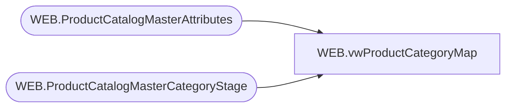

# WEB.vwProductCategoryMap

**Database:** IntegrationStaging  
**Server:** STL-SSIS-P-01  

## Architecture Diagram



## Table Dependencies

| Referenced Table |
|---|
| WEB.ProductCatalogMasterAttributes |
| WEB.ProductCatalogMasterCategoryStage |

## View Code

```sql
CREATE view [WEB].[vwProductCategoryMap]

as

--------------------------------------------------------------------------------------------------
-- vwProductCategoryMap - Maps Product to Category for eCommerce Product Catalog XML
--							Queries tables that are populated via SSIS, view is tied to same package flow
--- 2017-05-10 - Dan Tweedie - Created View
--------------------------------------------------------------------------------------------------


select 
	cast(c.CategoryID as nvarchar(200)) as CategoryID,
	cast(p.BABWProductID as nvarchar(6)) as Style
from WEB.ProductCatalogMasterAttributes p
join WEB.ProductCatalogMasterCategoryStage c on p.CategoryTree = c.CategoryID
```

