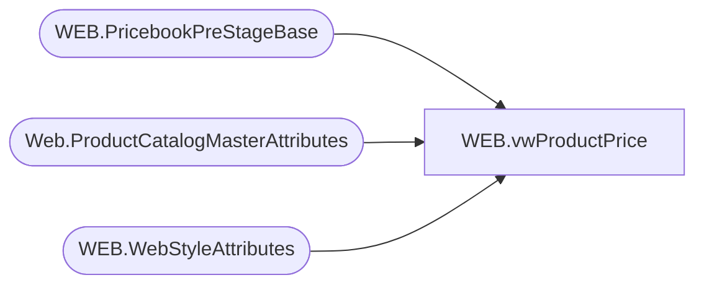

# WEB.vwProductPrice

**Database:** IntegrationStaging  
**Server:** STL-SSIS-P-01  

## Architecture Diagram



## Table Dependencies

| Referenced Table |
|---|
| WEB.PricebookPreStageBase |
| Web.ProductCatalogMasterAttributes |
| WEB.WebStyleAttributes |

## View Code

```sql
CREATE VIEW [WEB].[vwProductPrice]
AS

WITH 
----Exceptions AS
----(
----select DISTINCT * from WEB.PricebookPreStageBase where concat(Jurisdiction	, BaseID) in (
----	SELECT DISTINCT concat(Jurisdiction	, BaseID) id
----		--, COUNT(OriginalPrice)
----	FROM WEB.PricebookPreStageBase
----	  WHERE 1=1
----		AND Jurisdiction IN ('US','UK','CA')
----	GROUP BY  concat(Jurisdiction	, BaseID) HAVING COUNT(distinct OriginalPrice) > 1)
----		AND AVAILB <> 'INTL'
----		ORDER BY 1,2
----)
----,
Styles AS
(
	SELECT style_code StyleCode
		,ProductSellingGeography
	  FROM Web.ProductCatalogMasterAttributes with(nolock)
	  WHERE StoreFrontEligible = 1
		--AND Style_Code NOT IN (SELECT DISTINCT StyleCode FROM Exceptions)
)
,
GroupCode AS
(
	SELECT DISTINCT BaseID
		, StyleCode
		--, CAST(LEFT(stylecode,1) AS int) PrefixID
		, SUBSTRING(a.[Value],1,5) AS GroupCode
	  FROM WEB.WebStyleAttributes a with(nolock)
	  WHERE 1=1
		AND a.Field = 'subclasscode'
		AND StyleCode IN (SELECT DISTINCT StyleCode FROM Styles)
)
,
StyleCodes AS
(
	Select DISTINCT ps.BaseID
	, ps.StyleCode
	  FROM WEB.PricebookPreStageBase ps with(nolock)
	  WHERE 1=1
		AND ps.Jurisdiction IN ('US','UK','CA')
		AND ps.StyleCode IN (SELECT DISTINCT StyleCode FROM Styles)
)
,
USPrices AS 
 (
	Select DISTINCT ps.BaseID
		, ps.OriginalPrice US_ListPrice
		,CASE WHEN ps.currentPrice <> ps.OriginalPrice
			THEN ps.currentPrice
			ELSE NULL
		  END AS US_SalePrice
	  FROM WEB.PricebookPreStageBase ps with(nolock)
	  WHERE 1=1
		AND ps.Jurisdiction = 'US'
		AND ps.AVAILB <> 'INTL'
		AND ps.StyleCode IN (SELECT DISTINCT StyleCode FROM Styles)		
		AND ps.StyleCode BETWEEN 000000 and 099999
)
,
USPricesSNC AS 
 (
	Select DISTINCT ps.BaseID
		, ps.OriginalPrice USSNC_ListPrice
		,CASE WHEN ps.currentPrice <> ps.OriginalPrice
			THEN ps.currentPrice
			ELSE NULL
		  END AS USSNC_SalePrice
	  FROM WEB.PricebookPreStageBase ps with(nolock)
	  WHERE 1=1
		AND ps.Jurisdiction = 'US'
		AND ps.StyleCode IN (SELECT DISTINCT StyleCode FROM Styles)			
		AND ps.StyleCode BETWEEN 200000 and 299999
)
,
USPricesSAC AS 
 (
	Select DISTINCT ps.BaseID
		, ps.OriginalPrice USSAC_ListPrice
		,CASE WHEN ps.currentPrice <> ps.OriginalPrice
			THEN ps.currentPrice
			ELSE NULL
		  END AS USSAC_SalePrice
	  FROM WEB.PricebookPreStageBase ps with(nolock)
	  WHERE 1=1
		AND ps.Jurisdiction = 'US'
		AND ps.StyleCode IN (SELECT DISTINCT StyleCode FROM Styles)		
		AND ps.StyleCode BETWEEN 300000 and 399999
)
,
UKPrices AS 
(
		Select DISTINCT pk.BaseID
		, pk.OriginalPrice UK_ListPrice
		,CASE WHEN pk.currentPrice <> pk.OriginalPrice
			THEN pk.currentPrice
			ELSE NULL
		  END AS UK_SalePrice
	  FROM WEB.PricebookPreStageBase pk with(nolock)
	  WHERE 1=1
		AND pk.Jurisdiction = 'UK' 
		AND pk.StyleCode IN (SELECT DISTINCT StyleCode FROM Styles)
		AND pk.StyleCode BETWEEN 400000 and 499999
)
,UKPricesSNC AS 
(
		Select DISTINCT pk.BaseID
		, pk.OriginalPrice UKSNC_ListPrice
		,CASE WHEN pk.currentPrice <> pk.OriginalPrice
			THEN pk.currentPrice
			ELSE NULL
		  END AS UKSNC_SalePrice
	  FROM WEB.PricebookPreStageBase pk with(nolock)
	  WHERE 1=1
		AND pk.Jurisdiction = 'UK' 
		AND pk.StyleCode IN (SELECT DISTINCT StyleCode FROM Styles)
		AND pk.StyleCode BETWEEN 500000 and 599999
)
,UKPricesSAC AS 
(
		Select DISTINCT pk.BaseID
		, pk.OriginalPrice UKSAC_ListPrice
		,CASE WHEN pk.currentPrice <> pk.OriginalPrice
			THEN pk.currentPrice
			ELSE NULL
		  END AS UKSAC_SalePrice
	  FROM WEB.PricebookPreStageBase pk with(nolock)
	  WHERE 1=1
		AND pk.Jurisdiction = 'UK' 
		AND pk.StyleCode IN (SELECT DISTINCT StyleCode FROM Styles)
		AND pk.StyleCode between 600000 and 699999
)
,
Prices AS 
(
		SELECT DISTINCT sc.BaseId
		, sc.StyleCode
		, k.UK_ListPrice
		, kn.UKSNC_ListPrice
		, ka.UKSAC_ListPrice
		, s.US_ListPrice
		, sn.USSNC_ListPrice
		, sa.USSAC_ListPrice
		, 0 as CA_ListPrice
		, k.UK_SalePrice
		, kn.UKSNC_SalePrice
		, ka.UKSAC_SalePrice
		, s.US_SalePrice
		, sn.USSNC_SalePrice
		, sa.USSAC_SalePrice
		, 0 as CA_SalePrice
	FROM StyleCodes sc
		LEFT JOIN UKPrices k ON sc.BaseId = k.BaseID
		LEFT JOIN UKPricesSNC kn ON sc.BaseId = kn.BaseID
		LEFT JOIN UKPricesSAC ka ON sc.BaseId = ka.BaseID
		LEFT JOIN USPrices s ON sc.BaseID = s.BaseId
		LEFT JOIN USPricesSNC sn ON sc.BaseID = sn.BaseId
		LEFT JOIN USPricesSAC sa ON sc.BaseID = sa.BaseId
	--WHERE sc.baseid IN ('26193')
		--ORDER BY 1
)
,
ListPrices AS 
(
	SELECT p.BaseID
		, p.StyleCode
		, CASE 
			WHEN g.GroupCode = 'R-B-C' or (g.GroupCode in ('R-B-Z','W-C-J','W-C-K','W-C-M','W-C-N','W-D-J','W-D-K','W-D-M','W-D-N','W-E-J','W-E-K','W-E-M','W-E-N','W-F-J','W-F-K','W-F-M','W-F-N') and g.StyleCode between 100000 and 199999)
				THEN CA_ListPrice
			WHEN g.GroupCode = 'R-B-U' or (g.GroupCode in ('R-B-Z','W-C-J','W-C-K','W-C-M','W-C-N','W-D-J','W-D-K','W-D-M','W-D-N','W-E-J','W-E-K','W-E-M','W-E-N','W-F-J','W-F-K','W-F-M','W-F-N') and g.StyleCode between 400000 and 499999)
				THEN UK_ListPrice
			WHEN g.GroupCode = 'R-B-U' or (g.GroupCode in ('R-B-Z','W-C-J','W-C-K','W-C-M','W-C-N','W-D-J','W-D-K','W-D-M','W-D-N','W-E-J','W-E-K','W-E-M','W-E-N','W-F-J','W-F-K','W-F-M','W-F-N') and g.StyleCode between 500000 and 599999)
				THEN UKSNC_ListPrice
			WHEN g.GroupCode = 'R-B-U' or (g.GroupCode in ('R-B-Z','W-C-J','W-C-K','W-C-M','W-C-N','W-D-J','W-D-K','W-D-M','W-D-N','W-E-J','W-E-K','W-E-M','W-E-N','W-F-J','W-F-K','W-F-M','W-F-N') and g.StyleCode between 600000 and 699999)
				THEN UKSAC_ListPrice
			WHEN g.StyleCode between 200000 and 299999
				THEN USSNC_ListPrice
			WHEN g.StyleCode between 300000 and 399999
				THEN USSAC_ListPrice
			ELSE US_ListPrice
			END AS ListPrice
		, CASE 
			WHEN g.GroupCode = 'R-B-C' or (g.GroupCode in ('R-B-Z','W-C-J','W-C-K','W-C-M','W-C-N','W-D-J','W-D-K','W-D-M','W-D-N','W-E-J','W-E-K','W-E-M','W-E-N','W-F-J','W-F-K','W-F-M','W-F-N') and g.StyleCode between 100000 and 199999)
				THEN CA_SalePrice
			WHEN g.GroupCode = 'R-B-U' or (g.GroupCode in ('R-B-Z','W-C-J','W-C-K','W-C-M','W-C-N','W-D-J','W-D-K','W-D-M','W-D-N','W-E-J','W-E-K','W-E-M','W-E-N','W-F-J','W-F-K','W-F-M','W-F-N') and g.StyleCode between 400000 and 699999)
				THEN UK_SalePrice
			ELSE US_SalePrice
		END AS SalePrice
		, CASE 
			WHEN g.GroupCode = 'R-B-C' or (g.GroupCode in ('R-B-Z','W-C-J','W-C-K','W-C-M','W-C-N','W-D-J','W-D-K','W-D-M','W-D-N','W-E-J','W-E-K','W-E-M','W-E-N','W-F-J','W-F-K','W-F-M','W-F-N') and g.StyleCode between 100000 and 199999)
				THEN 'CA'
			WHEN g.GroupCode = 'R-B-U' or (g.GroupCode in ('R-B-Z','W-C-J','W-C-K','W-C-M','W-C-N','W-D-J','W-D-K','W-D-M','W-D-N','W-E-J','W-E-K','W-E-M','W-E-N','W-F-J','W-F-K','W-F-M','W-F-N') and g.StyleCode between 400000 and 699999)
				THEN 'UK'
			ELSE 'US'
		END AS JurisdictionId	
		,g.GroupCode
	  FROM Prices p 
		JOIN GroupCode g ON p.baseId = g.BaseID AND p.StyleCode = g.StyleCode
	  
)

SELECT DISTINCT
	l.BaseId
	, CAST(l.StyleCode AS varchar(6)) StyleCode
	, l.ListPrice AS CurrentPrice
	, l.ListPrice AS OriginalPrice
	, CASE
		WHEN ISNULL(l.ListPrice,0) <> ISNULL(l.SalePrice,0) THEN l.SalePrice
		ELSE NULL
	  END AS SalePrice
	, CASE WHEN l.JurisdictionId = 'UK' THEN 'UK'
		ELSE 'US'
	  END AS [Catalog]
--	, NULL As EffectiveTo
FROM ListPrices l
WHERE l.ListPrice IS NOT NULL
--ORDER BY 1,2
```

