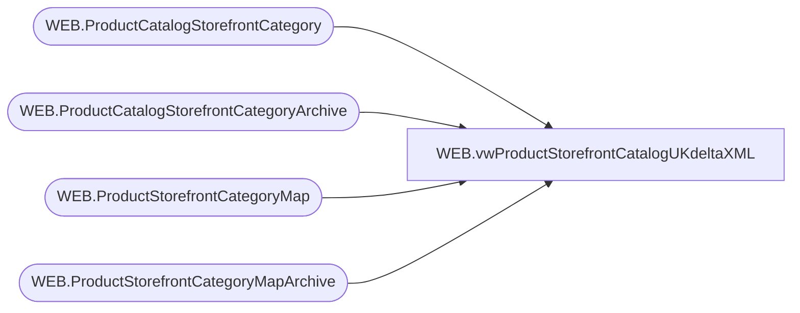

# WEB.vwProductStorefrontCatalogUKdeltaXML

**Database:** IntegrationStaging  
**Server:** STL-SSIS-P-01  

## Architecture Diagram



## Table Dependencies

| Referenced Table |
|---|
| WEB.ProductCatalogStorefrontCategory |
| WEB.ProductCatalogStorefrontCategoryArchive |
| WEB.ProductStorefrontCategoryMap |
| WEB.ProductStorefrontCategoryMapArchive |

## View Code

```sql
CREATE view [WEB].[vwProductStorefrontCatalogUKdeltaXML]

as

--------------------------------------------------------------------------------------------------
-- vwProductStorefrontCatalogUKfullXML - Outputs XML for eCommerce Product Storefront Catalog XML 
--							Queries tables that are populated via SSIS, view is tied to same package flow
--- 2017-06-14 - Dan Tweedie - Created View
-- 2018-04-16	- Dan Tweedie -  Commented out Position from Categories
--	2018-10-01	- Dan Tweedie	-	 Remove online-flag and showInMenu from Categories CTE
--------------------------------------------------------------------------------------------------


with 
Header (XML) as
	( 
		select 
			(
				select '/' as 'internal-location/@base-path',
				(
					select
						'large' as 'view-type', NULL,
						'medium' as 'view-type', NULL,
						'small' as 'view-type', NULL,
						'swatch' as 'view-type'
					for xml path('view-types'), Type
				),
				'${productname}' as 'alt-pattern',
				'${productname}' as 'title-pattern'
				for xml path('image-settings'), Type
			) 
		for xml path ('header'), Type
	),
Categories (XML) as
	(
		select *
		from 
			(
				select 
					substring(CategoryID, 4, 999) as '@category-id',
					'delete' as '@mode', NULL xtra1,
					'x-default' as 'display-name/@xml:lang',
					DisplayName as 'display-name',
					--case 
					--	when OnlineFlag = 1
					--	then 'true' 
					--	else 'false'
					--end	as 'online-flag',
					case 
						when Parent = 'UK' 
						then 'root'
						else replace(Parent, 'UK-', '') 
					end as 'parent'
					--,
					--'showInMenu' as 'custom-attributes/custom-attribute/@attribute-id',
					--ShowInMenu as 'custom-attributes/custom-attribute'
				from WEB.ProductCatalogStorefrontCategoryArchive
				where left(CategoryID, 2) = 'UK'
				and CategoryID <> 'UK'
				and ChangeType = 'DELETE'
				and CurrentBatch = 1
				and substring(CategoryID, 4, 999) not in (select substring(CategoryID, 4, 999) from WEB.ProductCatalogStorefrontCategory)
				UNION
				select 
					substring(CategoryID, 4, 999) as '@category-id',
					NULL as '@mode', NULL xtra1,
					'x-default' as 'display-name/@xml:lang',
					DisplayName as 'display-name',
					--case 
					--	when OnlineFlag = 1
					--	then 'true' 
					--	else 'false'
					--end	as 'online-flag',
					case 
						when Parent = 'UK' 
						then 'root'
						else replace(Parent, 'UK-', '') 
					end as 'parent'
					--,
					--'showInMenu' as 'custom-attributes/custom-attribute/@attribute-id',
					--ShowInMenu as 'custom-attributes/custom-attribute'
				from WEB.ProductCatalogStorefrontCategory
				where left(CategoryID, 2) = 'UK'
				and CategoryID <> 'UK'
				and SendData = 1
			) x
		order by [@category-id]
		for xml path('category'), Type
	),
CategoryAssignment (XML) as 
	(
		select *
		from 
			(
				select 
					substring(CategoryID, 4, 999) as '@category-id',
					Style as '@product-id',
					NULL as '@mode', NULL xtra1,
					case 
						when PrimaryCategory = 1
						then 'true' 
						else 'false'
					end as 'primary-flag'
				from WEB.ProductStorefrontCategoryMapArchive
				where left(CategoryID, 2) = 'UK'
				and CategoryID <> 'UK'
				and ChangeType = 'DELETE'
				and CurrentBatch = 1
				and style <> '080088'
				UNION
				select 
					substring(CategoryID, 4, 999) as '@category-id',
					Style as '@product-id',
					NULL as '@mode', NULL xtra1,
					case 
						when PrimaryCategory = 1
						then 'true' 
						else 'false'
					end as 'primary-flag'
				from WEB.ProductStorefrontCategoryMap
				where left(CategoryID, 2) = 'UK'
				and CategoryID <> 'UK'
				and SendData = 1
				and style <> '080088'
			) x
		order by [@product-id], [@category-id]
		for xml path('category-assignment'), Type
	),
XMLStage (XML) as
	(
		select
			'buildabear-storefront-uk' as '@catalog-id',
			--(
			--	select *
			--	from Header
			--),
			(
				select *
				from Categories
			),
			(
				select *
				from CategoryAssignment
			)
		for xml path('catalog'), Type
	)
select 
cast(
	replace(cast(XML as nvarchar(max)), '<catalog catalog-id="buildabear-storefront-uk">', '<catalog catalog-id="buildabear-storefront-uk" xmlns="http://www.demandware.com/xml/impex/catalog/2006-10-31">') 
as xml) as XMLData
from XMLStage
```

