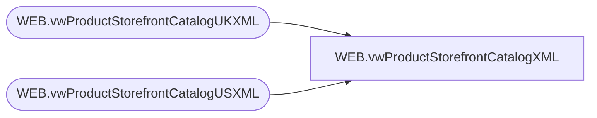

# WEB.vwProductStorefrontCatalogXML

**Database:** IntegrationStaging  
**Server:** STL-SSIS-P-01  

## Architecture Diagram



## Table Dependencies

| Referenced Table |
|---|
| WEB.vwProductStorefrontCatalogUKXML |
| WEB.vwProductStorefrontCatalogUSXML |

## View Code

```sql
CREATE view [WEB].[vwProductStorefrontCatalogXML]

as

--------------------------------------------------------------------------------------------------
-- vwProductStorefrontCatalogXML - Outputs XML for eCommerce Product Storefront Catalog XML 
--							Queries tables that are populated via SSIS, view is tied to same package flow
--- 2017-06-14 - Dan Tweedie - Created View
--------------------------------------------------------------------------------------------------


WITH
Stage1 (XML) as
	(
		select cast(XMLData as nvarchar(max)) as XMLData
		from WEB.vwProductStorefrontCatalogUSXML
		UNION
		select cast(XMLData as nvarchar(max)) as XMLData
		from WEB.vwProductStorefrontCatalogUKXML
	),
Stage2 (XML) as
	(
		select cast(XML as xml)
		from Stage1
		for xml path, Type
	) 
select 
	cast(replace(replace(cast(XML as nvarchar(max)), '<row>', ''), '</row>', '') as xml) as XMLData
from Stage2
```

