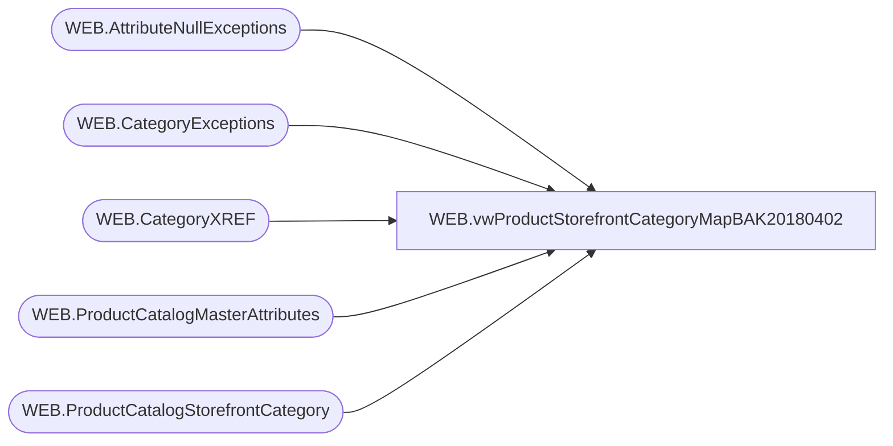

# WEB.vwProductStorefrontCategoryMapBAK20180402

**Database:** IntegrationStaging  
**Server:** STL-SSIS-P-01  

## Architecture Diagram



## Table Dependencies

| Referenced Table |
|---|
| WEB.AttributeNullExceptions |
| WEB.CategoryExceptions |
| WEB.CategoryXREF |
| WEB.ProductCatalogMasterAttributes |
| WEB.ProductCatalogStorefrontCategory |

## View Code

```sql
CREATE view [WEB].[vwProductStorefrontCategoryMapBAK20180402]

as

--------------------------------------------------------------------------------------------------
-- vwProductStorefrontCategoryMap - Maps Product to Category for eCommerce Product Storefront Catalog XML
--							Queries tables that are populated via SSIS, view is tied to same package flow
--- 2017-06-14 - Dan Tweedie - Created View
--------------------------------------------------------------------------------------------------


with 
Attributes as
	(
		select 
			*,
			case 
				when LICEN = 'NO'
				OR LicensedCollection in (select AttributeValue from WEB.AttributeNullExceptions where Attribute = 'LICNSR')
				then 1
				else 0
			end as LICEN_NO
		from WEB.ProductCatalogMasterAttributes 
		where StoreFrontEligible = 1
	),
Categories as
	(
		select 
			CategoryID,
			Parent,
			DisplayName,
			CategoryLevel
		from WEB.ProductCatalogStorefrontCategory
	),
XREF as
	(
		select *
		from WEB.CategoryXREF 
	),
Unions as
	(
		select 
			a.BABWProductID,
			c.CategoryID,
			c.Parent,
			c.DisplayName,
			c.CategoryLevel,
			x.PrimaryCategoryDesignation
		from Attributes a
		join XREF x on 
			 x.FilterGroup = 1.1 and x.Filter = 'Unstuffed Dept'
			and (a.ProductSellingGeography = x.CountrySpecificCategory or x.CountrySpecificCategory is NULL)
			and substring(a.HierarchyGroupCode,1,8) in ('W-C-J-02','W-D-J-02','W-E-J-02','W-F-J-02')
		join Categories c on isnull(x.TertiaryCategoryID, x.SecondaryCategoryID) = substring(CategoryID, 4, 999) --substring(CategoryID, 4, 999) --replace(c.CategoryID, left(c.CategoryID, 3), '')
			and left(c.CategoryID,2) = a.ProductSellingGeography
				--case
				--	when left(a.BABWProductID, 1) = 4 
				--		then 'UK'
				--	else 'US'
				--end			
		UNION
		select 
			a.BABWProductID,
			c.CategoryID,
			c.Parent,
			c.DisplayName,
			c.CategoryLevel,
			x.PrimaryCategoryDesignation
		from Attributes a
		join XREF x on 
			 x.FilterGroup = 1.2 and x.Filter = 'Clothing Dept' 
			and (a.ProductSellingGeography = x.CountrySpecificCategory or x.CountrySpecificCategory is NULL)
			and substring(a.HierarchyGroupCode,1,8) in ('W-C-K-06','W-D-K-06','W-E-K-06','W-F-K-06')
		join Categories c on isnull(x.TertiaryCategoryID, x.SecondaryCategoryID) = substring(CategoryID, 4, 999) --substring(CategoryID, 4, 999) --replace(c.CategoryID, left(c.CategoryID, 3), '')
			and left(c.CategoryID,2) = a.ProductSellingGeography
				--case
				--	when left(a.BABWProductID, 1) = 4 
				--		then 'UK'
				--	else 'US'
				--end			
		UNION
		select 
			a.BABWProductID,
			c.CategoryID,
			c.Parent,
			c.DisplayName,
			c.CategoryLevel,
			x.PrimaryCategoryDesignation
		from Attributes a
		join XREF x on 
			 x.FilterGroup = 1.2 and x.Filter = 'Footwear Dept'
			and (a.ProductSellingGeography = x.CountrySpecificCategory or x.CountrySpecificCategory is NULL)
			and substring(a.HierarchyGroupCode,1,8) in ('W-C-K-10','W-D-K-10','W-E-K-10','W-F-K-10')
		join Categories c on isnull(x.TertiaryCategoryID, x.SecondaryCategoryID) = substring(CategoryID, 4, 999) --substring(CategoryID, 4, 999) --replace(c.CategoryID, left(c.CategoryID, 3), '')
			and left(c.CategoryID,2) = a.ProductSellingGeography
				--case
				--	when left(a.BABWProductID, 1) = 4 
				--		then 'UK'
				--	else 'US'
				--end			
		UNION
		select 
			a.BABWProductID,
			c.CategoryID,
			c.Parent,
			c.DisplayName,
			c.CategoryLevel,
			x.PrimaryCategoryDesignation
		from Attributes a
		join XREF x on 
			 x.FilterGroup = 1.3 and x.Filter = 'Sounds Class'
			and (a.ProductSellingGeography = x.CountrySpecificCategory or x.CountrySpecificCategory is NULL)
			and substring(a.HierarchyGroupCode,1,11) in ('W-C-K-12-01','W-D-K-12-01','W-E-K-12-01','W-F-K-12-01')
		join Categories c on isnull(x.TertiaryCategoryID, x.SecondaryCategoryID) = substring(CategoryID, 4, 999) --substring(CategoryID, 4, 999) --replace(c.CategoryID, left(c.CategoryID, 3), '')
			and left(c.CategoryID,2) = a.ProductSellingGeography
				--case
				--	when left(a.BABWProductID, 1) = 4 
				--		then 'UK'
				--	else 'US'
				--end			
		UNION
		select 
			a.BABWProductID,
			c.CategoryID,
			c.Parent,
			c.DisplayName,
			c.CategoryLevel,
			x.PrimaryCategoryDesignation
		from Attributes a
		join XREF x on 
			 x.FilterGroup = 1.3 and x.Filter = 'Scents Class'
			and (a.ProductSellingGeography = x.CountrySpecificCategory or x.CountrySpecificCategory is NULL)
			and substring(a.HierarchyGroupCode,1,11) in ('W-C-K-12-02','W-D-K-12-02','W-E-K-12-02','W-F-K-12-02')
		join Categories c on isnull(x.TertiaryCategoryID, x.SecondaryCategoryID) = substring(CategoryID, 4, 999) --substring(CategoryID, 4, 999) --replace(c.CategoryID, left(c.CategoryID, 3), '')
			and left(c.CategoryID,2) = a.ProductSellingGeography
				--case
				--	when left(a.BABWProductID, 1) = 4 
				--		then 'UK'
				--	else 'US'
				--end			
		UNION
		select 
			a.BABWProductID,
			c.CategoryID,
			c.Parent,
			c.DisplayName,
			c.CategoryLevel,
			x.PrimaryCategoryDesignation
		from Attributes a
		join XREF x on 
			 x.FilterGroup = 1.4 and x.Filter = 'Accessories Dept'
			and (a.ProductSellingGeography = x.CountrySpecificCategory or x.CountrySpecificCategory is NULL)
			and substring(a.HierarchyGroupCode,1,8) in ('W-C-K-08','W-D-K-08','W-E-K-08','W-F-K-08','W-C-M-14','W-D-M-14','W-E-M-14','W-F-M-14')
		join Categories c on isnull(x.TertiaryCategoryID, x.SecondaryCategoryID) = substring(CategoryID, 4, 999) --substring(CategoryID, 4, 999) --replace(c.CategoryID, left(c.CategoryID, 3), '')
			and left(c.CategoryID,2) = a.ProductSellingGeography
				--case
				--	when left(a.BABWProductID, 1) = 4 
				--		then 'UK'
				--	else 'US'
				--end			
		UNION
		select 
			a.BABWProductID,
			c.CategoryID,
			c.Parent,
			c.DisplayName,
			c.CategoryLevel,
			x.PrimaryCategoryDesignation
		from Attributes a
		join XREF x on 
			 x.FilterGroup = 2.1 
			and (a.LICEN_NO = 1)
			and (a.ProductSellingGeography = x.CountrySpecificCategory or x.CountrySpecificCategory is NULL)
			and a.KeyStory = x.MerchCodeValue  
		join Categories c on isnull(x.TertiaryCategoryID, x.SecondaryCategoryID) = substring(CategoryID, 4, 999) --substring(CategoryID, 4, 999) --replace(c.CategoryID, left(c.CategoryID, 3), '')
			and left(c.CategoryID,2) = a.ProductSellingGeography
				--case
				--	when left(a.BABWProductID, 1) = 4 
				--		then 'UK'
				--	else 'US'
				--end			
		UNION
		select 
			a.BABWProductID,
			c.CategoryID,
			c.Parent,
			c.DisplayName,
			c.CategoryLevel,			
			x.PrimaryCategoryDesignation
		from Attributes a
		join XREF x on 
			x.FilterGroup = 2.2 
			--and (a.LICEN_NO = 0)
			and (a.ProductSellingGeography = x.CountrySpecificCategory or x.CountrySpecificCategory is NULL)
			and a.KeyStory = x.MerchCodeValue 
		join Categories c on isnull(x.TertiaryCategoryID, x.SecondaryCategoryID) = substring(CategoryID, 4, 999) --substring(CategoryID, 4, 999) --replace(c.CategoryID, left(c.CategoryID, 3), '')
			and left(c.CategoryID,2) = a.ProductSellingGeography
				--case
				--	when left(a.BABWProductID, 1) = 4 
				--		then 'UK'
				--	else 'US'
				--end			
		UNION
		select 
			a.BABWProductID,
			c.CategoryID,
			c.Parent,
			c.DisplayName,
			c.CategoryLevel,			
			x.PrimaryCategoryDesignation
		from Attributes a
		join XREF x on 
			x.FilterGroup = 2.3
			and (a.ProductSellingGeography = x.CountrySpecificCategory or x.CountrySpecificCategory is NULL)
			and a.KeyStory = x.MerchCodeValue  
		join Categories c on isnull(x.TertiaryCategoryID, x.SecondaryCategoryID) = substring(CategoryID, 4, 999) --substring(CategoryID, 4, 999) --replace(c.CategoryID, left(c.CategoryID, 3), '')
			and left(c.CategoryID,2) = a.ProductSellingGeography
				--case
				--	when left(a.BABWProductID, 1) = 4 
				--		then 'UK'
				--	else 'US'
				--end			
		UNION
		select 
			a.BABWProductID,
			c.CategoryID,
			c.Parent,
			c.DisplayName,
			c.CategoryLevel,			
			x.PrimaryCategoryDesignation
		from Attributes a
		join XREF x on 
			x.FilterGroup = 2.4
			and (a.ProductSellingGeography = x.CountrySpecificCategory or x.CountrySpecificCategory is NULL)
			and a.KeyStory = x.MerchCodeValue  
		join Categories c on isnull(x.TertiaryCategoryID, x.SecondaryCategoryID) = substring(CategoryID, 4, 999) --substring(CategoryID, 4, 999) --replace(c.CategoryID, left(c.CategoryID, 3), '')
			and left(c.CategoryID,2) = a.ProductSellingGeography
				--case
				--	when left(a.BABWProductID, 1) = 4 
				--		then 'UK'
				--	else 'US'
				--end			
		UNION
		select 
			a.BABWProductID,
			c.CategoryID,
			c.Parent,
			c.DisplayName,
			c.CategoryLevel,			
			x.PrimaryCategoryDesignation
		from Attributes a
		join XREF x on 
			x.FilterGroup = 2.5
			and (a.ProductSellingGeography = x.CountrySpecificCategory or x.CountrySpecificCategory is NULL)
			and (
					(x.MerchCodeLabel = 'KEY STORY' and a.KeyStory = x.MerchCodeValue)
					OR
					(x.MerchCodeLabel = 'WOCCAS' and a.OccasionCode = x.MerchCodeValue) 
				)
		join Categories c on isnull(x.TertiaryCategoryID, x.SecondaryCategoryID) = substring(CategoryID, 4, 999) --substring(CategoryID, 4, 999) --replace(c.CategoryID, left(c.CategoryID, 3), '')
			and left(c.CategoryID,2) = a.ProductSellingGeography
				--case
				--	when left(a.BABWProductID, 1) = 4 
				--		then 'UK'
				--	else 'US'
				--end			
		UNION
		select 
			a.BABWProductID,
			c.CategoryID,
			c.Parent,
			c.DisplayName,
			c.CategoryLevel,			
			x.PrimaryCategoryDesignation
		from Attributes a
		join XREF x on 
			x.FilterGroup = 2.6
			and (a.ProductSellingGeography = x.CountrySpecificCategory or x.CountrySpecificCategory is NULL)
			and a.WebExclusive = 'True'
		join Categories c on isnull(x.TertiaryCategoryID, x.SecondaryCategoryID) = substring(CategoryID, 4, 999) --substring(CategoryID, 4, 999) --replace(c.CategoryID, left(c.CategoryID, 3), '')
			and left(c.CategoryID,2) = a.ProductSellingGeography
				--case
				--	when left(a.BABWProductID, 1) = 4 
				--		then 'UK'
				--	else 'US'
				--end			
		UNION
		select 
			a.BABWProductID,
			c.CategoryID,
			c.Parent,
			c.DisplayName,
			c.CategoryLevel,			
			x.PrimaryCategoryDesignation
		from Attributes a
		join XREF x on 
			x.FilterGroup = 3.1
			and (a.ProductSellingGeography = x.CountrySpecificCategory or x.CountrySpecificCategory is NULL)
			 and substring(a.HierarchyGroupCode,1,8) in ('W-C-J-04','W-D-J-04','W-E-J-04','W-F-J-04', 'W-C-J-02', 'W-D-J-02', 'W-E-J-02', 'W-F-J-02') --stuffed/unstuffed
			 and a.SkinType = x.MerchCodeValue
		join Categories c on isnull(x.TertiaryCategoryID, x.SecondaryCategoryID) = substring(CategoryID, 4, 999) --substring(CategoryID, 4, 999) --replace(c.CategoryID, left(c.CategoryID, 3), '')
			and left(c.CategoryID,2) = a.ProductSellingGeography
				--case
				--	when left(a.BABWProductID, 1) = 4 
				--		then 'UK'
				--	else 'US'
				--end			
		UNION
		select 
			a.BABWProductID,
			c.CategoryID,
			c.Parent,
			c.DisplayName,
			c.CategoryLevel,			
			x.PrimaryCategoryDesignation
		from Attributes a
		join XREF x on 
			x.FilterGroup = 3.1
			and x.MerchCodeType is NULL 
			 and substring(a.HierarchyGroupCode,1,8) in ('W-C-J-02', 'W-D-J-02', 'W-E-J-02', 'W-F-J-02') --stuffed
		join Categories c on isnull(x.TertiaryCategoryID, x.SecondaryCategoryID) = substring(CategoryID, 4, 999) --replace(c.CategoryID, left(c.CategoryID, 3), '')
			and left(c.CategoryID,2) = a.ProductSellingGeography
				--case
				--	when left(a.BABWProductID, 1) = 4 
				--		then 'UK'
				--	else 'US'
				--end			
		UNION
		select 
			a.BABWProductID,
			c.CategoryID,
			c.Parent,
			c.DisplayName,
			c.CategoryLevel,			
			x.PrimaryCategoryDesignation
		from Attributes a
		join XREF x on 
			x.FilterGroup = 3.2
			and (a.ProductSellingGeography = x.CountrySpecificCategory or x.CountrySpecificCategory is NULL)
			 and substring(a.HierarchyGroupCode,1,8) in ('W-C-J-04','W-D-J-04','W-E-J-04','W-F-J-04', 'W-C-J-02', 'W-D-J-02', 'W-E-J-02', 'W-F-J-02') --stuffed/unstuffed
			  and (a.LICEN_NO = 1)
			 and a.KeyStory = x.MerchCodeValue  
		join Categories c on isnull(x.TertiaryCategoryID, x.SecondaryCategoryID) = substring(CategoryID, 4, 999) --replace(c.CategoryID, left(c.CategoryID, 3), '')
			and left(c.CategoryID,2) = a.ProductSellingGeography
				--case
				--	when left(a.BABWProductID, 1) = 4 
				--		then 'UK'
				--	else 'US'
				--end			
		UNION
		select 
			a.BABWProductID,
			c.CategoryID,
			c.Parent,
			c.DisplayName,
			c.CategoryLevel,			
			x.PrimaryCategoryDesignation
		from Attributes a
		join XREF x on 
			x.FilterGroup = 3.3
			and (a.ProductSellingGeography = x.CountrySpecificCategory or x.CountrySpecificCategory is NULL)
			 and substring(a.HierarchyGroupCode,1,8) in ('W-C-J-04','W-D-J-04','W-E-J-04','W-F-J-04', 'W-C-J-02', 'W-D-J-02', 'W-E-J-02', 'W-F-J-02') --stuffed/unstuffed
			 --and (a.LICEN_NO = 0)
			 and a.KeyStory = x.MerchCodeValue  
		join Categories c on isnull(x.TertiaryCategoryID, x.SecondaryCategoryID) = substring(CategoryID, 4, 999) --replace(c.CategoryID, left(c.CategoryID, 3), '')
			and left(c.CategoryID,2) = a.ProductSellingGeography
				--case
				--	when left(a.BABWProductID, 1) = 4 
				--		then 'UK'
				--	else 'US'
				--end			
		UNION
		select 
			a.BABWProductID,
			c.CategoryID,
			c.Parent,
			c.DisplayName,
			c.CategoryLevel,			
			x.PrimaryCategoryDesignation
		from Attributes a
		join XREF x on 
			x.FilterGroup = 3.4
			and (a.ProductSellingGeography = x.CountrySpecificCategory or x.CountrySpecificCategory is NULL)
			 and substring(a.HierarchyGroupCode,1,8) in ('W-C-J-04','W-D-J-04','W-E-J-04','W-F-J-04', 'W-C-J-02', 'W-D-J-02', 'W-E-J-02', 'W-F-J-02') --stuffed/unstuffed
			 and a.KeyStory = x.MerchCodeValue 
		join Categories c on isnull(x.TertiaryCategoryID, x.SecondaryCategoryID) = substring(CategoryID, 4, 999) --replace(c.CategoryID, left(c.CategoryID, 3), '')
			and left(c.CategoryID,2) = a.ProductSellingGeography
				--case
				--	when left(a.BABWProductID, 1) = 4 
				--		then 'UK'
				--	else 'US'
				--end			
		UNION
		select 
			a.BABWProductID,
			c.CategoryID,
			c.Parent,
			c.DisplayName,
			c.CategoryLevel,			
			x.PrimaryCategoryDesignation
		from Attributes a
		join XREF x on 
			x.FilterGroup = 3.5
			and (a.ProductSellingGeography = x.CountrySpecificCategory or x.CountrySpecificCategory is NULL)
			 and substring(a.HierarchyGroupCode,1,8) in ('W-C-J-04','W-D-J-04','W-E-J-04','W-F-J-04', 'W-C-J-02', 'W-D-J-02', 'W-E-J-02', 'W-F-J-02') --stuffed/unstuffed
			 and (
					(x.MerchCodeLabel = 'Key Story'  and a.KeyStory = x.MerchCodeValue )
					OR
					(x.MerchCodeLabel = 'WOCCAS' and a.OccasionCode = x.MerchCodeValue)
				)
		join Categories c on isnull(x.TertiaryCategoryID, x.SecondaryCategoryID) = substring(CategoryID, 4, 999) --replace(c.CategoryID, left(c.CategoryID, 3), '')
			and left(c.CategoryID,2) = a.ProductSellingGeography
				--case
				--	when left(a.BABWProductID, 1) = 4 
				--		then 'UK'
				--	else 'US'
				--end			
		UNION
		select 
			a.BABWProductID,
			c.CategoryID,
			c.Parent,
			c.DisplayName,
			c.CategoryLevel,			
			x.PrimaryCategoryDesignation
		from Attributes a
		join XREF x on 
			x.FilterGroup = 3.6
			 and (a.ProductSellingGeography = x.CountrySpecificCategory or x.CountrySpecificCategory is NULL)
			 and substring(a.HierarchyGroupCode,1,8) in ('W-C-J-04','W-D-J-04','W-E-J-04','W-F-J-04', 'W-C-J-02', 'W-D-J-02', 'W-E-J-02', 'W-F-J-02') --stuffed/unstuffed
			 and a.WebExclusive = 'True'
		join Categories c on isnull(x.TertiaryCategoryID, x.SecondaryCategoryID) = substring(CategoryID, 4, 999) --replace(c.CategoryID, left(c.CategoryID, 3), '')
			and left(c.CategoryID,2) = a.ProductSellingGeography
				--case
				--	when left(a.BABWProductID, 1) = 4 
				--		then 'UK'
				--	else 'US'
				--end			
		UNION
		select 
			a.BABWProductID,
			c.CategoryID,
			c.Parent,
			c.DisplayName,
			c.CategoryLevel,			
			x.PrimaryCategoryDesignation
		from Attributes a
		join XREF x on 
			x.FilterGroup = 3.7
			and (a.ProductSellingGeography = x.CountrySpecificCategory or x.CountrySpecificCategory is NULL)
			and substring(a.HierarchyGroupCode,1,8) in ('W-C-J-04','W-D-J-04','W-E-J-04','W-F-J-04', 'W-C-J-02', 'W-D-J-02', 'W-E-J-02', 'W-F-J-02') --stuffed/unstuffed
			and x.MerchCodeValue = case when a.ProductCanBeEmbroidered = 'true' then 'Y' else 'N' end
		join Categories c on isnull(x.TertiaryCategoryID, x.SecondaryCategoryID) = substring(CategoryID, 4, 999) --replace(c.CategoryID, left(c.CategoryID, 3), '')
			and left(c.CategoryID,2) = a.ProductSellingGeography
				--case
				--	when left(a.BABWProductID, 1) = 4 
				--		then 'UK'
				--	else 'US'
				--end			
		UNION
		select 
			a.BABWProductID,
			c.CategoryID,
			c.Parent,
			c.DisplayName,
			c.CategoryLevel,			
			x.PrimaryCategoryDesignation
		from Attributes a
		join XREF x on 
			x.FilterGroup = 3.8
			and x.MerchCodeType is NULL 
			 and substring(a.HierarchyGroupCode,1,8) in ('W-C-J-04','W-D-J-04','W-E-J-04','W-F-J-04') --stuffed
		join Categories c on isnull(x.TertiaryCategoryID, x.SecondaryCategoryID) = substring(CategoryID, 4, 999) --replace(c.CategoryID, left(c.CategoryID, 3), '')
			and left(c.CategoryID,2) = a.ProductSellingGeography
				--case
				--	when left(a.BABWProductID, 1) = 4 
				--		then 'UK'
				--	else 'US'
				--end			
		UNION
		select 
			a.BABWProductID,
			c.CategoryID,
			c.Parent,
			c.DisplayName,
			c.CategoryLevel,			
			x.PrimaryCategoryDesignation
		from Attributes a
		join XREF x on 
			x.FilterGroup = 4.1 
			and (a.ProductSellingGeography = x.CountrySpecificCategory or x.CountrySpecificCategory is NULL)
			and (
					substring(a.HierarchyGroupCode,1,11) in ('W-C-K-06-03',	'W-D-K-06-03',	'W-E-K-06-03',	'W-F-K-06-03')
					OR
					a.HierarchyGroupCode in (
												'W-C-K-06-02-01',	'W-D-K-06-02-01',	'W-E-K-06-02-01',	'W-F-K-06-02-01',	'W-C-K-06-02-02',	'W-D-K-06-02-02',	'W-E-K-06-02-02',	'W-F-K-06-02-02',
												'W-C-K-06-04-01',	'W-D-K-06-04-01',	'W-E-K-06-04-01',	'W-F-K-06-04-01',				
												'W-C-K-06-04-02',	'W-D-K-06-04-02',	'W-E-K-06-04-02',	'W-F-K-06-04-02',				
												'W-C-K-06-04-03',	'W-D-K-06-04-03',	'W-E-K-06-04-03',	'W-F-K-06-04-03',				
												'W-C-K-06-08-03',	'W-D-K-06-08-03',	'W-E-K-06-08-03',	'W-F-K-06-08-03',				
												'W-C-K-06-08-01',	'W-D-K-06-08-01',	'W-E-K-06-08-01',	'W-F-K-06-08-01',	'W-C-K-06-08-02',	'W-D-K-06-08-02',	'W-E-K-06-08-02',	'W-F-K-06-08-02'
											)
				)
			and (a.LICEN_NO = 1)
			and x.TertiaryCategoryName = case 
										when substring(a.HierarchyGroupCode,1,11) in ('W-C-K-06-03','W-D-K-06-03','W-E-K-06-03','W-F-K-06-03')
											then 'Outfits'
										when a.HierarchyGroupCode in ('W-C-K-06-02-01','W-D-K-06-02-01','W-E-K-06-02-01','W-F-K-06-02-01','W-C-K-06-02-02','W-D-K-06-02-02','W-E-K-06-02-02','W-F-K-06-02-02')
											then 'Dresses'
										when a.HierarchyGroupCode in ('W-C-K-06-04-01','W-D-K-06-04-01','W-E-K-06-04-01','W-F-K-06-04-01')
											then 'Tops'
										when a.HierarchyGroupCode in ('W-C-K-06-04-02','W-D-K-06-04-02','W-E-K-06-04-02','W-F-K-06-04-02')
											then 'Pants and Shorts'
										when a.HierarchyGroupCode in ('W-C-K-06-04-03','W-D-K-06-04-03','W-E-K-06-04-03','W-F-K-06-04-03')
											then 'Tutus and Skirts'
										when a.HierarchyGroupCode in ('W-C-K-06-08-03','W-D-K-06-08-03','W-E-K-06-08-03','W-F-K-06-08-03')
											then 'Sleepwear' 
										when x.MerchCodeValue = a.KeyStory and x.MerchCodeValue = 'Occupation'
											then 'Occupations' 
										when a.HierarchyGroupCode in ('W-C-K-06-08-01',	'W-D-K-06-08-01','W-E-K-06-08-01','W-F-K-06-08-01','W-C-K-06-08-02','W-D-K-06-08-02','W-E-K-06-08-02','W-F-K-06-08-02')
											then 'Bear Underwear' 
									end
		join Categories c on isnull(x.TertiaryCategoryID, x.SecondaryCategoryID) = substring(CategoryID, 4, 999) --replace(c.CategoryID, left(c.CategoryID, 3), '')
			and left(c.CategoryID,2) = a.ProductSellingGeography
				--case
				--	when left(a.BABWProductID, 1) = 4 
				--		then 'UK'
				--	else 'US'
				--end			
		UNION
		select 
			a.BABWProductID,
			c.CategoryID,
			c.Parent,
			c.DisplayName,
			c.CategoryLevel,
			x.PrimaryCategoryDesignation
		from Attributes a
		join XREF x on 
				x.FilterGroup = 4.1 and x.Filter = 'Footwear Dept' 
			and (a.ProductSellingGeography = x.CountrySpecificCategory or x.CountrySpecificCategory is NULL)
			and substring(a.HierarchyGroupCode,1,8) in ('W-C-K-10',	'W-D-K-10',	'W-E-K-10',	'W-F-K-10'	)
			and x.TertiaryCategoryName = 'Footwear'
		join Categories c on isnull(x.QuaternaryCategoryID, x.TertiaryCategoryID) = substring(CategoryID, 4, 999) --substring(CategoryID, 4, 999) --replace(c.CategoryID, left(c.CategoryID, 3), '')
			and left(c.CategoryID,2) = a.ProductSellingGeography
				--case
				--	when left(a.BABWProductID, 1) = 4 
				--		then 'UK'
				--	else 'US'
				--end			
		UNION	
		select 
			a.BABWProductID,
			c.CategoryID,
			c.Parent,
			c.DisplayName,
			c.CategoryLevel,			
			x.PrimaryCategoryDesignation
		from Attributes a
		join XREF x on 
			x.FilterGroup = 4.2
			and (a.ProductSellingGeography = x.CountrySpecificCategory or x.CountrySpecificCategory is NULL)
			and substring(a.HierarchyGroupCode,1,8) in ('W-C-K-06',	'W-D-K-06',	'W-E-K-06',	'W-F-K-06')
			--and (a.LICEN_NO = 0)
			and x.MerchCodeValue = a.KeyStory
		join Categories c on isnull(x.TertiaryCategoryID, x.SecondaryCategoryID) = substring(CategoryID, 4, 999) --replace(c.CategoryID, left(c.CategoryID, 3), '')
			and left(c.CategoryID,2) = a.ProductSellingGeography
				--case
				--	when left(a.BABWProductID, 1) = 4 
				--		then 'UK'
				--	else 'US'
				--end			
		UNION
		select 
			a.BABWProductID,
			c.CategoryID,
			c.Parent,
			c.DisplayName,
			c.CategoryLevel,			
			x.PrimaryCategoryDesignation
		from Attributes a
		join XREF x on 
			x.FilterGroup = 4.3
			and (a.ProductSellingGeography = x.CountrySpecificCategory or x.CountrySpecificCategory is NULL)
			and substring(a.HierarchyGroupCode,1,8) in ('W-C-K-06',	'W-D-K-06',	'W-E-K-06',	'W-F-K-06')
			and x.MerchCodeValue = a.KeyStory
		join Categories c on isnull(x.TertiaryCategoryID, x.SecondaryCategoryID) = substring(CategoryID, 4, 999) --replace(c.CategoryID, left(c.CategoryID, 3), '')
			and left(c.CategoryID,2) = a.ProductSellingGeography
				--case
				--	when left(a.BABWProductID, 1) = 4 
				--		then 'UK'
				--	else 'US'
				--end			
		UNION
		select 
			a.BABWProductID,
			c.CategoryID,
			c.Parent,
			c.DisplayName,
			c.CategoryLevel,			
			x.PrimaryCategoryDesignation
		from Attributes a
		join XREF x on 
			x.FilterGroup = 4.4
			and (a.ProductSellingGeography = x.CountrySpecificCategory or x.CountrySpecificCategory is NULL)
			and substring(a.HierarchyGroupCode,1,8) in ('W-C-K-06',	'W-D-K-06',	'W-E-K-06',	'W-F-K-06')
			and x.MerchCodeValue = a.KeyStory
		join Categories c on isnull(x.TertiaryCategoryID, x.SecondaryCategoryID) = substring(CategoryID, 4, 999) --replace(c.CategoryID, left(c.CategoryID, 3), '')
			and left(c.CategoryID,2) = a.ProductSellingGeography
				--case
				--	when left(a.BABWProductID, 1) = 4 
				--		then 'UK'
				--	else 'US'
				--end			
		UNION
		select 
			a.BABWProductID,
			c.CategoryID,
			c.Parent,
			c.DisplayName,
			c.CategoryLevel,			
			x.PrimaryCategoryDesignation
		from Attributes a
		join XREF x on 
			x.FilterGroup = 4.4
			and x.MerchCodeValue = a.OccasionCode
			 and substring(a.HierarchyGroupCode,1,11) in ('W-C-K-06-03','W-D-K-06-03','W-E-K-06-03','W-F-K-06-03')
		join Categories c on isnull(x.TertiaryCategoryID, x.SecondaryCategoryID) = substring(CategoryID, 4, 999) --replace(c.CategoryID, left(c.CategoryID, 3), '')
			and left(c.CategoryID,2) = a.ProductSellingGeography
				--case
				--	when left(a.BABWProductID, 1) = 4 
				--		then 'UK'
				--	else 'US'
				--end			
		UNION
		select 
			a.BABWProductID,
			c.CategoryID,
			c.Parent,
			c.DisplayName,
			c.CategoryLevel,			
			x.PrimaryCategoryDesignation
		from Attributes a
		join XREF x on 
			x.FilterGroup = 4.5
			and x.MerchCodeType is NULL 
			 and a.HierarchyGroupCode in
				(
					'W-C-K-06-02-01','W-D-K-06-02-01','W-E-K-06-02-01','W-F-K-06-02-01','W-C-K-06-02-02','W-D-K-06-02-02','W-E-K-06-02-02','W-F-K-06-02-02',
					'W-C-K-06-04-01','W-D-K-06-04-01','W-E-K-06-04-01','W-F-K-06-04-01',
					'W-C-K-06-04-02','W-D-K-06-04-02','W-E-K-06-04-02','W-F-K-06-04-02',
					'W-C-K-06-04-03','W-D-K-06-04-03','W-E-K-06-04-03','W-F-K-06-04-03',
					'W-C-K-06-08-03','W-D-K-06-08-03','W-E-K-06-08-03','W-F-K-06-08-03',
					'W-C-K-06-08-01','W-D-K-06-08-01','W-E-K-06-08-01','W-F-K-06-08-01','W-C-K-06-08-02','W-D-K-06-08-02','W-E-K-06-08-02','W-F-K-06-08-02'				
				)
			and x.TertiaryCategoryName = case 
											when a.HierarchyGroupCode in ('W-C-K-06-02-01','W-D-K-06-02-01','W-E-K-06-02-01','W-F-K-06-02-01','W-C-K-06-02-02','W-D-K-06-02-02','W-E-K-06-02-02','W-F-K-06-02-02')
												then 'Dresses'
											when a.HierarchyGroupCode in ('W-C-K-06-04-01','W-D-K-06-04-01','W-E-K-06-04-01','W-F-K-06-04-01')
												then 'Tops'
											when a.HierarchyGroupCode in ('W-C-K-06-04-02','W-D-K-06-04-02','W-E-K-06-04-02','W-F-K-06-04-02')
												then 'Pants and Shorts'
											when a.HierarchyGroupCode in ('W-C-K-06-04-03','W-D-K-06-04-03','W-E-K-06-04-03','W-F-K-06-04-03')
												then 'Tutus and Skirts'
											when a.HierarchyGroupCode in ('W-C-K-06-08-03','W-D-K-06-08-03','W-E-K-06-08-03','W-F-K-06-08-03')
												then 'Sleepwear'
											when a.HierarchyGroupCode in ('W-C-K-06-08-01','W-D-K-06-08-01','W-E-K-06-08-01','W-F-K-06-08-01','W-C-K-06-08-02','W-D-K-06-08-02','W-E-K-06-08-02','W-F-K-06-08-02')
												then 'Bear Underwear' 
										end
		join Categories c on isnull(x.TertiaryCategoryID, x.SecondaryCategoryID) = substring(CategoryID, 4, 999) --replace(c.CategoryID, left(c.CategoryID, 3), '')
			and left(c.CategoryID,2) = a.ProductSellingGeography
				--case
				--	when left(a.BABWProductID, 1) = 4 
				--		then 'UK'
				--	else 'US'
				--end			
		UNION
		select 
			a.BABWProductID,
			c.CategoryID,
			c.Parent,
			c.DisplayName,
			c.CategoryLevel,			
			x.PrimaryCategoryDesignation
		from Attributes a
		join XREF x on 
			x.FilterGroup = 4.6
			and (a.ProductSellingGeography = x.CountrySpecificCategory or x.CountrySpecificCategory is NULL)
			and substring(a.HierarchyGroupCode,1,8) in ('W-C-K-06',	'W-D-K-06',	'W-E-K-06',	'W-F-K-06')
			 and (
					(x.MerchCodeLabel = 'Key Story'  and a.KeyStory = x.MerchCodeValue )
					OR
					(x.MerchCodeLabel = 'WOCCAS' and a.OccasionCode = x.MerchCodeValue)
				)
		join Categories c on isnull(x.TertiaryCategoryID, x.SecondaryCategoryID) = substring(CategoryID, 4, 999) --replace(c.CategoryID, left(c.CategoryID, 3), '')
			and left(c.CategoryID,2) = a.ProductSellingGeography
				--case
				--	when left(a.BABWProductID, 1) = 4 
				--		then 'UK'
				--	else 'US'
				--end			
		UNION
		select 
			a.BABWProductID,
			c.CategoryID,
			c.Parent,
			c.DisplayName,
			c.CategoryLevel,			
			x.PrimaryCategoryDesignation
		from Attributes a
		join XREF x on 
			x.FilterGroup = 4.7
			and x.MerchCodeType is NULL 
			 and substring(a.HierarchyGroupCode,1,8) in ('W-C-K-10','W-D-K-10','W-E-K-10','W-F-K-10')
			and x.TertiaryCategoryName = case 
											when a.HierarchyGroupCode in ('W-C-K-10-01-01','W-D-K-10-01-01','W-E-K-10-01-01','W-F-K-10-01-01')
												then 'Dressy'
											when a.HierarchyGroupCode in ('W-C-K-10-01-02','W-D-K-10-01-02','W-E-K-10-01-02','W-F-K-10-01-02')
												then 'Casual / Sports'
											when a.HierarchyGroupCode in ('W-C-K-10-01-03','W-D-K-10-01-03','W-E-K-10-01-03','W-F-K-10-01-03')
												then 'Skates'
											when a.HierarchyGroupCode in ('W-C-K-10-01-04','W-D-K-10-01-04','W-E-K-10-01-04','W-F-K-10-01-04'	)
												then 'House Slippers'
											--when substring(a.HierarchyGroupCode,1,8) in ('W-C-K-10','W-D-K-10','W-E-K-10','W-F-K-10')
											--	then 'See All'
											end
		join Categories c on isnull(x.TertiaryCategoryID, x.SecondaryCategoryID) = substring(CategoryID, 4, 999) --replace(c.CategoryID, left(c.CategoryID, 3), '')
			and left(c.CategoryID,2) = a.ProductSellingGeography
				--case
				--	when left(a.BABWProductID, 1) = 4 
				--		then 'UK'
				--	else 'US'
				--end			
		UNION
		select 
			a.BABWProductID,
			c.CategoryID,
			c.Parent,
			c.DisplayName,
			c.CategoryLevel,			
			x.PrimaryCategoryDesignation
		from Attributes a
		join XREF x on 
			x.FilterGroup = 4.7
			and x.MerchCodeType is NULL 
			and substring(a.HierarchyGroupCode,1,8) in ('W-C-K-10','W-D-K-10','W-E-K-10','W-F-K-10')
			and x.TertiaryCategoryName = 'See All'
		join Categories c on isnull(x.TertiaryCategoryID, x.SecondaryCategoryID) = substring(CategoryID, 4, 999) --replace(c.CategoryID, left(c.CategoryID, 3), '')
			and left(c.CategoryID,2) = a.ProductSellingGeography
				--case
				--	when left(a.BABWProductID, 1) = 4 
				--		then 'UK'
				--	else 'US'
				--end			
		UNION
		select 
			a.BABWProductID,
			c.CategoryID,
			c.Parent,
			c.DisplayName,
			c.CategoryLevel,			
			x.PrimaryCategoryDesignation
		from Attributes a
		join XREF x on 
			x.FilterGroup = 4.8
			and x.MerchCodeType is NULL 
			 and substring(a.HierarchyGroupCode,1,8) in ('W-C-N-20','W-D-N-20','W-E-N-20','W-F-N-20')
		join Categories c on isnull(x.TertiaryCategoryID, x.SecondaryCategoryID) = substring(CategoryID, 4, 999) --replace(c.CategoryID, left(c.CategoryID, 3), '')
			and left(c.CategoryID,2) = a.ProductSellingGeography
				--case
				--	when left(a.BABWProductID, 1) = 4 
				--		then 'UK'
				--	else 'US'
				--end			
		UNION
		select 
			a.BABWProductID,
			c.CategoryID,
			c.Parent,
			c.DisplayName,
			c.CategoryLevel,			
			x.PrimaryCategoryDesignation
		from Attributes a
		join XREF x on 
			x.FilterGroup = 5.1
			and (a.ProductSellingGeography = x.CountrySpecificCategory or x.CountrySpecificCategory is NULL)
			 and substring(a.HierarchyGroupCode,1,8) in (
															'W-C-K-08','W-D-K-08','W-E-K-08','W-F-K-08',
															'W-C-M-14','W-D-M-14','W-E-M-14','W-F-M-14',
															'W-C-K-12','W-D-K-12','W-E-K-12','W-F-K-12'
														)
			 and (a.LICEN_NO = 1)
			 and a.KeyStory = x.MerchCodeValue  
		join Categories c on isnull(x.TertiaryCategoryID, x.SecondaryCategoryID) = substring(CategoryID, 4, 999) --replace(c.CategoryID, left(c.CategoryID, 3), '')
			and left(c.CategoryID,2) = a.ProductSellingGeography
				--case
				--	when left(a.BABWProductID, 1) = 4 
				--		then 'UK'
				--	else 'US'
				--end			
		UNION
		select 
			a.BABWProductID,
			c.CategoryID,
			c.Parent,
			c.DisplayName,
			c.CategoryLevel,			
			x.PrimaryCategoryDesignation
		from Attributes a
		join XREF x on 
			x.FilterGroup = 5.2
			and (a.ProductSellingGeography = x.CountrySpecificCategory or x.CountrySpecificCategory is NULL)
			 and substring(a.HierarchyGroupCode,1,8) in (
															'W-C-K-08','W-D-K-08','W-E-K-08','W-F-K-08',
															'W-C-M-14','W-D-M-14','W-E-M-14','W-F-M-14',
															'W-C-K-12','W-D-K-12','W-E-K-12','W-F-K-12'
														)
			 --and (a.LICEN_NO = 0)
			 and a.KeyStory = x.MerchCodeValue  
		join Categories c on isnull(x.TertiaryCategoryID, x.SecondaryCategoryID) = substring(CategoryID, 4, 999) --replace(c.CategoryID, left(c.CategoryID, 3), '')
			and left(c.CategoryID,2) = a.ProductSellingGeography
				--case
				--	when left(a.BABWProductID, 1) = 4 
				--		then 'UK'
				--	else 'US'
				--end			
		UNION
		select 
			a.BABWProductID,
			c.CategoryID,
			c.Parent,
			c.DisplayName,
			c.CategoryLevel,			
			x.PrimaryCategoryDesignation
		from Attributes a
		join XREF x on 
			x.FilterGroup = 5.3
			--and x.MerchCodeType is NULL 
			and 
				(
					a.HierarchyGroupCode in 
										(
											'W-C-K-08-02-01','W-D-K-08-02-01','W-E-K-08-02-01','W-F-K-08-02-01','W-C-K-08-02-03','W-D-K-08-02-03','W-E-K-08-02-03','W-F-K-08-02-03',
											'W-C-K-08-02-02','W-D-K-08-02-02','W-E-K-08-02-02','W-F-K-08-02-02',
											'W-C-M-14-01-02','W-D-M-14-01-02','W-E-M-14-01-02','W-F-M-14-01-02','W-C-M-14-02-02','W-D-M-14-02-02','W-E-M-14-02-02','W-F-M-14-02-02',
											'W-C-M-14-01-01','W-D-M-14-01-01','W-E-M-14-01-01','W-F-M-14-01-01','W-C-M-14-02-01','W-D-M-14-02-01','W-E-M-14-02-01','W-F-M-14-02-01','W-C-M-14-03-01','W-D-M-14-03-01','W-E-M-14-03-01','W-F-M-14-03-01','W-C-M-14-03-02','W-D-M-14-03-02','W-E-M-14-03-02','W-F-M-14-03-02','W-C-M-14-03-03','W-D-M-14-03-03','W-E-M-14-03-03','W-F-M-14-03-03'
										)
					OR substring(a.HierarchyGroupCode,1,8) in ('W-C-K-08','W-D-K-08','W-E-K-08','W-F-K-08')
				)

		and x.TertiaryCategoryName = case 
											when a.Purses = 'true' 
												then 'Purses and Backpacks'
											when a.HierarchyGroupCode in ('W-C-K-08-02-01','W-D-K-08-02-01','W-E-K-08-02-01','W-F-K-08-02-01','W-C-K-08-02-03','W-D-K-08-02-03','W-E-K-08-02-03','W-F-K-08-02-03')
												then 'Hats / Wigs / Crowns'
											when a.HierarchyGroupCode in ('W-C-K-08-02-02','W-D-K-08-02-02','W-E-K-08-02-02','W-F-K-08-02-02')
												then 'Eyewear'
											when substring(a.HierarchyGroupCode,1,11) in ('W-C-K-08-03','W-D-K-08-03','W-E-K-08-03','W-F-K-08-03')
												then 'Handheld Items'
											when a.HierarchyGroupCode in ('W-C-M-14-01-02','W-D-M-14-01-02','W-E-M-14-01-02','W-F-M-14-01-02','W-C-M-14-02-02','W-D-M-14-02-02','W-E-M-14-02-02','W-F-M-14-02-02')
												then 'Furniture and Cards'
											when a.HierarchyGroupCode in ('W-C-M-14-01-01','W-D-M-14-01-01','W-E-M-14-01-01','W-F-M-14-01-01','W-C-M-14-02-01','W-D-M-14-02-01','W-E-M-14-02-01','W-F-M-14-02-01','W-C-M-14-03-01','W-D-M-14-03-01','W-E-M-14-03-01','W-F-M-14-03-01','W-C-M-14-03-02','W-D-M-14-03-02','W-E-M-14-03-02','W-F-M-14-03-02','W-C-M-14-03-03','W-D-M-14-03-03','W-E-M-14-03-03','W-F-M-14-03-03')
												then 'Pet Acessories'
											--when substring(a.HierarchyGroupCode,1,8) in ('W-C-K-08','W-D-K-08','W-E-K-08','W-F-K-08')
											--		OR a.HierarchyGroupCode in 
											--			(
											--				'W-C-M-14-01-02','W-D-M-14-01-02','W-E-M-14-01-02','W-F-M-14-01-02','W-C-M-14-02-02','W-D-M-14-02-02','W-E-M-14-02-02','W-F-M-14-02-02',
											--				'W-C-M-14-01-01','W-D-M-14-01-01','W-E-M-14-01-01','W-F-M-14-01-01','W-C-M-14-02-01','W-D-M-14-02-01','W-E-M-14-02-01','W-F-M-14-02-01','W-C-M-14-03-01','W-D-M-14-03-01','W-E-M-14-03-01','W-F-M-14-03-01','W-C-M-14-03-02','W-D-M-14-03-02','W-E-M-14-03-02','W-F-M-14-03-02','W-C-M-14-03-03','W-D-M-14-03-03','W-E-M-14-03-03','W-F-M-14-03-03'
											--			)
											--	then 'See All Accessories'
											end
		join Categories c on isnull(x.TertiaryCategoryID, x.SecondaryCategoryID) = substring(CategoryID, 4, 999) --replace(c.CategoryID, left(c.CategoryID, 3), '')
			and left(c.CategoryID,2) = a.ProductSellingGeography
				--case
				--	when left(a.BABWProductID, 1) = 4 
				--		then 'UK'
				--	else 'US'
				--end			
		UNION
		select 
			a.BABWProductID,
			c.CategoryID,
			c.Parent,
			c.DisplayName,
			c.CategoryLevel,			
			x.PrimaryCategoryDesignation
		from Attributes a
		join XREF x on 
			x.FilterGroup = 5.3
			--and x.MerchCodeType is NULL 
			and (
					substring(a.HierarchyGroupCode,1,8) in ('W-C-K-08','W-D-K-08','W-E-K-08','W-F-K-08')
					OR a.HierarchyGroupCode in 
						(
							'W-C-M-14-01-02','W-D-M-14-01-02','W-E-M-14-01-02','W-F-M-14-01-02','W-C-M-14-02-02','W-D-M-14-02-02','W-E-M-14-02-02','W-F-M-14-02-02',
							'W-C-M-14-01-01','W-D-M-14-01-01','W-E-M-14-01-01','W-F-M-14-01-01','W-C-M-14-02-01','W-D-M-14-02-01','W-E-M-14-02-01','W-F-M-14-02-01','W-C-M-14-03-01','W-D-M-14-03-01','W-E-M-14-03-01','W-F-M-14-03-01','W-C-M-14-03-02','W-D-M-14-03-02','W-E-M-14-03-02','W-F-M-14-03-02','W-C-M-14-03-03','W-D-M-14-03-03','W-E-M-14-03-03','W-F-M-14-03-03'
						)
				)
		and x.TertiaryCategoryName = 'See All Accessories'
		join Categories c on isnull(x.TertiaryCategoryID, x.SecondaryCategoryID) = substring(CategoryID, 4, 999) --replace(c.CategoryID, left(c.CategoryID, 3), '')
			and left(c.CategoryID,2) = a.ProductSellingGeography
				--case
				--	when left(a.BABWProductID, 1) = 4 
				--		then 'UK'
				--	else 'US'
				--end			
		UNION
		select 
			a.BABWProductID,
			c.CategoryID,
			c.Parent,
			c.DisplayName,
			c.CategoryLevel,			
			x.PrimaryCategoryDesignation
		from Attributes a
		join XREF x on 
			x.FilterGroup = 5.4
			and x.MerchCodeType is NULL 
			and (
					a.HierarchyGroupCode in 
							(
								--'W-C-K-12-01-07','W-D-K-12-01-07','W-E-K-12-01-07','W-F-K-12-01-07',
								--'W-C-K-12-01-06','W-D-K-12-01-06','W-E-K-12-01-06','W-F-K-12-01-06',				
								'W-C-K-12-01-05','W-D-K-12-01-05','W-E-K-12-01-05','W-F-K-12-01-05',				
								'W-C-K-12-01-02','W-D-K-12-01-02','W-E-K-12-01-02','W-F-K-12-01-02','W-C-K-12-01-04','W-D-K-12-01-04','W-E-K-12-01-04','W-F-K-12-01-04',
								'W-C-K-12-01-01','W-D-K-12-01-01','W-E-K-12-01-01','W-F-K-12-01-01','W-C-K-12-01-03','W-D-K-12-01-03','W-E-K-12-01-03','W-F-K-12-01-03'

							)
					OR
					a.BABWProductID in ('016869', '416869') 
				)
	
		and x.TertiaryCategoryName = case 
											--when a.HierarchyGroupCode in ('W-C-K-12-01-07','W-D-K-12-01-07','W-E-K-12-01-07','W-F-K-12-01-07','W-C-K-12-01-06','W-D-K-12-01-06','W-E-K-12-01-06','W-F-K-12-01-06')
											when a.BABWProductID in ('016869', '416869') 
												then 'Record-Your-Voice'
											when a.HierarchyGroupCode in ('W-C-K-12-01-05','W-D-K-12-01-05','W-E-K-12-01-05','W-F-K-12-01-05')
												then 'Heartbeat'
											when a.HierarchyGroupCode in ('W-C-K-12-01-02','W-D-K-12-01-02','W-E-K-12-01-02','W-F-K-12-01-02','W-C-K-12-01-04','W-D-K-12-01-04','W-E-K-12-01-04','W-F-K-12-01-04')
												then 'Music'
											when a.HierarchyGroupCode in ('W-C-K-12-01-01','W-D-K-12-01-01','W-E-K-12-01-01','W-F-K-12-01-01','W-C-K-12-01-03','W-D-K-12-01-03','W-E-K-12-01-03','W-F-K-12-01-03')
												then 'Popular Phrases and Sounds'
											end
		join Categories c on isnull(x.TertiaryCategoryID, x.SecondaryCategoryID) = substring(CategoryID, 4, 999) --replace(c.CategoryID, left(c.CategoryID, 3), '')
			and left(c.CategoryID,2) = a.ProductSellingGeography
				--case
				--	when left(a.BABWProductID, 1) = 4 
				--		then 'UK'
				--	else 'US'
				--end			
		UNION
		select 
			a.BABWProductID,
			c.CategoryID,
			c.Parent,
			c.DisplayName,
			c.CategoryLevel,			
			x.PrimaryCategoryDesignation
		from Attributes a
		join XREF x on 
			x.FilterGroup = 5.5
			and x.MerchCodeType is NULL 
			and substring(a.HierarchyGroupCode,1,11) in ('W-C-K-12-02','W-D-K-12-02','W-E-K-12-02','W-F-K-12-02')
	
		join Categories c on isnull(x.TertiaryCategoryID, x.SecondaryCategoryID) = substring(CategoryID, 4, 999) --replace(c.CategoryID, left(c.CategoryID, 3), '')
			and left(c.CategoryID,2) = a.ProductSellingGeography
				--case
				--	when left(a.BABWProductID, 1) = 4 
				--		then 'UK'
				--	else 'US'
				--end			
		UNION
		select 
			a.BABWProductID,
			c.CategoryID,
			c.Parent,
			c.DisplayName,
			c.CategoryLevel,			
			x.PrimaryCategoryDesignation
		from Attributes a
		join XREF x on 
			x.FilterGroup = 6.1
			and (a.ProductSellingGeography = x.CountrySpecificCategory or x.CountrySpecificCategory is NULL)
			 and (
					(x.MerchCodeLabel = 'Key Story'  and a.KeyStory = x.MerchCodeValue )
					OR
					(x.MerchCodeLabel = 'WOCCAS' and a.OccasionCode = x.MerchCodeValue)
				)
		join Categories c on isnull(x.TertiaryCategoryID, x.SecondaryCategoryID) = substring(CategoryID, 4, 999) --replace(c.CategoryID, left(c.CategoryID, 3), '')
			and left(c.CategoryID,2) = a.ProductSellingGeography
				--case
				--	when left(a.BABWProductID, 1) = 4 
				--		then 'UK'
				--	else 'US'
				--end			
		UNION
		select 
			a.BABWProductID,
			c.CategoryID,
			c.Parent,
			c.DisplayName,
			c.CategoryLevel,			
			x.PrimaryCategoryDesignation
		from Attributes a
		join XREF x on 
			x.FilterGroup = 6.2
			and (a.ProductSellingGeography = x.CountrySpecificCategory or x.CountrySpecificCategory is NULL)
			and x.Filter = case 
								when substring(a.HierarchyGroupCode,1,8) in ('W-C-K-08','W-D-K-08','W-E-K-08','W-F-K-08') then 'Accessories Dept' 
								when substring(a.HierarchyGroupCode,1,8) in ('W-C-K-06','W-D-K-06',	'W-E-K-06',	'W-F-K-06') then 'Clothing Dept'
								when substring(a.HierarchyGroupCode,1,8) in ('W-C-J-04','W-D-J-04','W-E-J-04','W-F-J-04', 'W-C-J-02', 'W-D-J-02', 'W-E-J-02', 'W-F-J-02') then 'Unstuffed Dept'
							end
		join Categories c on isnull(x.TertiaryCategoryID, x.SecondaryCategoryID) = substring(CategoryID, 4, 999) --replace(c.CategoryID, left(c.CategoryID, 3), '')
			and left(c.CategoryID,2) = a.ProductSellingGeography
				--case
				--	when left(a.BABWProductID, 1) = 4 
				--		then 'UK'
				--	else 'US'
				--end			
		where a.ProductCanBeEmbroidered = 'true' 
					OR
					a.ProductMustBeEmbroidered = 'true' 
		UNION
		select 
			a.BABWProductID,
			c.CategoryID,
			c.Parent,
			c.DisplayName,
			c.CategoryLevel,			
			x.PrimaryCategoryDesignation
		from Attributes a
		join XREF x on 
			x.FilterGroup = 6.2
			and (a.ProductSellingGeography = x.CountrySpecificCategory or x.CountrySpecificCategory is NULL)
			and x.Filter = case 
								when a.ProductCanBeEmbroidered = 'true' OR 	a.ProductMustBeEmbroidered = 'true' then 'All Products' end
		join Categories c on isnull(x.TertiaryCategoryID, x.SecondaryCategoryID) = substring(CategoryID, 4, 999) --replace(c.CategoryID, left(c.CategoryID, 3), '')
			and left(c.CategoryID,2) = a.ProductSellingGeography
				--case
				--	when left(a.BABWProductID, 1) = 4 
				--		then 'UK'
				--	else 'US'
				--end			
		where a.ProductCanBeEmbroidered = 'true' 
					OR
					a.ProductMustBeEmbroidered = 'true' 
		UNION
		select 
			a.BABWProductID,
			c.CategoryID,
			c.Parent,
			c.DisplayName,
			c.CategoryLevel,			
			x.PrimaryCategoryDesignation
		from Attributes a
		join XREF x on 
			x.FilterGroup = 6.3
			and (a.ProductSellingGeography = x.CountrySpecificCategory or x.CountrySpecificCategory is NULL)
			 and x.MerchCodeValue = a.Occasion
		join Categories c on isnull(x.TertiaryCategoryID, x.SecondaryCategoryID) = substring(CategoryID, 4, 999) --replace(c.CategoryID, left(c.CategoryID, 3), '')
			and left(c.CategoryID,2) = a.ProductSellingGeography
				--case
				--	when left(a.BABWProductID, 1) = 4 
				--		then 'UK'
				--	else 'US'
				--end			
		UNION
		select 
			a.BABWProductID,
			c.CategoryID,
			c.Parent,
			c.DisplayName,
			c.CategoryLevel,			
			x.PrimaryCategoryDesignation
		from Attributes a
		join XREF x on 
			x.FilterGroup = 6.4
			and x.MerchCodeType is NULL 
			and (
					(
						substring(a.HierarchyGroupCode,1,11) in ('R-B-D-80-01', 'R-B-U-80-01')
						and 
						--x.TertiaryCategoryName = 'Mail a Gift Card'
						x.TertiaryCategoryID = 'gifts-and-gift-cards-gift-cards-mail-a-gift-card'
					)
					OR
					(
						substring(a.HierarchyGroupCode,1,11) in ('R-B-D-80-02', 'R-B-U-80-02')
						and 
						--x.TertiaryCategoryName = 'Email a Gift Card'
						x.TertiaryCategoryID = 'gifts-and-gift-cards-gift-cards-email-a-gift-card'
					)
				)
		join Categories c on isnull(x.TertiaryCategoryID, x.SecondaryCategoryID) = substring(CategoryID, 4, 999) --replace(c.CategoryID, left(c.CategoryID, 3), '')
			and left(c.CategoryID,2) = a.ProductSellingGeography
				--case
				--	when left(a.BABWProductID, 1) = 4 
				--		then 'UK'
				--	else 'US'
				--end			
		--UNION ---BLOCK COMMENTED OUT 2017-10-19 BY REQUEST FROM BRYCE AHRENS
		--select 
		--	a.BABWProductID,
		--	c.CategoryID,
		--	c.Parent,
		--	c.DisplayName,
		--	c.CategoryLevel,			
		--	x.PrimaryCategoryDesignation
		--from Attributes a
		--join XREF x on 
		--	x.FilterGroup = 7.2
		--	and (a.ProductSellingGeography = x.CountrySpecificCategory or x.CountrySpecificCategory is NULL)
		--	 and x.MerchCodeValue = a.MSTAT
		--	 and x.Filter = case 
		--						when substring(a.HierarchyGroupCode,1,8) in (
		--																		'W-C-K-08','W-D-K-08','W-E-K-08','W-F-K-08',
		--																		'W-C-M-14','W-D-M-14','W-E-M-14','W-F-M-14','W-C-K-12','W-D-K-12','W-E-K-12','W-F-K-12'
		--																	) then 'Accessories Dept' 
		--						when substring(a.HierarchyGroupCode,1,8) in ('W-C-K-06','W-D-K-06','W-E-K-06','W-F-K-06') then 'Clothing Dept'
		--						when substring(a.HierarchyGroupCode,1,8) in ('W-C-J-04','W-D-J-04','W-E-J-04','W-F-J-04','W-C-J-02','W-D-J-02','W-E-J-02','W-F-J-02') then 'Unstuffed Dept'
		--					else 'All Products' end
		--join Categories c on isnull(x.TertiaryCategoryID, x.SecondaryCategoryID) = substring(CategoryID, 4, 999) --replace(c.CategoryID, left(c.CategoryID, 3), '')
		--	and left(c.CategoryID,2) = a.ProductSellingGeography
		--		--case
		--		--	when left(a.BABWProductID, 1) = 4 
		--		--		then 'UK'
		--		--	else 'US'
		--		--end			
)
select 
	cast(u.BABWProductID as varchar(6)) as BABWProductID,
	u.CategoryID,
	u.PrimaryCategoryDesignation
from Unions u
where not exists (select e.StyleCode from WEB.CategoryExceptions e where cast(e.StyleCode as varchar(6)) = cast(u.BABWProductID as varchar(6)))

UNION
select distinct 
	cast(e.StyleCode as varchar(6)) as BABWProductID,
	c.CategoryID,
	x.PrimaryCategoryDesignation
from WEB.CategoryExceptions E
join Attributes a on cast(e.StyleCode as varchar(6)) = a.BABWProductID 
join Categories c 
	on substring(c.CategoryID, 4,1000) = isnull(E.TertiaryCategoryID, E.SecondaryCategoryID)
	and a.ProductSellingGeography = left(c.CategoryID, 2)
JOIN XREF x
	ON 
		E.PrimaryCategoryID = X.PrimaryCategoryID
	and	isnull(e.SecondaryCategoryID, 'xxx') = isnull(X.SecondaryCategoryID, 'xxx')
	and isnull(e.TertiaryCategoryID, 'xxx') = isnull(X.TertiaryCategoryID, 'xxx')
	and (a.ProductSellingGeography = x.CountrySpecificCategory or x.CountrySpecificCategory is NULL)
```

