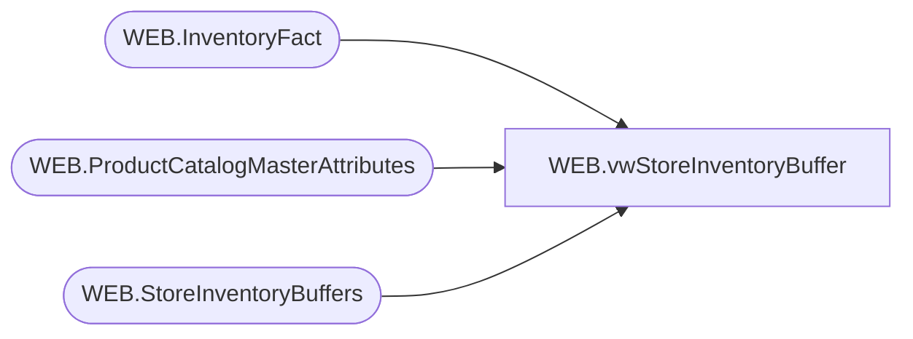

# WEB.vwStoreInventoryBuffer

**Database:** IntegrationStaging  
**Server:** STL-SSIS-P-01  

## Architecture Diagram



## Table Dependencies

| Referenced Table |
|---|
| WEB.InventoryFact |
| WEB.ProductCatalogMasterAttributes |
| WEB.StoreInventoryBuffers |

## View Code

```sql
CREATE view [WEB].[vwStoreInventoryBuffer] 
as

with 
Buffers as
	(
		select 
			pcma.UPC as GTIN,
			invF.LocationCode,
			invF.StyleCode,
			invF.SKUDescription,
			invF.UnbufferedQty,
			isnull(isnull(isnull(StoreSku.BufferQty,StoreDept.BufferQty),Dept.BufferQty),pcma.InventoryBuffer) as StoreInventoryBuffer
		from WEB.InventoryFact invF with (nolock)
		join WEB.ProductCatalogMasterAttributes pcma with (nolock) on invF.StyleCode=pcma.BABWProductID
		left join WEB.StoreInventoryBuffers StoreSku with (nolock) 
			on cast(invF.LocationCode as int)=StoreSku.StoreNumber
			and cast(invF.StyleCode as int)=cast(StoreSku.ItemNumber as int)
			and invF.LocationCode not in ('0013','2013')
		left join WEB.StoreInventoryBuffers StoreDept with (nolock) 
			on cast(invF.LocationCode as int)=StoreDept.StoreNumber
			and left(pcma.HierarchyGroupCode,8)=StoreDept.Department
			and invF.LocationCode not in ('0013','2013')
		left join WEB.StoreInventoryBuffers Dept with (nolock) 
			on left(pcma.HierarchyGroupCode,8)=Dept.Department
			and Dept.StoreNumber is NULL
			and Dept.ItemNumber is NULL
			and invF.LocationCode not in ('0013','2013')
	),
Inventory as
	(
		select 
			GTIN,
			case 
				when (UnbufferedQty - StoreInventoryBuffer) <0
					then 0
				else (UnbufferedQty - StoreInventoryBuffer)
			end as Qty,
			LocationCode,
			StyleCode,
			SKUDescription,
			UnbufferedQty,
			StoreInventoryBuffer
		from Buffers
	)
select 
	cast(GTIN as nvarchar) as 'GTIN',
	cast(sum(QTY) as int) as 'TotalQuantity',
	cast(0 as int) as 'ProtectedQuantity',
	cast(LocationCode as nvarchar) as 'WarehouseCode',
	cast(StyleCode as nvarchar) as 'CustomerSKU',
	cast(StyleCode as nvarchar) as 'ProductCode',
	cast(left(SKUDescription, 50) as nvarchar) as 'Attribute1',
	cast(0 as nvarchar) as PreBackOrderQuantity, 
	convert(nvarchar, getdate(), 121) as InStockDateUTC, 
	cast('' as nvarchar) as InventoryType,
	UnbufferedQty,
	StoreInventoryBuffer
from Inventory
group by GTIN,
	LocationCode,
	StyleCode,
	StyleCode,
	left(SKUDescription, 50),
	UnbufferedQty,
	StoreInventoryBuffer
```

