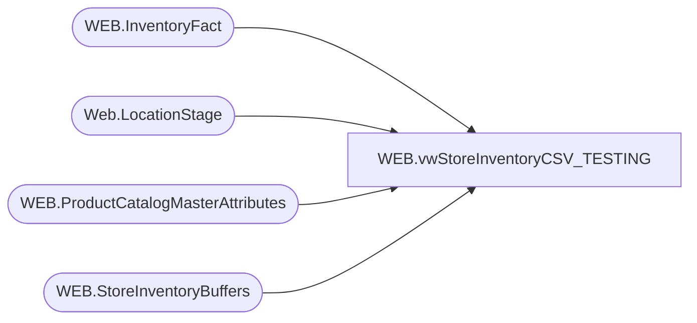

# WEB.vwStoreInventoryCSV_TESTING

**Database:** IntegrationStaging  
**Server:** STL-SSIS-P-01  

## Architecture Diagram



## Table Dependencies

| Referenced Table |
|---|
| WEB.InventoryFact |
| Web.LocationStage |
| WEB.ProductCatalogMasterAttributes |
| WEB.StoreInventoryBuffers |

## View Code

```sql
CREATE view [WEB].[vwStoreInventoryCSV_TESTING]

as

--------------------------------------------------------------------------------------------------
--Dan Tweedie	2020-04-09	Created View for sending Store Inventory to Deck for Buy Online / Ship from Store.
--Lizzy Timm	2024-02-20	Added date filter to Buffers CTE.
---------------------------------------------------------------------------------------------------

with 
Buffers as
	(
		select 
			pcma.UPC as GTIN,
			invF.LocationCode,
			invF.StyleCode,
			invF.SKUDescription,
			invF.UnbufferedQty,
			isnull(isnull(isnull(StoreSku.BufferQty,StoreDept.BufferQty),Dept.BufferQty),pcma.InventoryBuffer) as StoreInventoryBuffer
		from WEB.InventoryFact invF with (nolock)
		join WEB.ProductCatalogMasterAttributes pcma with (nolock) on invF.StyleCode=pcma.BABWProductID and pcma.StoreFrontEligible = 1
		left join WEB.StoreInventoryBuffers StoreSku with (nolock) 
			on cast(invF.LocationCode as int)=StoreSku.StoreNumber
			and cast(invF.StyleCode as int)=cast(StoreSku.ItemNumber as int)
			and invF.LocationCode not in ('0013','2013')
		left join WEB.StoreInventoryBuffers StoreDept with (nolock) 
			on cast(invF.LocationCode as int)=StoreDept.StoreNumber
			and left(pcma.HierarchyGroupCode,8)=StoreDept.Department
			and invF.LocationCode not in ('0013','2013')
		left join WEB.StoreInventoryBuffers Dept with (nolock) 
			on left(pcma.HierarchyGroupCode,8)=Dept.Department
			and Dept.StoreNumber is NULL
			and Dept.ItemNumber is NULL
			and invF.LocationCode not in ('0013','2013')
		WHERE 1=1
		and 
			(
				invF.UnbufferedQty>=99999
				OR 
				(
					(datepart(hh, getdate()) = 0 and isnull(invF.UpdateDate,invF.InsertDate) >= dateadd(hh,-24, getdate()))
					OR (datepart(hh, getdate()) <> 0 and isnull(invF.UpdateDate,invF.InsertDate) >= dateadd(hh,-1, getdate()))
				)
				OR
				isnull(StoreSku.UpdateDate, StoreSku.InsertDate) >= dateadd(hh,-24, getdate())
				OR
				isnull(StoreDept.UpdateDate, StoreDept.InsertDate) >= dateadd(hh,-24, getdate())
				OR
				isnull(StoreSku.UpdateDate, Dept.InsertDate) >= dateadd(hh,-24, getdate())
				OR
				isnull(PCMA.UpdateDate, PCMA.InsertDate) >= dateadd(hh,-24, getdate())
			)
	),
Inventory as
	(
		select 
			GTIN,
			case 
				when (UnbufferedQty - StoreInventoryBuffer) <0
					then 0
				else (UnbufferedQty - StoreInventoryBuffer)
			end as Qty,
			LocationCode,
			StyleCode,
			SKUDescription
		from Buffers
	)
select 
	cast(i.GTIN as nvarchar) as 'GTIN',
	cast(sum(i.QTY) as int) as 'TotalQuantity',
	cast(0 as int) as 'ProtectedQuantity',
	cast(i.LocationCode as nvarchar) as 'WarehouseCode',
	cast(i.StyleCode as nvarchar) as 'CustomerSKU',
	cast(i.StyleCode as nvarchar) as 'ProductCode',
	cast(left(i.SKUDescription, 50) as nvarchar) as 'Attribute1',
	cast(0 as nvarchar) as PreBackOrderQuantity, 
	convert(nvarchar, getdate(), 121) as InStockDateUTC, 
	cast('' as nvarchar) as InventoryType
from Inventory i
where isnull(i.GTIN,'') <> ''
and i.LocationCode not in ('0013', '2013','2019','2079','2080') -- no getting good inventory for the stores '2019','2079','2080'
and i.StyleCode not in ('089173', '080187','081678') --gala tickets
and exists (select wl.Code from Web.LocationStage wl where wl.Code=i.LocationCode)
group by 
	i.GTIN,
	i.LocationCode,
	i.StyleCode,
	i.StyleCode,
	left(i.SKUDescription, 50)
```

