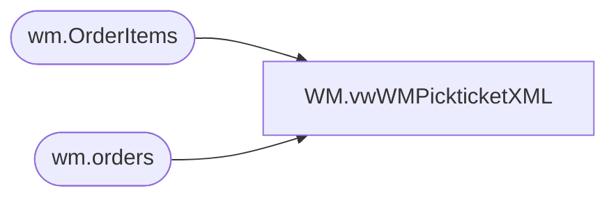

# WM.vwWMPickticketXML

**Database:** IntegrationStaging  
**Server:** STL-SSIS-P-01  

## Architecture Diagram



## Table Dependencies

| Referenced Table |
|---|
| wm.OrderItems |
| wm.orders |

## View Code

```sql
CREATE VIEW [WM].[vwWMPickticketXML]
AS
with XMLStage (XML) as
	(SELECT        (SELECT        '001' AS Company, '001' AS Division, OrderNum AS PktCtlNbr, '980' AS Warehouse, OrderType AS OrderType,
                                                        (SELECT        ShipToFName + ' ' + ShipToLName AS ShipToName, ShipToAddress1 AS ShipToAddr1, ShipToAddress2 AS ShipToAddr2, ShipToCity, ShipToState, ShipToPostalCode ShipToZip, 
                                                                                    ShipToCountry, BillToFName + ' ' + BillToLName AS SoldToName, BillToAddress1 AS SoldToAddr1, BillToAddress2 AS SoldToAddr2, BillToCity SoldToCity, BillToState SoldToState, 
                                                                                    BillToPostalCode SoldToZip, BillTophone TelephoneNumber, BillToCountry SoldToCountry, ShippingMethod AS ShipVia, GetDate() AS ShipDateTime, 51 AS PrintCode, 10 AS StatusCode,
                                                                                     0 AS CollectFreight
                                                          FROM            wm.Orders
                                                          WHERE        orderID = o1.OrderID FOR xml path(''), type) AS PickticketHeaderFields,
                                                        (SELECT        Row_Number() OVER (Partition BY OrderID
                                                          ORDER BY orderID, OrderItemID) - 1 AS PktLineNbr,
                                                        (SELECT        sku AS Style
                                                          FROM            wm.OrderItems
                                                          WHERE        orderItemID = OI1.OrderItemID FOR xml Path('SKUDefinition'), type) AS SKU,
                                                        (SELECT        'F' AS InventoryType, '*' AS CountryOfOrigin FOR xml path(''), type) AS SubSKUFields,
                                                        (SELECT        QTY AS OrigPktQTY, 'WEB' AS CartonType, 'XXL' AS CartonSize, 'WEB' AS InventoryAllocationType, 1 AS WaveProcessingType
                                                          FROM            wm.OrderItems
                                                          WHERE        orderItemID = OI1.OrderItemID FOR xml path(''), type) AS PickticketDetailFields
                          FROM            wm.OrderItems OI1
                          WHERE        OrderID = O1.OrderID FOR xml Path('PickticketDetail'), type) AS ListOfPickticketDetails
FROM            wm.orders O1  where ISNULL(PickTicketFlag,0) = 0 and SourceSite = 'BABW-US' FOR xml path('Pickticket'), root('PickticketBridge')) AS COL1)
select 
	cast(XML as xml) as XMLData
	--[XML] as XMLData
from XMLStage
```

