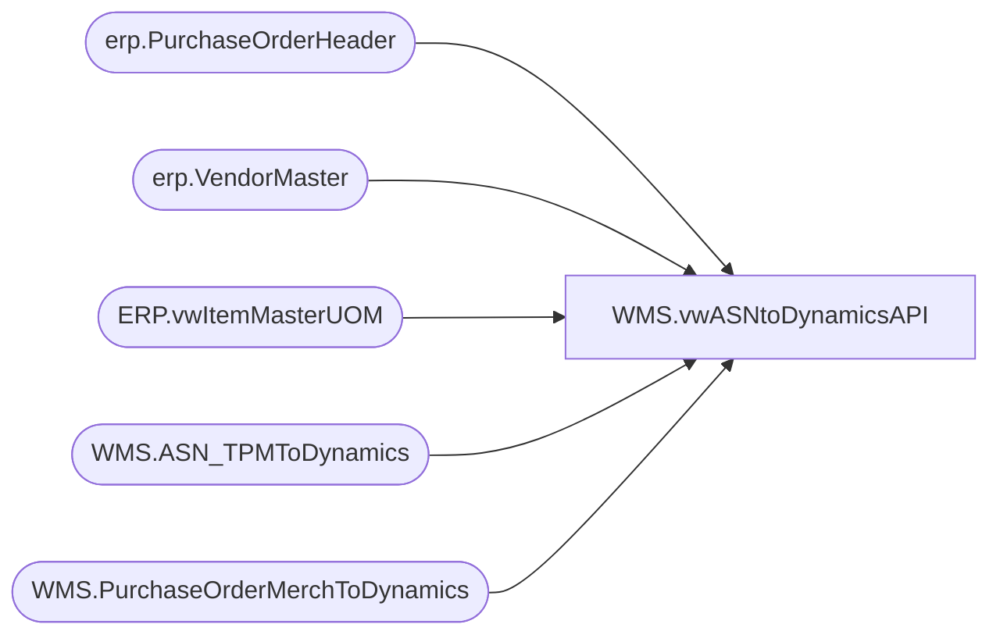

# WMS.vwASNtoDynamicsAPI

**Database:** IntegrationStaging  
**Server:** STL-SSIS-P-01  

## Architecture Diagram



## Table Dependencies

| Referenced Table |
|---|
| erp.PurchaseOrderHeader |
| erp.VendorMaster |
| ERP.vwItemMasterUOM |
| WMS.ASN_TPMToDynamics |
| WMS.PurchaseOrderMerchToDynamics |

## View Code

```sql
CREATE view [WMS].[vwASNtoDynamicsAPI] 

as


with 
POVendorAccount as
	(
		select 
			po.PONumber,
			po.POLineNumber,
			vm.VendorAccountNumber,
			vm.InvoiceVendorAccountNumber,
			po.Company
		from WMS.PurchaseOrderMerchToDynamics po with (nolock)
		join erp.VendorMaster vm with (nolock) 
			on vm.Entity = 
				case when exists 
					(
						select d.PONumber 
						from WMS.PurchaseOrderMerchToDynamics d with (nolock)
						where cast(d.InsertDate as date) < '2020-08-18'--- FIRST DAY OF ECO -- 
						and d.PONumber = po.PONumber
					) then 1200
				else po.Company
			end
			and cast(po.VendorCode as nvarchar) =
				case 
					when vm.OrganizationPhoneticName like '%-%' 
					then substring(vm.OrganizationPhoneticName, 1, charindex('-',vm.OrganizationPhoneticName)-1) 
					else vm.OrganizationPhoneticName 
				end
			and po.FactoryCode =
				case 
					when vm.OrganizationPhoneticName like '%-%' 
					then substring(vm.OrganizationPhoneticName, charindex('-',vm.OrganizationPhoneticName)+1, 20) 
					else po.FactoryCode
				end
	),
VendorAccountForDynamicsPO as
	(
		select 
			h.PurchaseOrderNumber as PONumber,
			h.shipfromid as VendorAccountNumber,
			h.Entity
		from erp.PurchaseOrderHeader h with (nolock)
	),
Summary as
	(
		select 
			a.shipment,	
			a.lpn,	
			a.ItemId,	
			a.PO_nbr,	
			cast(a.Po_Shipment_Line_nbr as int) as Po_Shipment_Line_nbr,	
			cast(a.Qty as int) as Qty,
			cast(a.Unit as nvarchar(10)) as Unit,	
			v.VendorAccountNumber,
			NULL as DynamicsPORefNum,
			concat(a.shipment, '_', v.VendorAccountNumber) as ShipmentVendor,
			v.Company
		from WMS.ASN_TPMToDynamics a
		join POVendorAccount v 
			on a.po_nbr=v.PONumber
			and a.Po_Shipment_Line_nbr=v.POLineNumber
		where 1=1
		and a.SentTo365 is NULL
		--and Shipment = 'SH0000033820'
		UNION
		select 
			a.shipment,	
			a.lpn,	
			a.ItemId,	
			Null as PO_nbr,	
			cast(a.Po_Shipment_Line_nbr as int) as Po_Shipment_Line_nbr,	
			(cast(a.Qty as int) / iUOM.PurchaseMultiple) as Qty,
			cast(iuom.PurchaseUnitSymbol as nvarchar(10)) as Unit,	
			NULL as VendorAccountNumber,
			a.PO_nbr as DynamicsPORefNum,
			concat(a.shipment, '_') as ShipmentVendor,
			v.Entity as Company
		from WMS.ASN_TPMToDynamics a
		join VendorAccountForDynamicsPO v 
			on a.po_nbr=v.PONumber
		join ERP.vwItemMasterUOM iUOM with (nolock) on a.ItemID = iUOM.ProductNumber and iUOM.Entity=1100
		where 1=1
		and a.SentTo365 is NULL
		--and Shipment = 'SH0000033820'
	)
select s.*
from Summary s
```

