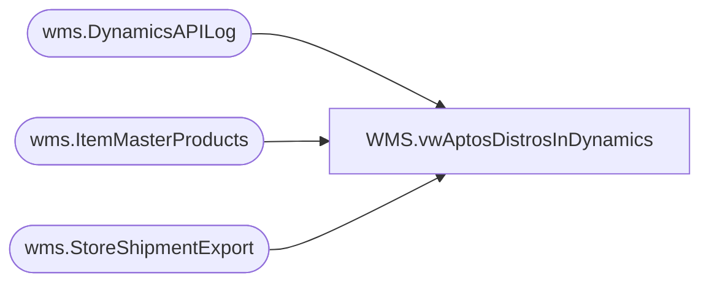

# WMS.vwAptosDistrosInDynamics

**Database:** IntegrationStaging  
**Server:** STL-SSIS-P-01  

## Architecture Diagram



## Table Dependencies

| Referenced Table |
|---|
| wms.DynamicsAPILog |
| wms.ItemMasterProducts |
| wms.StoreShipmentExport |

## View Code

```sql
create view [WMS].[vwAptosDistrosInDynamics]

as


with
StagedShipments as
	(
		select 
			AptosShipmentNumber,
			AptosDistroNumber,
			ToWarehouse,
			ItemNumber,
			sum(quantity) StagedOrderQty
		from wms.StoreShipmentExport with (nolock)
		group by 
			AptosShipmentNumber,
			AptosDistroNumber,
			ToWarehouse,
			ItemNumber
	),
APILog as
	(
		select distinct
			api.StoreShipmentNumber, 
			case 
				when api.ResponseBody like '%Transfer order%was created successully%'
					then substring(api.ResponseBody, charindex('Transfer order ', api.ResponseBody, 1)+15, 12)
				when api.ResponseBody like '%Intercompany sales order%has been created%'
					then replace(substring(api.ResponseBody, charindex('Intercompany sales order ', api.ResponseBody, 1)+24, 16), ' ha', '')
				else NULL
			end as DynamicsOrder
		from wms.DynamicsAPILog api with (nolock)
		where api.IntegrationName in ('WMS_TransferOrderCreateFromAptos', 'WMS_POtoSOIntercompanyOrderCreate')
		and 
			case 
				when api.ResponseBody like '%Transfer order%was created successully%' then 1 
				when api.ResponseBody like '%Intercompany sales order%has been created%' then 1
			else 0 end = 1
	)
select 
	ss.AptosDistroNumber,
	ss.AptosShipmentNumber,	
	api.DynamicsOrder,
	ss.ToWarehouse,	
	ss.ItemNumber,	
	imp.ProductName,
	ss.StagedOrderQty
from StagedShipments ss
join APILog api on ss.AptosShipmentNumber=api.StoreShipmentNumber
join wms.ItemMasterProducts imp with (nolock) 
	on ss.ItemNumber=imp.ProductNumber
```

