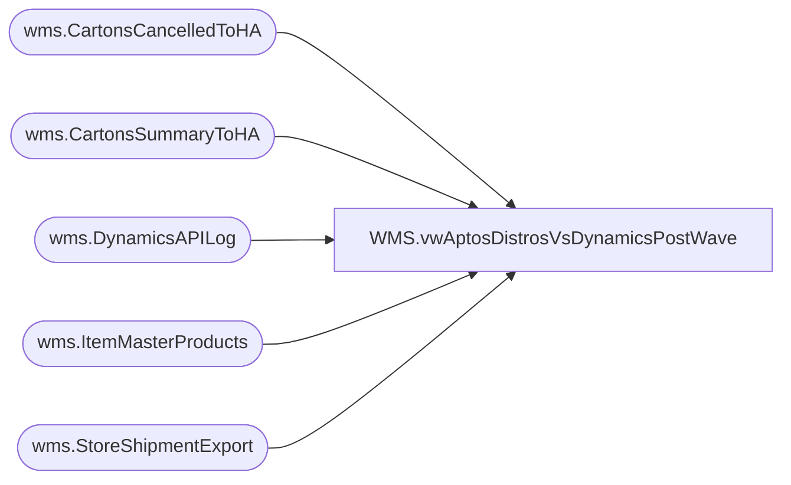

# WMS.vwAptosDistrosVsDynamicsPostWave

**Database:** IntegrationStaging  
**Server:** STL-SSIS-P-01  

## Architecture Diagram



## Table Dependencies

| Referenced Table |
|---|
| wms.CartonsCancelledToHA |
| wms.CartonsSummaryToHA |
| wms.DynamicsAPILog |
| wms.ItemMasterProducts |
| wms.StoreShipmentExport |

## View Code

```sql
CREATE view [WMS].[vwAptosDistrosVsDynamicsPostWave]

as


with
StagedShipments as
	(
		select 
			AptosShipmentNumber,
			AptosDistroNumber,
			ToWarehouse,
			ItemNumber,
			sum(quantity) StagedOrderQty
		from wms.StoreShipmentExport with (nolock)
		--where datediff(dd, ExportDate, getdate()) <= 21
		group by 
			AptosShipmentNumber,
			AptosDistroNumber,
			ToWarehouse,
			ItemNumber
	),
APILog as
	(
		select distinct
			api.StoreShipmentNumber, 
			case 
				when api.ResponseBody like '%Transfer order%was created successully%'
					then substring(api.ResponseBody, charindex('Transfer order ', api.ResponseBody, 1)+15, 12)
				when api.ResponseBody like '%Intercompany sales order%has been created%'
					then replace(substring(api.ResponseBody, charindex('Intercompany sales order ', api.ResponseBody, 1)+24, 16), ' ha', '')
				else NULL
			end as DynamicsOrder
		from wms.DynamicsAPILog api with (nolock)
		where api.IntegrationName in ('WMS_TransferOrderCreateFromAptos', 'WMS_POtoSOIntercompanyOrderCreate')
		and 
			case 
				when api.ResponseBody like '%Transfer order%was created successully%' then 1 
				when api.ResponseBody like '%Intercompany sales order%has been created%' then 1
			else 0 end = 1
	),
PostWave as
	(
		select 
			WaveID,
			OrderNumber,
			ShipTo,
			ItemNumber,
			Description,
			AptosDistroNumber,
			sum(cast(TotalQuantity as int)) as WaveAllocQty,
			cast(dateadd(hh, -5, MessageDateUTC) as date) as WaveDate
		from wms.CartonsSummaryToHA h with (nolock)
		where 1=1
		and OrderNumber is not null
		and Warehouse in ('9980')
		and not exists (select c.ContainerID from wms.CartonsCancelledToHA c with (nolock) where c.ContainerID = h.ContainerID)
		group by 
			WaveID,
			OrderNumber,
			ShipTo,
			ItemNumber,
			Description,
			AptosDistroNumber,
			cast(dateadd(hh, -5, MessageDateUTC) as date)
	),
StagedToWaved as
	(
		select 
			ss.AptosDistroNumber,
			ss.AptosShipmentNumber,	
			api.DynamicsOrder,
			ss.ToWarehouse,	
			ss.ItemNumber,	
			imp.ProductName,
			ss.StagedOrderQty,		
			pw.WaveID,
			pw.WaveAllocQty,
			pw.WaveDate
		from StagedShipments ss
		join APILog api on ss.AptosShipmentNumber=api.StoreShipmentNumber
		join PostWave pw 
			on api.DynamicsOrder=pw.OrderNumber
			and ss.ToWarehouse=pw.ShipTo
			and ss.ItemNumber=pw.ItemNumber
			and ss.AptosDistroNumber=pw.AptosDistroNumber
		join wms.ItemMasterProducts imp with (nolock) 
			on ss.ItemNumber=imp.ProductNumber
	),
StagedToUnWaved as
	(
		select distinct 
			ss.AptosDistroNumber,
			ss.AptosShipmentNumber,	
			api.DynamicsOrder,
			ss.ToWarehouse,	
			ss.ItemNumber,	
			imp.ProductName,
			ss.StagedOrderQty,		
			pw.WaveID,
			isnull(lpw.WaveAllocQty,0) as WaveAllocQty,
			pw.WaveDate
		from StagedShipments ss
		join APILog api on ss.AptosShipmentNumber=api.StoreShipmentNumber
		join PostWave pw 
			on api.DynamicsOrder=pw.OrderNumber
		join wms.ItemMasterProducts imp with (nolock) 
			on ss.ItemNumber=imp.ProductNumber
		left join PostWave lpw 
			on api.DynamicsOrder=lpw.OrderNumber
			and ss.ToWarehouse=lpw.ShipTo
			and ss.ItemNumber=lpw.ItemNumber
			and ss.AptosDistroNumber=lpw.AptosDistroNumber
		where lpw.OrderNumber is NULL
	),
Summary as 
	(
		select *
		from StagedToWaved
		UNION ALL
		select *
		from StagedToUnWaved
	)
select *
from Summary
```

