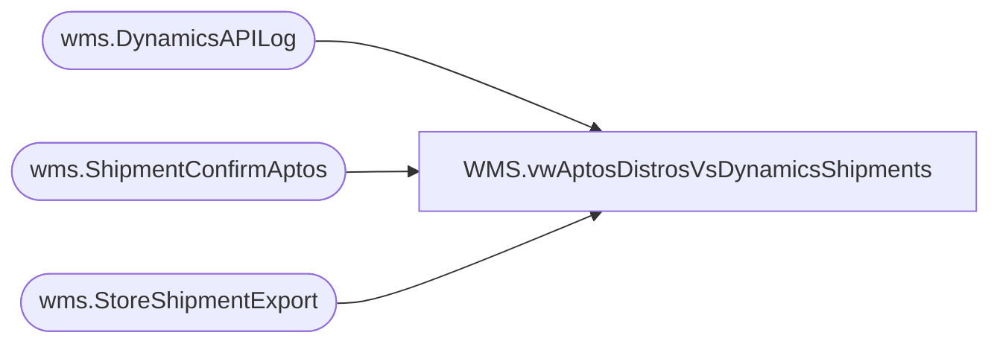

# WMS.vwAptosDistrosVsDynamicsShipments

**Database:** IntegrationStaging  
**Server:** STL-SSIS-P-01  

## Architecture Diagram



## Table Dependencies

| Referenced Table |
|---|
| wms.DynamicsAPILog |
| wms.ShipmentConfirmAptos |
| wms.StoreShipmentExport |

## View Code

```sql
CREATE view [WMS].[vwAptosDistrosVsDynamicsShipments]

as 

with 
StagedShipments as
	(
		select 
			AptosShipmentNumber,
			cast(AptosDistroNumber as varchar) as AptosDistroNumber,
			AptosDistroLineNumber,
			ToWarehouse,
			ItemNumber,
			sum(quantity) StagedOrderQty,
			cast(InsertDate as date) StageDate
		from wms.StoreShipmentExport with (nolock)
		group by 
			AptosShipmentNumber,
			AptosDistroNumber,
			AptosDistroLineNumber,
			ToWarehouse,
			ItemNumber,
			cast(InsertDate as date)
	),
APILog as
	(
		select distinct
			api.StoreShipmentNumber, 
			case 
				when api.ResponseBody like '%Transfer order%was created successully%'
					then substring(api.ResponseBody, charindex('Transfer order ', api.ResponseBody, 1)+15, 12)
				when api.ResponseBody like '%Intercompany sales order%has been created%'
					then replace(substring(api.ResponseBody, charindex('Intercompany sales order ', api.ResponseBody, 1)+24, 16), ' ha', '')
				else NULL
			end as DynamicsOrder
		from wms.DynamicsAPILog api with (nolock)
		where api.IntegrationName in ('WMS_TransferOrderCreateFromAptos', 'WMS_POtoSOIntercompanyOrderCreate')
		and 
			case 
				when api.ResponseBody like '%Transfer order%was created successully%' then 1 
				when api.ResponseBody like '%Intercompany sales order%has been created%' then 1
			else 0 end = 1
	),
ShipConfirm as
	(
		select 
			AptosShipmentID, 
			cast(AptosDistributionNumber as varchar) as AptosDistributionNumber, 
			AptosDistributionDocLineNumber,  
			ToLocation, 
			ItemNumber,
			sum(ShippedQuantity) as ShippedQty,
			cast(ShipConfirmDateTime as date) as ShipDate
		from wms.ShipmentConfirmAptos
		group by 
			AptosShipmentID, 
			AptosDistributionNumber, 
			AptosDistributionDocLineNumber,  
			ToLocation, 
			ItemNumber,
			cast(ShipConfirmDateTime as date)

	),
ShipDate as
	(
		select AptosShipmentID, ShipDate
		from ShipConfirm
		group by AptosShipmentID, ShipDate
	),
StagedToShipped as
	(
		select 
			ss.AptosShipmentNumber,
			ss.AptosDistroNumber,
			ss.AptosDistroLineNumber,
			ss.ToWarehouse,
			ss.ItemNumber,
			ss.StagedOrderQty,
			ss.StageDate,
			api.DynamicsOrder,
			sc.ShippedQty,
			sc.ShipDate
		from StagedShipments ss
		join APILog api on ss.AptosShipmentNumber=api.StoreShipmentNumber
		join ShipConfirm sc 
			on ss.AptosShipmentNumber=sc.AptosShipmentID
			and ss.AptosDistroNumber=sc.AptosDistributionNumber
			and ss.AptosDistroLineNumber=sc.AptosDistributionDocLineNumber
			and ss.ToWarehouse=sc.ToLocation
			and ss.ItemNumber=sc.ItemNumber
	),
StagedNotShipped as
	(
		select 
			ss.AptosShipmentNumber,
			ss.AptosDistroNumber,
			ss.AptosDistroLineNumber,
			ss.ToWarehouse,
			ss.ItemNumber,
			ss.StagedOrderQty,
			ss.StageDate,
			api.DynamicsOrder,
			isnull(scc.ShippedQty,0) ShippedQty,
			sd.ShipDate
		from StagedShipments ss
		join APILog api on ss.AptosShipmentNumber=api.StoreShipmentNumber
		left join ShipConfirm scc 
			on ss.AptosShipmentNumber=scc.AptosShipmentID
			and ss.AptosDistroNumber=scc.AptosDistributionNumber
			and ss.AptosDistroLineNumber=scc.AptosDistributionDocLineNumber
			and ss.ToWarehouse=scc.ToLocation
			and ss.ItemNumber=scc.ItemNumber
		left join ShipDate sd on ss.AptosShipmentNumber=sd.AptosShipmentID 
		where exists (select sc.AptosShipmentID from ShipConfirm sc where ss.AptosShipmentNumber=sc.AptosShipmentID)
		and scc.AptosShipmentID is NULL
	),
--WavedNotShipped as
--	(
--		select 
--			WaveID,
--			OrderNumber,
--			ShipTo,
--			ItemNumber,
--			Description,
--			AptosDistroNumber,
--			sum(cast(TotalQuantity as int)) as WaveAllocQty,
--			cast(dateadd(hh, -5, MessageDateUTC) as date) as WaveDate
--		from wms.CartonsSummaryToHA h with (nolock)
--		where 1=1
--		and OrderNumber is not null
--		and Warehouse in ('9980')
--		and not exists (select c.ContainerID from wms.CartonsCancelledToHA c with (nolock) where c.ContainerID = h.ContainerID)
--		group by 
--			WaveID,
--			OrderNumber,
--			ShipTo,
--			ItemNumber,
--			Description,
--			AptosDistroNumber,
--			cast(dateadd(hh, -5, MessageDateUTC) as date)
--	),
Summary as
	(
		select *
		from StagedToShipped
		UNION ALL
		select *
		from StagedNotShipped
	)
select *
from Summary
where StageDate >=  cast((getdate()-8) as date) 
--where StagedOrderQty > ShippedQty
```

