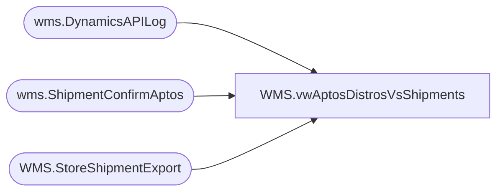

# WMS.vwAptosDistrosVsShipments

**Database:** IntegrationStaging  
**Server:** STL-SSIS-P-01  

## Architecture Diagram



## Table Dependencies

| Referenced Table |
|---|
| wms.DynamicsAPILog |
| wms.ShipmentConfirmAptos |
| WMS.StoreShipmentExport |

## View Code

```sql
CREATE view [WMS].[vwAptosDistrosVsShipments]

as 

with 
DistrosExported as
	(
		select 
			AptosShipmentNumber	as BABAptosShipmentNumber,
			cast(AptosDistroNumber as varchar) as BABAptosDistroNumber,
			cast(AptosDistroLineNumber as int) as BABAptosDistroLineNumber,
			ToWarehouse,
			ItemNumber,
			--convert(varchar(10), ShipDate,101) as ShipDate,
			InsertDate
		from WMS.StoreShipmentExport 
		where 1=1
		and datediff(dd, ExportDate, getdate()) <=30
	),
Shipments as
	(
		select 
			AptosShipmentID as shipment, 
			cast(AptosDistributionNumber as varchar) as distribution_number, 
			cast(AptosDistributionDocLineNumber as int) as distribution_line,  
			ToLocation as location_code, 
			ItemNumber,
			InsertDate
		from wms.ShipmentConfirmAptos
		where 
			Warehouse='9980' 
			and AptosShipmentID<>''
			and AptosDistributionNumber not in (0, '')
			and AptosDistributionDocLinenumber not in (0, '')
	),
MaxDate as
	(
		select StoreShipmentNumber, max(InsertDate) as MaxDate
		from wms.DynamicsAPILog 
		where IntegrationName in ('WMS_TransferOrderCreateFromAptos', 'WMS_POtoSOIntercompanyOrderCreate')
		--and datediff(dd, InsertDate, getdate()) <= 7
		group by StoreShipmentNumber
	),
APILog as
	(
		select 
			api.StoreShipmentNumber, 
			case 
				when api.ResponseBody like '%Transfer order%was created successully%' then 1 
				when api.ResponseBody like '%Intercompany sales order%has been created%' then 1
			else 0 end as APISuccess,
			case 
				when api.ResponseBody like '%Transfer order%was created successully%'
					then substring(api.ResponseBody, charindex('Transfer order ', api.ResponseBody, 1)+15, 12)
				when api.ResponseBody like '%Intercompany sales order%has been created%'
					then replace(substring(api.ResponseBody, charindex('Intercompany sales order ', api.ResponseBody, 1)+24, 16), ' ha', '')
				else NULL
			end as DynamicsOrder,
			api.responseBody,
			api.BatchID,
			api.InsertDate
		from wms.DynamicsAPILog api
		join MaxDate md 
			on api.StoreShipmentNumber=md.StoreShipmentNumber 
			and api.InsertDate=md.MaxDate
		where api.IntegrationName in ('WMS_TransferOrderCreateFromAptos', 'WMS_POtoSOIntercompanyOrderCreate')
		--and datediff(dd, InsertDate, getdate()) <= 7
	)
select 
	de.BABAptosDistroNumber,
	de.BABAptosDistroLineNumber,
	de.BABAptosShipmentNumber,
	de.InsertDate DistroShipmentStageDate,
	de.ToWarehouse,
	de.ItemNumber,
	--de.ShipDate,
	isnull(api.ApiSuccess,0) as APISuccess,
	cast(isnull(api.DynamicsOrder, 'not found') as varchar(52)) as DynamicsOrder,
	case when s.shipment is NULL then 'NO' else 'YES' end as DynamicsShipmentLogged,
	s.InsertDate ShipmentStageDate
from DistrosExported de
left join Shipments s 
	on de.BABAptosShipmentNumber=s.shipment
	and de.BABAptosDistroNumber=s.distribution_number
	and de.BABAptosDistroLineNumber=s.distribution_line
	and de.ToWarehouse=s.location_code
	and de.ItemNumber=s.ItemNumber
left join APILog api 
	on de.BABAptosShipmentNumber=api.StoreShipmentNumber
```

