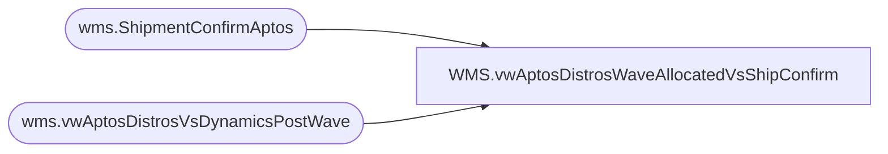

# WMS.vwAptosDistrosWaveAllocatedVsShipConfirm

**Database:** IntegrationStaging  
**Server:** STL-SSIS-P-01  

## Architecture Diagram



## Table Dependencies

| Referenced Table |
|---|
| wms.ShipmentConfirmAptos |
| wms.vwAptosDistrosVsDynamicsPostWave |

## View Code

```sql
CREATE view [WMS].[vwAptosDistrosWaveAllocatedVsShipConfirm]

as 

with 
WaveAllocated as
	(
		select *
		from wms.vwAptosDistrosVsDynamicsPostWave
		where WaveAllocQty <> 0
	),
ShipConfirm as
	(
		select 
			AptosShipmentID, 
			AptosDistributionNumber, 
			ToLocation, 
			ItemNumber,
			sum(ShippedQuantity) as ShippedQty,
			cast(ShipConfirmDateTime as date) as ShipDate
		from wms.ShipmentConfirmAptos
		group by 
			AptosShipmentID, 
			AptosDistributionNumber, 
			AptosDistributionDocLineNumber,  
			ToLocation, 
			ItemNumber,
			cast(ShipConfirmDateTime as date)
	)
select
	wa.AptosDistroNumber,	
	wa.AptosShipmentNumber,	
	wa.DynamicsOrder,	
	wa.ToWarehouse,	
	wa.ItemNumber,	
	wa.ProductName,	
	wa.WaveAllocQty,	
	wa.WaveDate,
	isnull(sc.ShippedQty,0) ShippedQty,
	sc.ShipDate
from WaveAllocated wa
left join ShipConfirm sc
	on wa.AptosDistroNumber=sc.AptosDistributionNumber
	and wa.AptosShipmentNumber=sc.AptosShipmentID
	and wa.ToWarehouse=sc.ToLocation
	and wa.ItemNumber=sc.ItemNumber
where exists (select s.AptosShipmentID from ShipConfirm s where wa.AptosShipmentNumber=s.AptosShipmentID)
```

