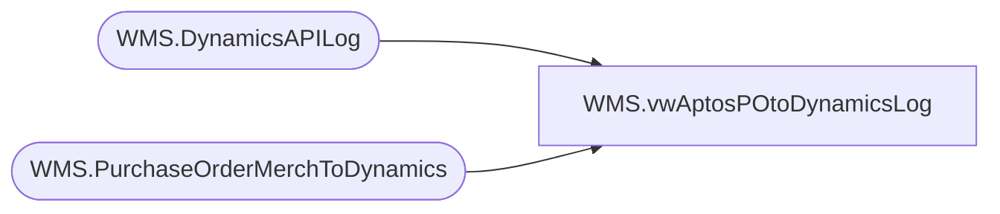

# WMS.vwAptosPOtoDynamicsLog

**Database:** IntegrationStaging  
**Server:** STL-SSIS-P-01  

## Architecture Diagram



## Table Dependencies

| Referenced Table |
|---|
| WMS.DynamicsAPILog |
| WMS.PurchaseOrderMerchToDynamics |

## View Code

```sql
CREATE view [WMS].[vwAptosPOtoDynamicsLog]
as

with
APILog as
	(
		select 
			e.PONumber as AptosPONumber, 
			api.InsertDate ExportedDate,
			case 
					when substring(api.ResponseBody, charindex('Purchase order PO1200', api.ResponseBody, 1)+15, 11) like 'PO1200%' 
						then substring(api.ResponseBody, charindex('Purchase order PO1200', api.ResponseBody, 1)+15, 11) 
					else NULL
			end as Dynamics1200PO,
			case 
				when substring(api.ResponseBody, charindex('Purchase order PO1100', api.ResponseBody, 1)+15, 11) like 'PO1100%'
					then substring(api.ResponseBody, charindex('Purchase order PO1100', api.ResponseBody, 1)+15, 11)
				else NULL
			end as Dynamics1100PO,
			api.PO_OrderAccountNumber as VendorAccount
		from WMS.PurchaseOrderMerchToDynamics e with (nolock)
		left join WMS.DynamicsAPILog api with (nolock)
			on api.IntegrationName='WMS_PurchaseOrderToDynamics'
			and e.BatchID=api.BatchID
			and e.PONumber=api.AptosDocumentNumber 
		group by 
			e.PONumber, 
			api.InsertDate,
			case 
					when substring(api.ResponseBody, charindex('Purchase order PO1200', api.ResponseBody, 1)+15, 11) like 'PO1200%' 
						then substring(api.ResponseBody, charindex('Purchase order PO1200', api.ResponseBody, 1)+15, 11) 
					else NULL
			end,
			case 
				when substring(api.ResponseBody, charindex('Purchase order PO1100', api.ResponseBody, 1)+15, 11) like 'PO1100%'
					then substring(api.ResponseBody, charindex('Purchase order PO1100', api.ResponseBody, 1)+15, 11)
				else NULL
			end,
			api.PO_OrderAccountNumber
	)
select *
from APILog
where Dynamics1200PO is not null
or Dynamics1100PO is not null
```

