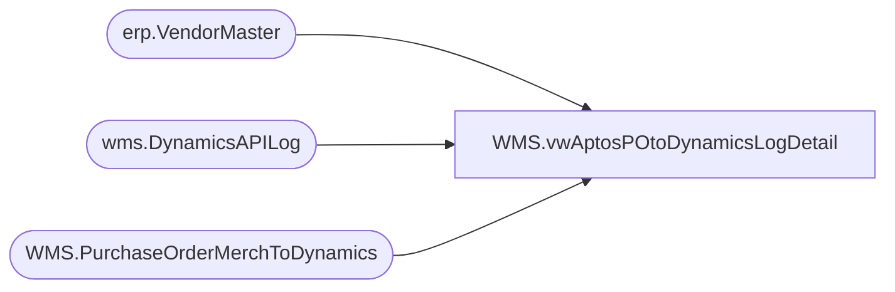

# WMS.vwAptosPOtoDynamicsLogDetail

**Database:** IntegrationStaging  
**Server:** STL-SSIS-P-01  

## Architecture Diagram



## Table Dependencies

| Referenced Table |
|---|
| erp.VendorMaster |
| wms.DynamicsAPILog |
| WMS.PurchaseOrderMerchToDynamics |

## View Code

```sql
CREATE view [WMS].[vwAptosPOtoDynamicsLogDetail]
as 
with 
POHistory as
	(
		select concat(AptosDocumentNumber, '_', PO_OrderAccountNumber) as POVendorAccountForJoin
		from wms.DynamicsAPILog with (nolock)
		where IntegrationName = 'WMS_PurchaseOrderToDynamics'
		and ResponseBody like '%hasErrors%false%'
		group by concat(AptosDocumentNumber, '_', PO_OrderAccountNumber)
	),
PODetail as 
	(
		select  --1200 PO
			po.Company,
			po.Warehouse,
			po.PONumber as AptosPONumber,
			po.POLineNumber,
			po.ItemNumber,
			po.Quantity,
			'ea' as UnitOfMeasure,
			vm.VendorAccountNumber, 
			vm.InvoiceVendorAccountNumber as InvoiceAccount,
			po.BatchID
		from WMS.PurchaseOrderMerchToDynamics po with (nolock)
		join erp.VendorMaster vm with (nolock) 
			on vm.Entity = 
				case when exists 
					(
						select d.PONumber 
						from WMS.PurchaseOrderMerchToDynamics d with (nolock)
						where cast(d.InsertDate as date) < '2020-08-18'--- FIRST DAY OF ECO -- 
						and d.PONumber = po.PONumber
					) then 1200
				else po.Company
			end
			and cast(po.VendorCode as nvarchar) =
				case 
					when vm.OrganizationPhoneticName like '%-%' 
					then substring(vm.OrganizationPhoneticName, 1, charindex('-',vm.OrganizationPhoneticName)-1) 
					else vm.OrganizationPhoneticName 
				end
			and po.FactoryCode =
				case 
					when vm.OrganizationPhoneticName like '%-%' 
					then substring(vm.OrganizationPhoneticName, charindex('-',vm.OrganizationPhoneticName)+1, 20) 
					else po.FactoryCode
				end
	)
select 
	e.*, 
	case 
		when substring(api.ResponseBody, charindex('Purchase order PO1200', api.ResponseBody, 1)+15, 11) like 'PO1200%' 
			then substring(api.ResponseBody, charindex('Purchase order PO1200', api.ResponseBody, 1)+15, 11) 
		else NULL
	end as Dynamics1200PO,
	case 
	when substring(api.ResponseBody, charindex('Purchase order PO1100', api.ResponseBody, 1)+15, 11) like 'PO1100%'
		then substring(api.ResponseBody, charindex('Purchase order PO1100', api.ResponseBody, 1)+15, 11)
	else NULL
	end as Dynamics1100PO
from PODetail e
left join WMS.DynamicsAPILog api with (nolock)
			on api.IntegrationName='WMS_PurchaseOrderToDynamics'
			and e.BatchID=api.BatchID
			and e.AptosPONumber=api.AptosDocumentNumber 
			and api.PO_OrderAccountNumber=e.VendorAccountNumber
```

