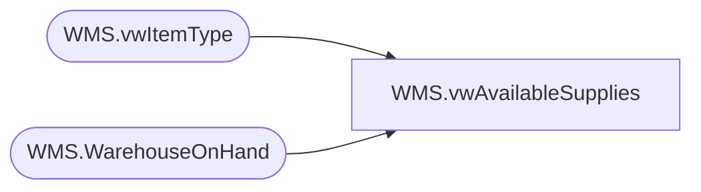

# WMS.vwAvailableSupplies

**Database:** IntegrationStaging  
**Server:** STL-SSIS-P-01  

## Architecture Diagram



## Table Dependencies

| Referenced Table |
|---|
| WMS.vwItemType |
| WMS.WarehouseOnHand |

## View Code

```sql
CREATE VIEW [WMS].[vwAvailableSupplies]
AS
SELECT        w.ItemNumber, InventoryWarehouseId, AvailableOnHandQuantity
FROM            WMS.WarehouseOnHand w WITH (NOLOCK)
INNER JOIN  WMS.vwItemType it WITH (NOLOCK) ON w.ItemNumber=it.ItemNumber and w.dataAreaId=it.entity
WHERE        (InventoryWarehouseId IN ('8010', '9960', '9980', '9940', '9970')) AND it.ItemType = 'Supplies'
```

