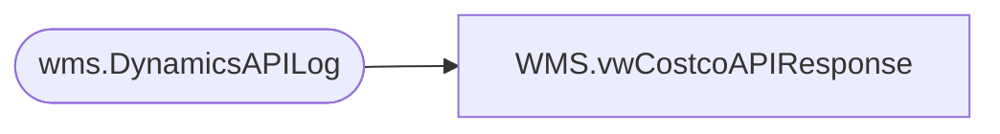

# WMS.vwCostcoAPIResponse

**Database:** IntegrationStaging  
**Server:** STL-SSIS-P-01  

## Architecture Diagram



## Table Dependencies

| Referenced Table |
|---|
| wms.DynamicsAPILog |

## View Code

```sql
CREATE view [WMS].[vwCostcoAPIResponse]
as 
select 
	CostcoOrderNumber,
	case 
		when upper(replace(substring(ResponseBody, charindex('hasErrors', ResponseBody)+11, 5), ',', '')) <> 'TRUE'
			then substring(ResponseBody, charindex('Sales order', ResponseBody)+12, 12)
		else 'n/a'
	end as SalesOrderNumber,
	upper(replace(substring(ResponseBody, charindex('hasErrors', ResponseBody)+11, 5), ',', '')) as hasError,
	case 
		when upper(replace(substring(ResponseBody, charindex('hasErrors', ResponseBody)+11, 5), ',', '')) = 'TRUE'
			then substring(ResponseBody, charindex('responseMsg', ResponseBody)+13, 4000) 
		else 'n/a'
	end as APIError,
	BatchID
from wms.DynamicsAPILog
where IntegrationName ='WMS_CostcoPurchaseOrdersToDynamics'
```

