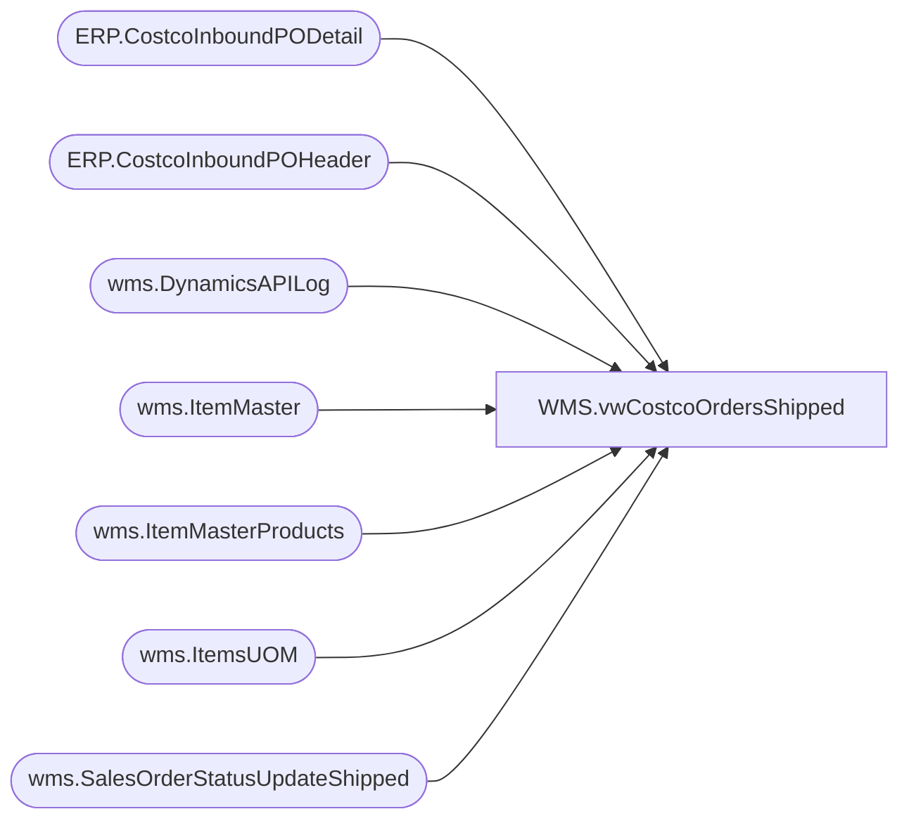

# WMS.vwCostcoOrdersShipped

**Database:** IntegrationStaging  
**Server:** STL-SSIS-P-01  

## Architecture Diagram



## Table Dependencies

| Referenced Table |
|---|
| ERP.CostcoInboundPODetail |
| ERP.CostcoInboundPOHeader |
| wms.DynamicsAPILog |
| wms.ItemMaster |
| wms.ItemMasterProducts |
| wms.ItemsUOM |
| wms.SalesOrderStatusUpdateShipped |

## View Code

```sql
CREATE view [WMS].[vwCostcoOrdersShipped]


as

with 
UOM as
	(
		select 
			im.ItemNumber,
			p.ProductName,
			im.ProductSearchName,
			im.InventoryUnitSymbol,
			im.NecessaryProductionWorkingTimeSchedulingPropertyId,
			isnull(uom.Factor,1) as Factor
		from wms.ItemMaster im with (nolock)
		left join wms.ItemsUOM uom with (nolock) 
			on im.entity = uom.entity 
			and im.ItemNumber = uom.ProductNumber
			and im.InventoryUnitSymbol = uom.FromUnitSymbol
			and uom.ToUnitSymbol = 'wmea'
		join wms.ItemMasterProducts p with (nolock) on im.ItemNumber=p.ProductNumber
		where im.entity=1100
		and isnumeric(im.ItemNumber) = 1
	),
CostcoPOData as
	(
		select 
			'9980' as 'inventLocationId',
			h.CUSTOMERREQUISITIONNUMBER as 'eCommOrderRefNum',
			h.CUSTOMERSORDERREFERENCE as CostcoWarehouse,
			'ORIGIN' as 'dlvTerms',
			'FEDEX-2DAY' as 'dlvMode',
			h.DELIVERYADDRESSNAME as 'deliveryName',
			h.DELIVERYADDRESSSTREET as 'address',
			h.DELIVERYADDRESSCITY as 'city',
			h.DELIVERYADDRESSSTATEID as 'state',
			h.DELIVERYADDRESSZIPCODE as 'zipCode',
			'USA' as 'country',
			d.ITEMNUMBER as 'itemID',
			uom.ProductName,
			d.ORDEREDSALESQUANTITY / UOM.Factor as 'salesQty',
			UOM.InventoryUnitSymbol as 'Unit'
		from ERP.CostcoInboundPOHeader h with (nolock)
		join ERP.CostcoInboundPODetail d with (nolock) on h.PurchaseOrderID = d.PurchaseOrderID
		join UOM on d.ItemNumber=uom.ItemNumber
	),
APILog as
	(
		select 
			api.CostcoOrderNumber,
			substring(api.ResponseBody, charindex('Sales order', api.ResponseBody, 1)+12, 12) as DynamicsOrder,
			api.InsertDate as APIDate
		from wms.DynamicsAPILog api with (nolock)
		where api.IntegrationName='WMS_CostcoPurchaseOrdersToDynamics'
		and api.CostcoOrderNumber is not null
		and api.ResponseBody like '%hasErrors":false%'
	),
ShipmentData as
	(
		select 
			s.OrderNum,
			s.WaveId,	
			s.ShipmentId,	
			s.ShipmentStatus,	
			s.ModeOfDelivery,	
			s.MasterTrackingNumber,	
			s.ContainerId,	
			s.ItemId,	
			s.ShippedQty,	
			s.ShipConfirmDateTime
		from wms.SalesOrderStatusUpdateShipped s with (nolock)
		where Warehouse='9980'
	)

select
	api.CostcoOrderNumber,
	api.DynamicsOrder,
	api.APIDate,
	cd.inventLocationId,	
	cd.eCommOrderRefNum as CostcoPONumber,		
	cd.dlvMode,	
	cd.itemID,	
	cd.ProductName,
	cd.salesQty,		
	cd.Unit,
	s.WaveId,	
	s.ShipmentId,	
	s.ShipmentStatus,	
	s.MasterTrackingNumber,	
	s.ContainerId,	
	s.ShippedQty,	
	s.ShipConfirmDateTime,
	cd.CostcoWarehouse,
	cd.deliveryName,	
	cd.address,	
	cd.city,	
	cd.state,	
	cd.zipCode,	
	cd.country
from CostCoPOData cd
join APILog api on cd.eCommOrderRefNum=api.CostcoOrderNumber
join ShipmentData s 
	on api.DynamicsOrder=s.OrderNum
	and cd.ItemID=s.ItemID
```

