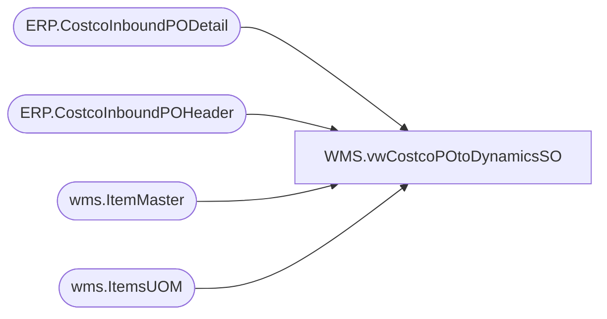

# WMS.vwCostcoPOtoDynamicsSO

**Database:** IntegrationStaging  
**Server:** STL-SSIS-P-01  

## Architecture Diagram



## Table Dependencies

| Referenced Table |
|---|
| ERP.CostcoInboundPODetail |
| ERP.CostcoInboundPOHeader |
| wms.ItemMaster |
| wms.ItemsUOM |

## View Code

```sql
CREATE view [WMS].[vwCostcoPOtoDynamicsSO]

as


with 
UOM as
	(
		select 
			im.ItemNumber,
			im.InventoryUnitSymbol,
			im.NecessaryProductionWorkingTimeSchedulingPropertyId,
			isnull(uom.Factor,1) as Factor
		from wms.ItemMaster im
		left join wms.ItemsUOM uom with (nolock) 
			on im.entity = uom.entity 
			and im.ItemNumber = uom.ProductNumber
			and im.InventoryUnitSymbol = uom.FromUnitSymbol
			and uom.ToUnitSymbol = 'wmea'
		where im.entity=1100
		--and im.ItemNumber in ('055798','021912')
	)
select 
	'9980' as 'inventLocationId',
	h.CUSTOMERREQUISITIONNUMBER as 'eCommOrderRefNum',
	h.INVOICECUSTOMERACCOUNTNUMBER as 'invoiceAccount',
	h.ORDERINGCUSTOMERACCOUNTNUMBER as 'orderAccount',
	'ORIGIN' as 'dlvTerms',
	'FEDEX-2DAY' as 'dlvMode',
	NULL as orderType,
	h.DELIVERYADDRESSNAME as 'deliveryName',
	h.DELIVERYADDRESSSTREET as 'address',
	h.DELIVERYADDRESSCITY as 'city',
	h.DELIVERYADDRESSSTATEID as 'state',
	h.DELIVERYADDRESSZIPCODE as 'zipCode',
	--h.DELIVERYADDRESSCOUNTRYREGIONID as 'country',
	'USA' as 'country',
	d.ITEMNUMBER as 'itemID',
	--d.ORDEREDSALESQUANTITY as 'salesQty',
	d.ORDEREDSALESQUANTITY / UOM.Factor as 'salesQty',
	0 as 'eCommUnitPrice',
	d.CUSTOMERSLINENUMBER as 'lineNumber',
	0 as 'totalValue',
	--d.SALESUNITSYMBOL as 'unit'
	UOM.InventoryUnitSymbol as 'Unit'
from ERP.CostcoInboundPOHeader h
join ERP.CostcoInboundPODetail d on h.PurchaseOrderID = d.PurchaseOrderID
join UOM on d.ItemNumber=uom.ItemNumber
where Transmitted = 0
```

