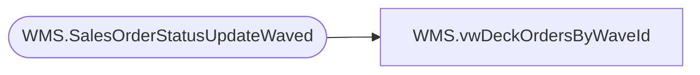

# WMS.vwDeckOrdersByWaveId

**Database:** IntegrationStaging  
**Server:** STL-SSIS-P-01  

## Architecture Diagram



## Table Dependencies

| Referenced Table |
|---|
| WMS.SalesOrderStatusUpdateWaved |

## View Code

```sql
CREATE VIEW [WMS].[vwDeckOrdersByWaveId]
AS

WITH uniqueDeckOrderNumbers(WaveId, DeckSalesOrderReferenceNumber)
AS
(
SELECT [WaveId]
      ,[DeckSalesOrderReferenceNumber]
  FROM [IntegrationStaging].[WMS].[SalesOrderStatusUpdateWaved]
  GROUP BY WaveId, DeckSalesOrderReferenceNumber
)
SELECT ISNULL(ROW_NUMBER() OVER(ORDER BY WaveId ASC), -1) AS RowId
      ,WaveId
	  ,DeckSalesOrderReferenceNumber
FROM uniqueDeckOrderNumbers
```

