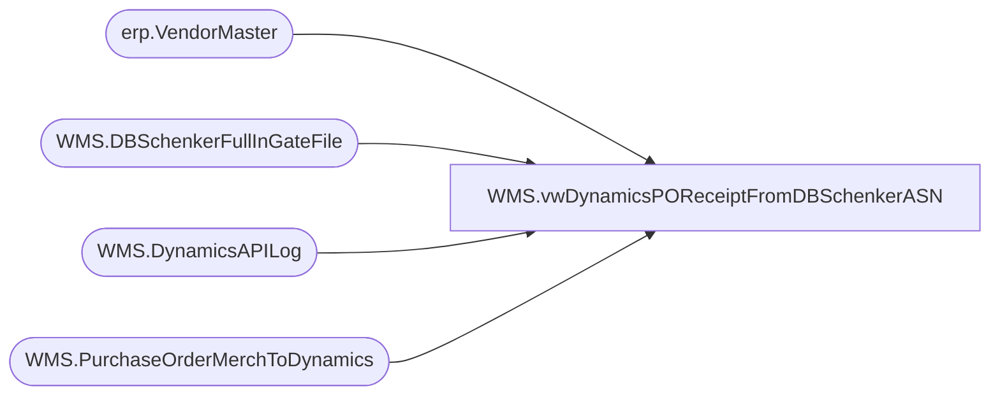

# WMS.vwDynamicsPOReceiptFromDBSchenkerASN

**Database:** IntegrationStaging  
**Server:** STL-SSIS-P-01  

## Architecture Diagram



## Table Dependencies

| Referenced Table |
|---|
| erp.VendorMaster |
| WMS.DBSchenkerFullInGateFile |
| WMS.DynamicsAPILog |
| WMS.PurchaseOrderMerchToDynamics |

## View Code

```sql
CREATE view [WMS].[vwDynamicsPOReceiptFromDBSchenkerASN]

as

--=============================================================================================================================================================
--		Dan Tweedie	2019-09-09	Created view to join staged DB Schenker PO Data to Dynamics PO for purpose of creating Dynamics PO Receipt into 1200 Entity
--=============================================================================================================================================================


with 
DynamicsPO as
	(
		select distinct
			e.PONumber as AptosPONumber, 
			case 
					when substring(api.ResponseBody, charindex('Purchase order PO1200', api.ResponseBody, 1)+15, 11) like 'PO1200%' 
						then substring(api.ResponseBody, charindex('Purchase order PO1200', api.ResponseBody, 1)+15, 11) 
					else NULL
			end as Dynamics1200PO,
			e.VendorCode,
			e.FactoryCode,
			vm.VendorAccountNumber
		from WMS.PurchaseOrderMerchToDynamics e with (nolock)
		join erp.VendorMaster vm with (nolock) 
			on vm.Entity = 1200
			and cast(e.VendorCode as nvarchar) =
				case 
					when vm.OrganizationPhoneticName like '%-%' 
					then substring(vm.OrganizationPhoneticName, 1, charindex('-',vm.OrganizationPhoneticName)-1) 
					else vm.OrganizationPhoneticName 
				end
			and e.FactoryCode =
				case 
					when vm.OrganizationPhoneticName like '%-%' 
					then substring(vm.OrganizationPhoneticName, charindex('-',vm.OrganizationPhoneticName)+1, 20) 
					else e.FactoryCode
				end 
		join WMS.DynamicsAPILog api with (nolock)
			on api.IntegrationName='WMS_PurchaseOrderToDynamics'
			and e.BatchID=api.BatchID
			and e.PONumber=api.AptosDocumentNumber 
			and vm.VendorAccountNumber=api.PO_OrderAccountNumber

		where 
			case 
				when substring(api.ResponseBody, charindex('Purchase order PO1200', api.ResponseBody, 1)+15, 11) like 'PO1200%' 
					then substring(api.ResponseBody, charindex('Purchase order PO1200', api.ResponseBody, 1)+15, 11) 
				else NULL
			end is not NULL
	),
DBS as
	(
		select 
			PurchaseOrder,
			ProductCode,
			cast(ShippedQty as int) as ShippedQty,
			convert(varchar, cast(fullIngateAtLoadPort as date),101) as InGateDate,
			--left(replace(replace(replace(replace(convert(varchar, left(fullInGateatLoadPort, 23), 120), 'T', ''),'-',''),'.',''),':',''),12) as InGateDate,
			Manufacturercode as FactoryCode
		from WMS.DBSchenkerFullInGateFile 
		where POReceiptExportDate is NULL
	)
select
	dbs.*, 
	Dynamics1200PO
from DBS 
join DynamicsPO dyn 
	on dbs.PurchaseOrder=dyn.AptosPONumber
	and dbs.FactoryCode=dyn.FactoryCode
```

