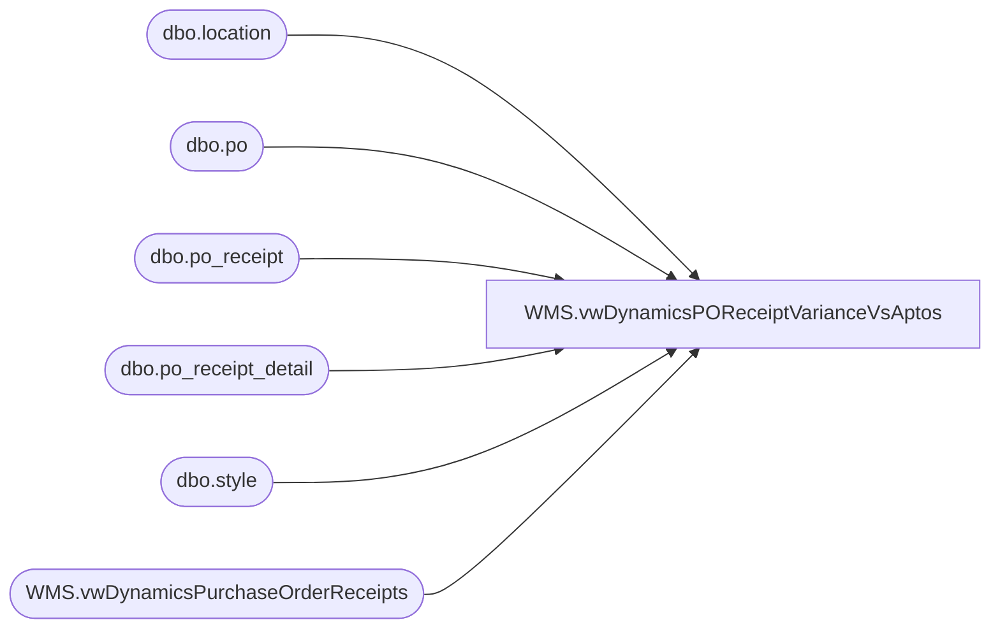

# WMS.vwDynamicsPOReceiptVarianceVsAptos

**Database:** IntegrationStaging  
**Server:** STL-SSIS-P-01  

## Architecture Diagram



## Table Dependencies

| Referenced Table |
|---|
| dbo.location |
| dbo.po |
| dbo.po_receipt |
| dbo.po_receipt_detail |
| dbo.style |
| WMS.vwDynamicsPurchaseOrderReceipts |

## View Code

```sql
CREATE view [WMS].[vwDynamicsPOReceiptVarianceVsAptos]

as

with 
DynReceipts as 
	(
		select 
			ReceivingWarehouseID,
			AptosPONumber PurchaseOrderNumber,
			--ProductReceiptDate as ReceiptDate,
			ItemNumber,
			ProductDescription,
			sum(ReceivedPurchaseQuantity) Quantity
		from WMS.vwDynamicsPurchaseOrderReceipts with (nolock)
		where 1=1
		and ReceivingWarehouseID in (
										'0013',
										'0980',
										'0960',
										'2970',
										'1013',
										'9980',
										'9960',
										'9970'
									)
		and ProductReceiptDate >= getdate()-90
		and ProductReceiptDate <= getdate()
		group by 
			ReceivingWarehouseID,
			AptosPONumber,
			--ProductReceiptDate,
			ItemNumber,
			ProductDescription
	),
AptosReceipts as
	(
		select 
			po.po_no PONumber,
			--cast(pr.receive_date as date) AptosReceiptDate,
			s.style_code,
			sum(prd.units_received) AptosReceiptQty,
			case 
				when l.location_code='0013' then '1013'
				when l.location_code='0980' then '9980'
				when l.location_code='0960' then '9960'
				when l.location_code='2970' then '9970'
			end as ReceivingWarehouse
		from bedrockdb02.me_01.dbo.po po with (nolock)
		join bedrockdb02.me_01.dbo.po_receipt pr with (nolock) on po.po_id=pr.po_id
		join bedrockdb02.me_01.dbo.location l with (nolock) on pr.location_id=l.location_id
		join bedrockdb02.me_01.dbo.po_receipt_detail prd with (nolock) on pr.po_receipt_id=prd.po_receipt_id
		join bedrockdb02.me_01.dbo.style s with (nolock) on prd.style_id=s.style_id
		where 1=1
		and exists (
						select dr.PurchaseOrderNumber 
						from DynReceipts dr 
						where dr.PurchaseOrderNumber=po.po_no 
						and dr.ItemNumber=s.style_code 
						--and cast(pr.receive_date as date)= dr.ReceiptDate
					)
		and l.location_code in ('0013', '0980', '0960','2970')
		group by 
			po.po_no,
			--cast(pr.receive_date as date),
			s.style_code,
			l.location_code
	)
select 
	d.ReceivingWarehouseID,
	--d.ReceiptDate,
	d.PurchaseOrderNumber,
	d.ItemNumber,
	d.ProductDescription,
	d.Quantity,
	isnull(a.AptosReceiptQty,0) as AptosReceiptQty,
	d.Quantity-isnull(a.AptosReceiptQty,0) VarianceQty
from DynReceipts d
left join AptosReceipts a 
	on d.PurchaseOrderNumber=a.PONumber
	and d.ItemNumber=a.style_code
	--and d.ReceiptDate=isnull(a.AptosReceiptDate,'3030-12-31')
	and d.ReceivingWarehouseID=a.ReceivingWarehouse
where 1=1
--and (d.ReceiptDate=isnull(a.AptosReceiptDate,'3030-12-31') or a.AptosReceiptDate is null)
--and datediff(dd, d.ReceiptDate, getdate()) <= 90
and isnull(a.AptosReceiptQty,0) <> isnull(d.Quantity,0)
```

