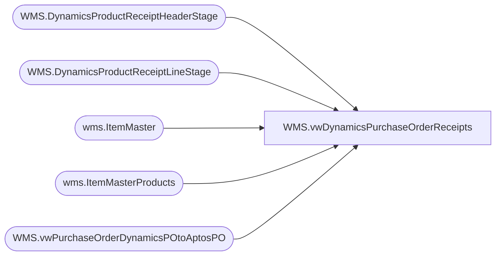

# WMS.vwDynamicsPurchaseOrderReceipts

**Database:** IntegrationStaging  
**Server:** STL-SSIS-P-01  

## Architecture Diagram



## Table Dependencies

| Referenced Table |
|---|
| WMS.DynamicsProductReceiptHeaderStage |
| WMS.DynamicsProductReceiptLineStage |
| wms.ItemMaster |
| wms.ItemMasterProducts |
| WMS.vwPurchaseOrderDynamicsPOtoAptosPO |

## View Code

```sql
CREATE view [WMS].[vwDynamicsPurchaseOrderReceipts]

as 

with POMap as
	(
		select 
			AptosPONumber,
			DynamicsPO,
			VendorAccountNumber
		from WMS.vwPurchaseOrderDynamicsPOtoAptosPO
		group by 
			AptosPONumber,
			DynamicsPO,
			VendorAccountNumber
	)
select 
	prh.DataAreaID as Entity,
	prh.PurchaseOrderNumber,	
	pom.AptosPONumber,
	cast(prh.ProductReceiptDate as date) as ProductReceiptDate,
	prl.LineNumber,	
	prl.PurchaseOrderLineNumber AptosPOShipmentLineNumber,
	prl.ItemNumber,	
	imp.ProductDescription,
	prl.OrderedPurchaseQuantity,		
	prl.ReceivedPurchaseQuantity,
	prl.RemainingPurchaseQuantity,
	prl.PurchaseUnitSymbol,	
	prl.ReceivedInventoryQuantity,	
	prl.ReceivedInventoryStatusId,	
	prl.RemainingInventoryQuantity,	
	prh.RecordId,
	prl.ReceivingSiteId,	
	prl.ReceivingWarehouseId,
	prh.dataAreaId,	
	prh.ProductReceiptNumber,	
	prh.OrderVendorAccountNumber
from WMS.DynamicsProductReceiptHeaderStage prh with (nolock)
join WMS.DynamicsProductReceiptLineStage prl with (nolock) 
	on prh.RecordID=prl.ProductReceiptHeaderRecordID
	and prh.dataAreaId=prl.dataAreaId
	and prh.ProductReceiptNumber=prl.ProductReceiptNumber
	and prh.PurchaseOrderNumber=prl.PurchaseOrderNumber
	and prh.DataAreaID=prl.DataAreaID
join wms.ItemMaster im with (nolock)
	on prh.dataAreaId=im.Entity
	and prl.ItemNumber=im.ProductNumber 
	and im.NecessaryProductionWorkingTimeSchedulingPropertyId = 'Merch'
join wms.ItemMasterProducts imp with (nolock) on im.ItemNumber=imp.ProductNumber
join POMap pom 
	on prh.PurchaseOrderNumber=pom.DynamicsPO
	and prh.OrderVendorAccountNumber=pom.VendorAccountNumber
```

