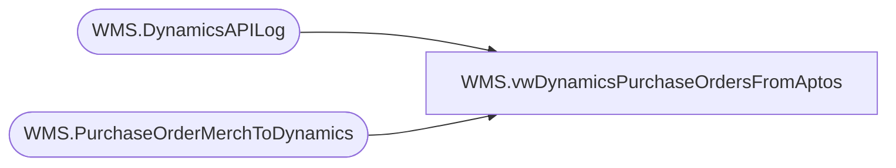

# WMS.vwDynamicsPurchaseOrdersFromAptos

**Database:** IntegrationStaging  
**Server:** STL-SSIS-P-01  

## Architecture Diagram



## Table Dependencies

| Referenced Table |
|---|
| WMS.DynamicsAPILog |
| WMS.PurchaseOrderMerchToDynamics |

## View Code

```sql
create view [WMS].[vwDynamicsPurchaseOrdersFromAptos]

as


select 
	e.PONumber as AptosPONumber, 
	convert(varchar, isnull(e.UpdateDate, e.InsertDate), 120) as StageDate,
	convert(varchar, e.ExportedToDynamicsDate, 120) as ExportedToDynamicsDate,
	case 
			when substring(api.ResponseBody, charindex('Purchase order PO1200', api.ResponseBody, 1)+15, 11) like 'PO1200%' 
				then substring(api.ResponseBody, charindex('Purchase order PO1200', api.ResponseBody, 1)+15, 11) 
			else NULL
	end as Dynamics1200PO,
	case 
		when substring(api.ResponseBody, charindex('Purchase order PO1100', api.ResponseBody, 1)+15, 11) like 'PO1100%'
			then substring(api.ResponseBody, charindex('Purchase order PO1100', api.ResponseBody, 1)+15, 11)
		else NULL
	end as Dynamics1100PO,
	case 
		when api.ResponseBody like '%hasErrors":true%' 
			then 'Yes'
		else 'NO'
	end as HasError,
	substring(api.ResponseBody, charindex('responseMsg', api.ResponseBody,1), 1000) APIResponseMessage,
	api.ResponseBody,
	api.BatchID,
	e.VendorCode,
	e.FactoryCode
from WMS.PurchaseOrderMerchToDynamics e with (nolock)
left join WMS.DynamicsAPILog api with (nolock)
	on api.IntegrationName='WMS_PurchaseOrderToDynamics'
	and e.BatchID=api.BatchID
	and e.PONumber=api.AptosDocumentNumber 

group by 
	e.PONumber, 
	convert(varchar, isnull(e.UpdateDate, e.InsertDate), 120),
	convert(varchar, e.ExportedToDynamicsDate, 120),
	case 
			when substring(api.ResponseBody, charindex('Purchase order PO1200', api.ResponseBody, 1)+15, 11) like 'PO1200%' 
				then substring(api.ResponseBody, charindex('Purchase order PO1200', api.ResponseBody, 1)+15, 11) 
			else NULL
	end,
	case 
		when substring(api.ResponseBody, charindex('Purchase order PO1100', api.ResponseBody, 1)+15, 11) like 'PO1100%'
			then substring(api.ResponseBody, charindex('Purchase order PO1100', api.ResponseBody, 1)+15, 11)
		else NULL
	end,
	case 
		when api.ResponseBody like '%hasErrors":true%' 
			then 'Yes'
		else 'NO'
	end,
	substring(api.ResponseBody, charindex('responseMsg', api.ResponseBody,1), 1000),
	api.ResponseBody,
	api.BatchID,
	e.VendorCode,
	e.FactoryCode
```

