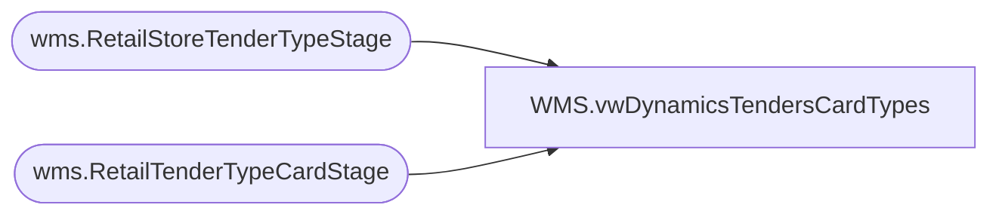

# WMS.vwDynamicsTendersCardTypes

**Database:** IntegrationStaging  
**Server:** STL-SSIS-P-01  

## Architecture Diagram



## Table Dependencies

| Referenced Table |
|---|
| wms.RetailStoreTenderTypeStage |
| wms.RetailTenderTypeCardStage |

## View Code

```sql
CREATE view [WMS].[vwDynamicsTendersCardTypes]

as

with BabTenders as (
select 'Amazon Receivable'as TenderName, 'Other'as TenderType union 
select 'Pay Pal Receivable'as TenderName, 'Other'as TenderType union 
select 'Cash'as TenderName, 'Cash'as TenderType union 
select 'Local Tender'as TenderName, 'Cash'as TenderType union 
select 'US Foreign Currency'as TenderName, 'Cash'as TenderType union 
select 'ACH'as TenderName, 'Check'as TenderType union 
select 'Check'as TenderName, 'Check'as TenderType union 
select 'Mall Certificate'as TenderName, 'Check'as TenderType union 
select 'Mall DC'as TenderName, 'Check'as TenderType union 
select 'American Express'as TenderName, 'Card' as TenderType union 
select 'American Express (No Ref)'as TenderName, 'Card' as TenderType union 
select 'BAB Charge Account'as TenderName, 'Other'as TenderType union 
select 'Canadian Credit Card (MC/Visa/Debit)'as TenderName, 'Card' as TenderType union 
select 'Discover'as TenderName, 'Card' as TenderType union 
select 'JCB'as TenderName, 'Card' as TenderType union 
select 'MAESTR'as TenderName, 'Card' as TenderType union 
select 'Master Card'as TenderName, 'Card' as TenderType union 
select 'UK Credit Card'as TenderName, 'Card' as TenderType union 
select 'Visa'as TenderName, 'Card' as TenderType union 
select 'Debit Card'as TenderName, 'Card'as TenderType union 
select 'BABW Gift Card Tender'as TenderName, 'Giftcard'as TenderType union 
select 'Bear Buck Gift Certificate'as TenderName, 'Giftcard'as TenderType union 
select 'Buy Stuff'as TenderName, 'Giftcard'as TenderType union 
select 'PROMO Gift Certificate'as TenderName, 'Giftcard'as TenderType union 
select 'E-Certificates Tender'as TenderName, 'Other'as TenderType union 
select 'House Charge'as TenderName, 'Other'as TenderType union 
select 'Paper Bear Bucks (discount)'as TenderName, 'Other'as TenderType union 
select 'Serialized Coupon'as TenderName, 'Other'as TenderType union 
select 'SFS Reward Certificates'as TenderName, 'Other'as TenderType union 
select 'Web Store Credit'as TenderName, 'Other'as TenderType union 
select 'Tax'as TenderName, 'Tax'as TenderType    union 
select 'Traveler''s Check'as TenderName, 'Check'as TenderType  union 
select 'US$ Traveler''s Check'as TenderName, 'Check' as TenderType  
) , 

TenderTypes as (
select Name as TenderTypeName, 
	PaymentMethodNumber as TenderTypeID
from wms.RetailStoreTenderTypeStage
group by Name, PaymentMethodNumber

), 

CreditCardTypes as (
select Name as CardTypeName, 
CardTypeId, 
case when CardTypeId = 'GIFTCARD' then '7'
	when CardTypeId = 'LOYALTY' then '6'
	else '2'
	end as TenderTypeID
from wms.RetailTenderTypeCardStage
group by Name, CardTypeId

), 
Summary1 as (
Select bt.TenderName, 
tt.TenderTypeName, 
tt.TenderTypeID, 
cct.CardTypeName, 
cct.CardTypeId
from BabTenders BT
left join TenderTypes TT on tt.TenderTypeName=bt.TenderType
left join CreditCardTypes CCT on cct.TenderTypeID=tt.TenderTypeID
	and  left(bt.TenderName,4) = left(cct.CardTypeName,4) 
group by bt.TenderName, 
tt.TenderTypeName, 
tt.TenderTypeID, 
cct.CardTypeName, 
cct.CardTypeId
)

select TenderName, 
TenderTypeName, 
TenderTypeID, 
case when TenderName = 'UK Credit Card'
	then 'EuroCard' 
	when TenderName = 'BABW Gift Card Tender'
	then 'Gift Card'
	ELSE CardTypeName END AS CardTypeName, 
case when TenderName = 'UK Credit Card'
	then 'EUROCARD' 
	when TenderName = 'BABW Gift Card Tender'
	then 'GIFTCARD'
	else CardTypeId end as CardTypeId

from Summary1
```

