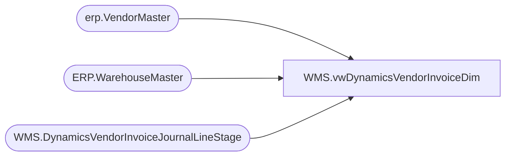

# WMS.vwDynamicsVendorInvoiceDim

**Database:** IntegrationStaging  
**Server:** STL-SSIS-P-01  

## Architecture Diagram



## Table Dependencies

| Referenced Table |
|---|
| erp.VendorMaster |
| ERP.WarehouseMaster |
| WMS.DynamicsVendorInvoiceJournalLineStage |

## View Code

```sql
CREATE view [WMS].[vwDynamicsVendorInvoiceDim]

as


with VendorMaster as (
select Entity,
VENDORACCOUNTNUMBER, 
VENDORORGANIZATIONNAME, 
VENDORSEARCHNAME,
PRIMARYEMAILADDRESS,
DEFAULTVENDORPAYMENTMETHODNAME,
DEFAULTPAYMENTTERMSNAME
from erp.VendorMaster v

),

MaxVendorEntry as (
select AccountDisplayValue, 
Company, 
SUBSTRING(vjl.OffsetAccountDisplayValue, CHARINDEX('-',OffsetAccountDisplayValue)+1,4)as StoreNumberExtract, 
max([Date]) as [MaxDate]
from  [WMS].[DynamicsVendorInvoiceJournalLineStage] VJL
where right(OffsetAccountDisplayValue,5) <> '-----' -- Appears to be non store location 
and OffsetAccountDisplayValue <> '' -- No location invoiced 
group by 
AccountDisplayValue, 
Company, 
SUBSTRING(vjl.OffsetAccountDisplayValue, CHARINDEX('-',OffsetAccountDisplayValue)+1,4)
), 


VendorLines as (

select
RemittanceAddressDescription, 
FullPrimaryRemittanceAddress, 
AccountDisplayValue, 
Company, 
OffsetAccountDisplayValue, 
SUBSTRING(vjl.OffsetAccountDisplayValue, CHARINDEX('-',OffsetAccountDisplayValue)+1,4)as StoreNumberExtract, 
[Date]
from  [WMS].[DynamicsVendorInvoiceJournalLineStage] VJL
where right(OffsetAccountDisplayValue,5) <> '-----' -- Appears to be non store location 
and OffsetAccountDisplayValue <> '' -- No location invoiced 
group by 
RemittanceAddressDescription, 
FullPrimaryRemittanceAddress, 
AccountDisplayValue, 
Company, 
OffsetAccountDisplayValue, 
SUBSTRING(vjl.OffsetAccountDisplayValue, CHARINDEX('-',OffsetAccountDisplayValue)+1,4),
[Date]
), 

WarehouseMaster as (
select WarehouseId, WarehouseName, Entity
from [ERP].[WarehouseMaster] w
where isnumeric(Warehouseid) = 1
and WarehouseId not in ('10') -- Lingering warehouse from initial Dynamics implementation

)

select 
vm.VENDORACCOUNTNUMBER as VendorAccount, 
vm.VENDORORGANIZATIONNAME as VendorName, 
vm.VENDORSEARCHNAME as SearchName,
vm.PRIMARYEMAILADDRESS as RemittanceEmail,
vl.RemittanceAddressDescription as RemittanceLocation, 
vl.FullPrimaryRemittanceAddress as RemittanceAddress, 
vm.DEFAULTVENDORPAYMENTMETHODNAME as MethodOfPayment,
vm.DEFAULTPAYMENTTERMSNAME as TermsOfPayment, 
isnull(wm.WarehouseId,vl.StoreNumberExtract) as StoreNumber , 
isnull(wm.WarehouseName,'Store Name Not Found') as StoreName, 
--vl.StoreNumberExtract, 
--vl.OffsetAccountDisplayValue, 
vl.Company, 
vl.[Date]
--, rs.*
from VendorLines vl 
join MaxVendorEntry mve on mve.AccountDisplayValue=vl.AccountDisplayValue	
	and mve.Company=vl.Company
	and mve.StoreNumberExtract=vl.StoreNumberExtract
	and mve.MaxDate=vl.[Date]
left join VendorMaster vm on vm.VENDORACCOUNTNUMBER=vl.AccountDisplayValue
	and vm.Entity=vl.company
left join WarehouseMaster wm on wm.WarehouseId=vl.StoreNumberExtract 
	and wm.Entity=vl.company
group by vm.VENDORACCOUNTNUMBER, 
vm.VENDORORGANIZATIONNAME , 
vm.VENDORSEARCHNAME ,
vm.PRIMARYEMAILADDRESS ,
vl.RemittanceAddressDescription , 
vl.FullPrimaryRemittanceAddress , 
vm.DEFAULTVENDORPAYMENTMETHODNAME ,
vm.DEFAULTPAYMENTTERMSNAME , 
isnull(wm.WarehouseId,vl.StoreNumberExtract) , 
isnull(wm.WarehouseName,'Store Name Not Found'), 
--vl.StoreNumberExtract, 
--vl.OffsetAccountDisplayValue, 
vl.Company,
vl.[Date]
--order by vl.Company, 1, 9
--order by vl.Company, 9, 1
```

