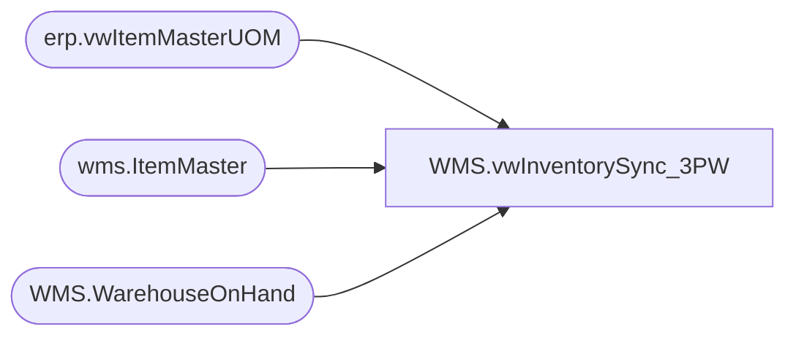

# WMS.vwInventorySync_3PW

**Database:** IntegrationStaging  
**Server:** STL-SSIS-P-01  

## Architecture Diagram



## Table Dependencies

| Referenced Table |
|---|
| erp.vwItemMasterUOM |
| wms.ItemMaster |
| WMS.WarehouseOnHand |

## View Code

```sql
CREATE VIEW [WMS].[vwInventorySync_3PW]
AS
select     --should include all items in dynamics per entity (merch and supplies, so should be left join to 3PL)
	cast(woh.ItemNumber as varchar(6)) as ItemNumber,
		case when im.NecessaryProductionWorkingTimeSchedulingPropertyId='Supplies' 
			then (
					sum((isnull(woh.AvailableOnHandQuantity,0) - isnull(woh.OnOrderQuantity,0)))
					*
					uom.InventoryMultiple
				)
			else sum((isnull(woh.AvailableOnHandQuantity,0) - isnull(woh.OnOrderQuantity,0)))
		 end as DynQty,
		
	--sum((isnull(woh.AvailableOnHandQuantity,0) - isnull(woh.OnOrderQuantity,0))) as DynQty,
	uom.InventoryMultiple,
	woh.InventoryWarehouseID as DynWhseID,
	case woh.InventoryWarehouseID 
		when '9970' then '2970'
		when '9940' then '3970'
		when '9941' then '3980'
		when '9960' then '0960'
		else cast(InventoryWarehouseID as varchar)
	end as LocationCode,
	woh.DataAreaID as Entity,
	cast(getdate() as date) as InventoryDate
from erp.vwItemMasterUOM uom
join wms.ItemMaster im 
	on uom.ProductNumber=im.ItemNumber
	and uom.Entity=im.Entity
	and im.NecessaryProductionWorkingTimeSchedulingPropertyId in ('Supplies','Merch')
	and uom.entity in ('1100', '2110', '3001','1200')
left join WMS.WarehouseOnHand woh 
	on uom.Entity=woh.DataAreaID
	and uom.ProductNumber=woh.ItemNumber
where 1=1 
and woh.InventoryWarehouseID not in ('9980', '1013') 
and isnumeric(left(woh.ItemNumber,1)) = 1
and woh.InventoryWarehouseID in ('9970','9940','9941','9942','9960','8502','8505')
AND (
		(
			woh.InventoryWarehouseID in  ('9970','9940','9941','9942','9960','8502','8505')
			AND cast(getdate() as date) < '2025-11-30'
		)
	  OR
		(
			woh.InventoryWarehouseID in  ('9970','9940','9960','8502','8505') -- 9941 and 9942 removed per BearAssist #92464:9941 and 9942 should be included on the sync for 11/29 but not for 11/30 and after
			AND cast(getdate() as date) > '2025-11-29' 
		)
	  )
--and woh.InventoryWarehouseID='9960'
--and im.itemNumber='018957'
group by 
	cast(woh.ItemNumber as varchar(6)), 
	uom.InventoryMultiple,
	woh.InventoryWarehouseID,
	case woh.InventoryWarehouseID 
		when '9970' then '2970'
		when '9940' then '3970'
		when '9941' then '3980'
		when '9960' then '0960'
		else cast(InventoryWarehouseID as varchar)
	end,
	woh.DataAreaID,
	im.NecessaryProductionWorkingTimeSchedulingPropertyId
--Order by woh.DataAreaID, woh.InventoryWarehouseID, cast(woh.ItemNumber as varchar(6))
```

