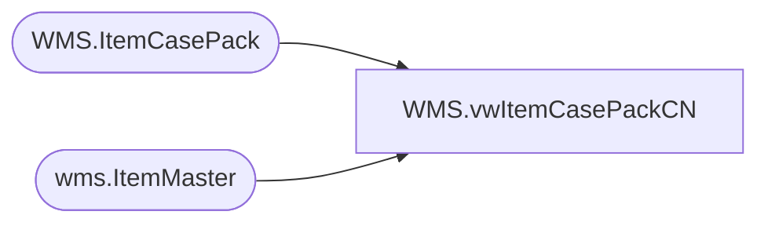

# WMS.vwItemCasePackCN

**Database:** IntegrationStaging  
**Server:** STL-SSIS-P-01  

## Architecture Diagram



## Table Dependencies

| Referenced Table |
|---|
| WMS.ItemCasePack |
| wms.ItemMaster |

## View Code

```sql
CREATE VIEW [WMS].[vwItemCasePackCN]
AS

WITH Styles AS (
select  im.ProductNumber,
		im.Entity
	from wms.ItemMaster im with (nolock) 
	where isnumeric(im.ProductNumber) = 1
		AND im.NecessaryProductionWorkingTimeSchedulingPropertyId <> 'Supplies'
		AND CAST(LEFT(im.ProductNumber,1) AS int) IN (0,8,9)
		AND im.Entity = '3001'
)
SELECT p.BaseId
	, p.StyleCode
	, p.OrderMultiple
	, p.DistribMultiple
	, p.ItemDesc
	, isnull(p.UpdateDate, p.InsertDate) as ItemDate
  FROM WMS.ItemCasePack p with(nolock) -- Imported from PLM HSE
  JOIN Styles s ON p.StyleCode = s.ProductNumber
```

