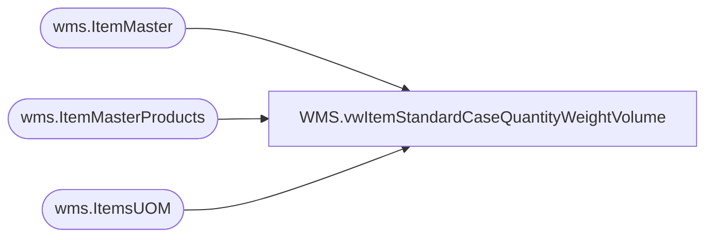

# WMS.vwItemStandardCaseQuantityWeightVolume

**Database:** IntegrationStaging  
**Server:** STL-SSIS-P-01  

## Architecture Diagram



## Table Dependencies

| Referenced Table |
|---|
| wms.ItemMaster |
| wms.ItemMasterProducts |
| wms.ItemsUOM |

## View Code

```sql
CREATE view [WMS].[vwItemStandardCaseQuantityWeightVolume]

as

with
UOMPivot as
(
    select
        ProductNumber,
       
        BAG,BALE,BDL,BX,CS,IP,KT,LB,PK,PLT,RL,ROLL,[SET]
    from
    (
        select
            ProductNumber,
           
            FromUnitSymbol,
            Factor as Qty
        from wms.ItemsUOM
        where Entity=1100
        and ToUnitSymbol='ea'
    ) as UOM
    PIVOT
    (
        sum(QTy)
        for FromUnitSymbol in ([BAG],[BALE],[BDL],[BX],[CS],[ip],[KT],[lb],[PK],[PLT],[RL],[Roll],[SET])
    ) as pt
)
select
    p.ProductNumber,
	p.ProductName,
	im.NecessaryProductionWorkingTimeSchedulingPropertyId as ItemType,
    im.InventoryUnitSymbol,
	isnull(u.CS,1) as StandardCaseQty,
    isnull(uom.Factor,1) as InventoryUnitQty,
    sum(im.NetProductWeight * isnull(u.CS,1)) as StandardCaseWeight,
    
	sum ((im.GrossProductHeight *  im.GrossProductWidth * im.GrossDepth) *isnull(u.CS,1)) as StandardCaseVolume
    --u.CS

from wms.ItemMasterProducts p with (nolock)
join wms.ItemMaster im with (nolock)
    on p.ProductNumber=im.ProductNumber
    and im.Entity=1100
left join wms.ItemsUOM uom with (nolock)
    on p.ProductNumber=uom.ProductNumber
    and uom.Entity=1100
	and uom.ToUnitSymbol='WMEA'
	and uom.FromUnitSymbol=im.InventoryUnitSymbol
left join UOMPivot u on p.ProductNumber = u.ProductNumber
where 1=1
and im.NecessaryProductionWorkingTimeSchedulingPropertyId in ('Merch', 'Supplies')
--and p.ProductNumber = '055680'
group by 
    p.ProductNumber,
	p.ProductName,
	im.NecessaryProductionWorkingTimeSchedulingPropertyId,
    im.InventoryUnitSymbol,
	isnull(u.CS,1),
    isnull(uom.Factor,1) 
--having sum(im.NetProductWeight * u.CS) is null 
--order by p.ProductNumber
```

