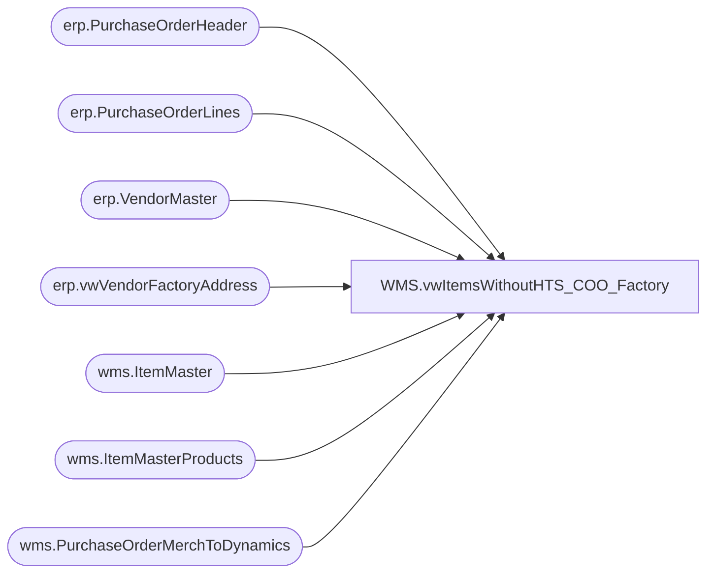

# WMS.vwItemsWithoutHTS_COO_Factory

**Database:** IntegrationStaging  
**Server:** STL-SSIS-P-01  

## Architecture Diagram



## Table Dependencies

| Referenced Table |
|---|
| erp.PurchaseOrderHeader |
| erp.PurchaseOrderLines |
| erp.VendorMaster |
| erp.vwVendorFactoryAddress |
| wms.ItemMaster |
| wms.ItemMasterProducts |
| wms.PurchaseOrderMerchToDynamics |

## View Code

```sql
--Country of Origin, HTS code, or Factory Code
CREATE view [WMS].[vwItemsWithoutHTS_COO_Factory]

as 

with 
Items as
	(
		select 
			ProductNumber,
			NecessaryProductionWorkingTimeSchedulingPropertyId as MerchOrSupply,
			case 
				when OriginCountryRegionID = '' 
					then NULL 
				else OriginCountryRegionID 
			end as CountryOfOrigin
		from wms.ItemMaster with (nolock)
		where entity = 1100
		and NecessaryProductionWorkingTimeSchedulingPropertyId in ('Merch', 'Supplies')
	),
Products as
	(
		select
			p.ProductNumber,
			p.ProductName,
			MerchOrSupply,
			p.HarmonizedSystemCode,
			im.CountryOfOrigin
		from wms.ItemMasterProducts p with (nolock)
		join Items im on p.ProductNumber=im.ProductNumber
	),
PO as
	( ---supply po's
		select 
			ph.Entity, 
			max(ph.PurchaseOrderNumber) PurchaseOrderNumber,
			pl.ItemID
		from erp.PurchaseOrderHeader ph
		join erp.PurchaseOrderLines pl 
			on ph.entity = pl.entity 
			and ph.PurchaseOrderNumber = pl.PurchaseOrderNumber
		where ph.entity=1100
		group by ph.Entity, pl.ItemID 
	---merch po's
		UNION
		select 
			'1100' as Entity,
			max(PONumber) PurchaseOrderNumber,
			ItemNumber as ItemID
		from wms.PurchaseOrderMerchToDynamics with (nolock)
		group by ItemNumber
	),
VendorAccount as 
	(
		select distinct poh.ShipFromID as VendorAccountNumber, po.ItemID, poh.Entity 
		from erp.PurchaseOrderHeader poh
		join PO 
			on poh.Entity = PO.Entity 
			and poh.PurchaseOrderNumber = PO.PurchaseOrderNumber
		UNION
		select p1.ItemID, vm.VendorAccountNumber, vm.Entity
		from po p1
		join wms.PurchaseOrderMerchToDynamics p with (nolock) 
			on p1.PurchaseOrderNumber=p.PONumber
		join erp.VendorMaster vm with (nolock)
		on vm.Entity=1100
		and vm.OrganizationPhoneticName = concat(p.Vendorcode, p.FactoryCode)
	),
VendorFactoryAddress as
	(
		select distinct	
			va.Entity, 
			p.ProductNumber,
			case 
				when fa.country = 'P.R. of China'
					then 'CN'
				when fa.country = 'Vietnam'
					then 'VN'
				when fa.country = 'Indonesia'
					then 'ID'
				else isnull(fa.country, 'CN')
			end as FactoryCountry,
			v.VendorAccountNumber,
			v.OrganizationPhoneticName
		from VendorAccount va
		join erp.VendorMaster v 
			on va.entity = v.entity 
			and va.VendorAccountNumber = v.VendorAccountNumber
			--and v.VendorGroupID <> 80
		join Products p 
			on va.ItemID = p.PRODUCTNUMBER
		left join erp.vwVendorFactoryAddress fa 
			on v.entity = fa.Entity 
			and v.VendorAccountNumber = fa.VendorAccountNumber 
		where v.entity=1100
	)
select 
	p.ProductNumber,
	p.ProductName,
	p.MerchOrSupply,
	p.HarmonizedSystemCode,
	p.CountryOfOrigin,
	vfa.VendorAccountNumber,
	vfa.OrganizationPhoneticName
from Products p
join VendorFactoryAddress vfa on p.ProductNumber=vfa.ProductNumber
where exists (select po.ItemID from po where po.ItemID=p.ProductNumber)
and
	(
		isnull(p.HarmonizedSystemCode,'') = ''
		or 
		isnull(p.CountryOfOrigin,'') = ''
		or
		(
			isnull(vfa.OrganizationPhoneticName,'') = '' 
			and not exists (select vm.VendorAccountNumber from erp.VendorMaster vm with (nolock) where vfa.VendorAccountNumber=vm.VendorAccountNumber and vm.VendorGroupID = 80)
		)
	)
--and not exists (select vm.VendorAccountNumber from erp.VendorMaster vm with (nolock) where vfa.VendorAccountNumber=vm.VendorAccountNumber and vm.VendorGroupID = 80)
```

