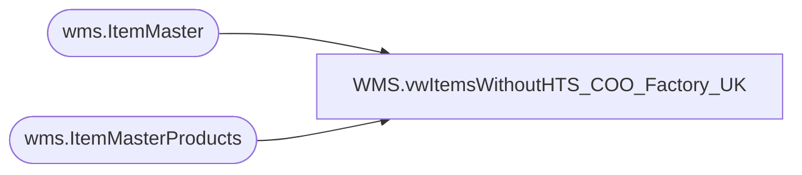

# WMS.vwItemsWithoutHTS_COO_Factory_UK

**Database:** IntegrationStaging  
**Server:** STL-SSIS-P-01  

## Architecture Diagram



## Table Dependencies

| Referenced Table |
|---|
| wms.ItemMaster |
| wms.ItemMasterProducts |

## View Code

```sql
--Country of Origin, HTS code, or Factory Code
CREATE view [WMS].[vwItemsWithoutHTS_COO_Factory_UK]

as 

with 
baseUKitems4 as
	(
	select cast(imp.ProductNumber as varchar (6)) as ProductNumber ,
		imp.ProductDescription,
		--case when imp.ProductDescription = '' then imp.ProductName
		--when imp.ProductDescription is null then imp.ProductName
		--else imp.ProductDescription
		--end as ProductDescription,

			im.NecessaryProductionWorkingTimeSchedulingPropertyId as MerchOrSupply
	from wms.ItemMasterProducts imp
	left join wms.ItemMaster im on imp.ProductNumber=im.ProductNumber
	and im.Entity = '2110'
	where left(imp.ProductNumber,1) in ('4')
	and NecessaryProductionWorkingTimeSchedulingPropertyId in ('Merch', 'Supplies')
	--order by ProductNumber asc
	--and imp.productNumber = '457426'
	),
baseUKitems5 as
	(
	select cast(imp.ProductNumber as varchar (6)) as ProductNumber ,
	imp.ProductDescription,
		--case when imp.ProductDescription = '' then imp.ProductName
		--when imp.ProductDescription is null then imp.ProductName
		--else imp.ProductDescription
		--end as ProductDescription,
			im.NecessaryProductionWorkingTimeSchedulingPropertyId as MerchOrSupply	
	from wms.ItemMasterProducts imp
	left join wms.ItemMaster im on imp.ProductNumber=im.ProductNumber
	and im.Entity = '2110'
	where left(imp.ProductNumber,1) in ('5')
	and NecessaryProductionWorkingTimeSchedulingPropertyId in ('Merch', 'Supplies')
	--and imp.productNumber = '457426'
	),
baseUKitems6 as
	(
	select cast(imp.ProductNumber as varchar (6)) as ProductNumber ,
	imp.ProductDescription,
		--case when imp.ProductDescription = '' then imp.ProductName
		--when imp.ProductDescription is null then imp.ProductName
		--else imp.ProductDescription
		--end as ProductDescription,
			im.NecessaryProductionWorkingTimeSchedulingPropertyId as MerchOrSupply	
	from wms.ItemMasterProducts imp
	left join wms.ItemMaster im on imp.ProductNumber=im.ProductNumber
	and im.Entity = '2110'
	where left(imp.ProductNumber,1) in ('6')
	and NecessaryProductionWorkingTimeSchedulingPropertyId in ('Merch', 'Supplies')
	--and imp.productNumber = '457426'
	),
items1100hts4 as
(
	select p.ProductNumber,p.ProductName,p.HarmonizedSystemCode
		from wms.ItemMasterProducts p with (nolock)
		where Entity = 1100 and left(p.ProductNumber,1) in ('0')
),
items1100coo4 as
(
	select im.ProductNumber,im.OriginCountryRegionId
		from wms.ItemMaster im with (nolock)
		where Entity = 1100 and left(im.ProductNumber,1) in ('0')
),
items1100hts5 as
(
	select p.ProductNumber,p.ProductName,p.HarmonizedSystemCode
		from wms.ItemMasterProducts p with (nolock)
		where Entity = 1100 and left(p.ProductNumber,1) in ('2')
),
items1100coo5 as
(
	select im.ProductNumber,im.OriginCountryRegionId
		from wms.ItemMaster im with (nolock)
		where Entity = 1100 and left(im.ProductNumber,1) in ('2')
),
items1100hts6 as
(
	select p.ProductNumber,p.ProductName,p.HarmonizedSystemCode
		from wms.ItemMasterProducts p with (nolock)
		where Entity = 1100 and left(p.ProductNumber,1) in ('3')
),
items1100coo6 as
(
	select im.ProductNumber,im.OriginCountryRegionId
		from wms.ItemMaster im with (nolock)
		where Entity = 1100 and left(im.ProductNumber,1) in ('3')
),
ukShipmentInvoiceEquivalent as
(
select cast (imp.ProductNumber as varchar) as ProductNumber ,
im.NecessaryProductionWorkingTimeSchedulingPropertyId as MerchOrSupply,
cast(imp.ProductDescription as varchar) as ProductDescription,
cast(imp.HarmonizedSystemCode as varchar) as HarmonizedSystemCode,
cast(im.OriginCountryRegionId as varchar) as OriginCountryRegionId
--im.entity,
--im.NecessaryProductionWorkingTimeSchedulingPropertyId as ItemType
from [WMS].[ItemMasterProducts] imp
join wms.ItemMaster im on imp.ProductNumber=im.ProductNumber
        and im.Entity = '2110'   
--where left(imp.ProductNumber,1) = '6'
where left(imp.ProductNumber,1) in ('4','5','6')
--order by 1
)

select * from ukShipmentInvoiceEquivalent
--order by ProductNumber asc

		--select b.ProductNumber, b.MerchOrSupply, b.ProductDescription,--, h.ProductName, 
		--h.ProductNumber as 'ProductNumber1100', h.HarmonizedSystemCode as 'HTScode1100', c.OriginCountryRegionId as 'COO1100' 
		--from baseUKitems4 b
		--join items1100hts4 h on right(b.ProductNumber,5) = right(h.ProductNumber, 5)
		--join items1100coo4 c on right(b.ProductNumber,5) = right(c.ProductNumber, 5)
		----order by ProductNumber asc
		

		--union

		--select b.ProductNumber, b.MerchOrSupply,  b.ProductDescription, --h.ProductName, 
		--h.ProductNumber as 'ProductNumber1100', h.HarmonizedSystemCode as 'HTScode1100', c.OriginCountryRegionId as 'COO1100' 
		--from baseUKitems5 b
		--join items1100hts5 h on right(b.ProductNumber,5) = right(h.ProductNumber, 5)
		--join items1100coo5 c on right(b.ProductNumber,5) = right(c.ProductNumber, 5)

		--union

		--select b.ProductNumber, b.MerchOrSupply, b.ProductDescription, -- h.ProductName, 
		--h.ProductNumber as 'ProductNumber1100', h.HarmonizedSystemCode as 'HTScode1100', c.OriginCountryRegionId as 'COO1100' 
		--from baseUKitems6 b
		--join items1100hts6 h on right(b.ProductNumber,5) = right(h.ProductNumber, 5)
		--join items1100coo6 c on right(b.ProductNumber,5) = right(c.ProductNumber, 5)
```

