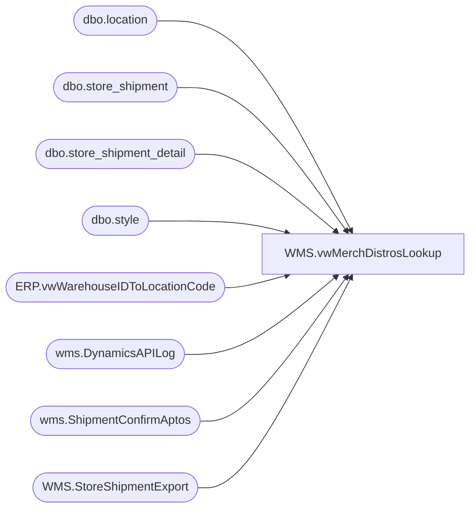

# WMS.vwMerchDistrosLookup

**Database:** IntegrationStaging  
**Server:** STL-SSIS-P-01  

## Architecture Diagram



## Table Dependencies

| Referenced Table |
|---|
| dbo.location |
| dbo.store_shipment |
| dbo.store_shipment_detail |
| dbo.style |
| ERP.vwWarehouseIDToLocationCode |
| wms.DynamicsAPILog |
| wms.ShipmentConfirmAptos |
| WMS.StoreShipmentExport |

## View Code

```sql
create view [WMS].[vwMerchDistrosLookup]

as


with 
DistrosExported as
	(
		select 
			AptosShipmentNumber	as BABAptosShipmentNumber,
			AptosDistroNumber as BABAptosDistroNumber,
			AptosDistroLineNumber as BABAptosDistroLineNumber,
			ToWarehouse,
			ItemNumber,
			sum(Quantity) as DistroQty,
			cast(ShipDate as date) as ShipDate
		from WMS.StoreShipmentExport 
		group by 
			AptosShipmentNumber,
			AptosDistroNumber,
			AptosDistroLineNumber,
			ToWarehouse,
			ItemNumber,
			cast(ShipDate as date)
	),
MaxDate as
	(
		select StoreShipmentNumber, max(InsertDate) as MaxDate
		from wms.DynamicsAPILog 
		where IntegrationName in ('WMS_TransferOrderCreateFromAptos', 'WMS_POtoSOIntercompanyOrderCreate')
		--and datediff(dd, InsertDate, getdate()) <= 7
		group by StoreShipmentNumber
	),
APILog as
	(
		select 
			api.StoreShipmentNumber, 
			case 
				when api.ResponseBody like '%Transfer order%was created successully%' then 1 
				when api.ResponseBody like '%Intercompany sales order%has been created%' then 1
			else 0 end as APISuccess,
			case 
				when api.ResponseBody like '%Transfer order%was created successully%'
					then substring(api.ResponseBody, charindex('Transfer order ', api.ResponseBody, 1)+15, 12)
				when api.ResponseBody like '%Intercompany sales order%has been created%'
					then replace(substring(api.ResponseBody, charindex('Intercompany sales order ', api.ResponseBody, 1)+24, 16), ' ha', '')
				else NULL
			end as DynamicsOrder,
			api.responseBody,
			api.BatchID,
			api.InsertDate
		from wms.DynamicsAPILog api
		join MaxDate md 
			on api.StoreShipmentNumber=md.StoreShipmentNumber 
			and api.InsertDate=md.MaxDate
		where api.IntegrationName in ('WMS_TransferOrderCreateFromAptos', 'WMS_POtoSOIntercompanyOrderCreate')
		--and datediff(dd, InsertDate, getdate()) <= 7
	),
DynamicsShipments as
	(
		select 
			d.AptosShipmentID as Shipment, 
			d.AptosDistributionNumber as DistroNumber, 
			d.AptosDistributionDocLineNumber as DistroLine,  
			d.ToLocation, 
			vw.LocationCode,
			d.ItemNumber,
			sum(d.ShippedQuantity) ShippedQty,
			cast(d.ShipConfirmDateTime as date) as ShipDate
		from wms.ShipmentConfirmAptos d
		join ERP.vwWarehouseIDToLocationCode vw on d.ToLocation=vw.WarehouseID and vw.entity= 1100
		where 
			d.Warehouse='9980' 
			and d.AptosShipmentID<>''
			and d.AptosDistributionNumber not in (0, '')
			and d.AptosDistributionDocLinenumber not in (0, '')
		group by
			d.AptosShipmentID, 
			d.AptosDistributionNumber, 
			d.AptosDistributionDocLineNumber,  
			d.ToLocation, 
			vw.LocationCode,
			d.ItemNumber,
			cast(d.ShipConfirmDateTime as date)
	),
MerchShipments as
	(
		select
			cast(ss.ship_date as date) ShipDate,
			ss.document_no as StoreShipment,
			s.style_code as StyleCode, 
			sd.distribution_no as DistroNumber,
			l.location_code as LocationCode,
			sum(sd.units_sent) ShippedQty
		from bedrocktestdb02.me_01.dbo.store_shipment ss
		join bedrocktestdb02.me_01.dbo.store_shipment_detail sd on ss.store_shipment_id=sd.store_shipment_id
		join bedrocktestdb02.me_01.dbo.style s on sd.style_id=s.style_id
		join bedrocktestdb02.me_01.dbo.location l on ss.location_id=l.location_id
		group by 
			cast(ss.ship_date as date),
			ss.document_no,
			s.style_code,
			sd.distribution_no,
			l.location_code
	)
select 
	de.BABAptosShipmentNumber,
	de.BABAptosDistroNumber,
	de.BABAptosDistroLineNumber,
	de.ToWarehouse,
	de.ItemNumber,
	de.DistroQty,
	de.ShipDate DistroShipDate,
	isnull(api.ApiSuccess,0) as APISuccess,
	isnull(api.DynamicsOrder, 'not found') as DynamicsOrder,
	case when s.shipment is NULL then 'NO' else 'YES' end as DynamicsShipmentLogged,
	s.ShipDate,
	isnull(s.ShippedQty,0) as DynamicsShippedQty,
	isnull(m.ShippedQty,0) as MerchShippedQty
from DistrosExported de
left join DynamicsShipments s 
	on de.BABAptosShipmentNumber=s.shipment
	and de.BABAptosDistroNumber=s.DistroNumber
	and de.BABAptosDistroLineNumber=s.DistroLine
	and de.ToWarehouse=s.ToLocation
	and de.ItemNumber=s.ItemNumber
left join APILog api 
	on de.BABAptosShipmentNumber=api.StoreShipmentNumber
left join MerchShipments m
	on s.Shipment=m.StoreShipment
	and s.DistroNumber=m.DistroNumber
	--and de.BABAptosDistroLineNumber
	and s.LocationCode=m.LocationCode
	and s.ItemNumber=m.StyleCode
	and s.ShipDate=m.ShipDate
```

