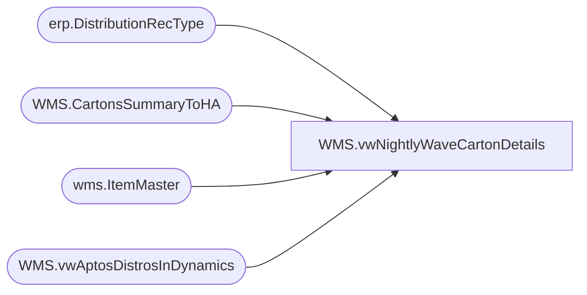

# WMS.vwNightlyWaveCartonDetails

**Database:** IntegrationStaging  
**Server:** STL-SSIS-P-01  

## Architecture Diagram



## Table Dependencies

| Referenced Table |
|---|
| erp.DistributionRecType |
| WMS.CartonsSummaryToHA |
| wms.ItemMaster |
| WMS.vwAptosDistrosInDynamics |

## View Code

```sql
create view [WMS].[vwNightlyWaveCartonDetails]

as

 -- New query

 with 
RecTypeToDelivery as 
(
select  RecType, 
		ModeOfDelivery, 
			case 
			   when rt.reasoncode = 'SSD' then 'Second'
			   when rt.reasoncode = 'STD' then 'Third'
			   when rt.reasoncode = '8'   then 'Fourth'
			   when rt.reasoncode = '9'   then 'Fifth'
			   when rt.reasoncode = '12'  then 'Sixth'
			   when rt.reasoncode = '13'  then 'Seventh'
			else 'First'
			End as 'Delivery'
from erp.DistributionRecType rt
)

select shipto, -- Will Dynamics Wareouse\location code suffice? 
waveId, 
r.Delivery, 
case when im.NecessaryProductionWorkingTimeSchedulingPropertyId = 'Merch' then isnull(a.AptosShipmentNumber,'NoAptosShpmtNbrFound') else h.shipmentId end as ShipmentId, 
h.itemNumber, 
description, 
sum(cast (totalQuantity as int))  as Units
from WMS.CartonsSummaryToHA h
join RecTypeToDelivery R on h.modeOfDelivery=r.ModeOfDelivery
left join [WMS].vwAptosDistrosInDynamics a on REPLACE(a.DynamicsOrder,' ','')=h.OrderNumber and a.AptosDistroNumber=h.AptosDistroNumber
left join wms.ItemMaster im on im.ProductNumber=h.itemNumber and im.entity = '1100'
where warehouse = '9980'
and datepart(hh,cast(dateadd(hh,-5, MessageDateUTC) as datetime)) >= 20  -- Only Waves after 20:00 aka 8pm Bearhouse tie\Primary Wave
and datediff(dd,cast(dateadd(hh,-5, MessageDateUTC) as date), getdate()) = 0 -- Today's Waves Only, REMOVE -2 FOR GO LIVE 
group by shipto, 
r.Delivery, 
cast(dateadd(hh,-5, MessageDateUTC) as date),
waveId, 
case when im.NecessaryProductionWorkingTimeSchedulingPropertyId = 'Merch' then isnull(a.AptosShipmentNumber,'NoAptosShpmtNbrFound') else h.shipmentId end, 
h.itemNumber, 
description
--order by 1, 4
```

