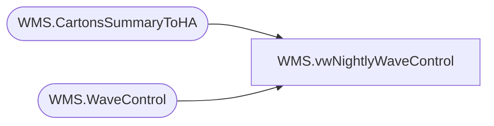

# WMS.vwNightlyWaveControl

**Database:** IntegrationStaging  
**Server:** STL-SSIS-P-01  

## Architecture Diagram



## Table Dependencies

| Referenced Table |
|---|
| WMS.CartonsSummaryToHA |
| WMS.WaveControl |

## View Code

```sql
CREATE view [WMS].[vwNightlyWaveControl]

as

select distinct ha.waveId, 
count (distinct containerid ) as TotalCartonCount, 
cast(sum (grossWeight) as numeric) as TotalCartonWeight
from WMS.CartonsSummaryToHA ha
left join WMS.WaveControl wc on ha.waveId=wc.waveid 
where warehouse = '9980'
--and datepart(hh,cast(dateadd(hh,-5, MessageDateUTC) as datetime)) >= 20  -- Only Waves after 20:00 aka 8pm\Primary Wave, removed this filter per Dan Lewis request on 6/10/2020
and datediff(dd,cast(dateadd(hh,-5, MessageDateUTC) as date), getdate()) = 0 -- Today's Waves Only , remove -1 after testing 
and wc.waveid is  null 
group by ha.waveId
```

