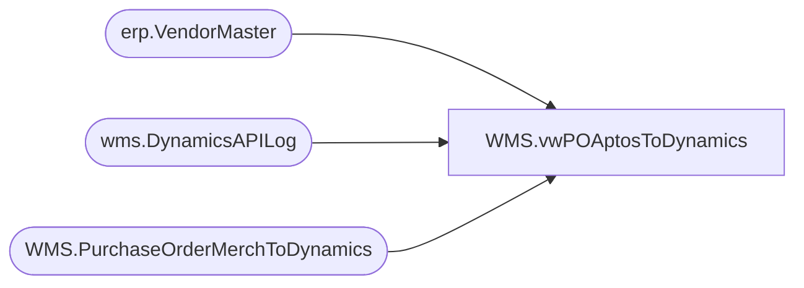

# WMS.vwPOAptosToDynamics

**Database:** IntegrationStaging  
**Server:** STL-SSIS-P-01  

## Architecture Diagram



## Table Dependencies

| Referenced Table |
|---|
| erp.VendorMaster |
| wms.DynamicsAPILog |
| WMS.PurchaseOrderMerchToDynamics |

## View Code

```sql
CREATE view [WMS].[vwPOAptosToDynamics] 

as

with 
POHistory as
	(
		select concat(AptosDocumentNumber, '_', PO_OrderAccountNumber) as POVendorAccountForJoin
		from wms.DynamicsAPILog with (nolock)
		where IntegrationName = 'WMS_PurchaseOrderToDynamics'
		and ResponseBody like '%hasErrors%false%'
		--and AptosDocumentNumber <> '1077828' -- Only Add this filter if you need to bypass the Create\Update logic 
		group by concat(AptosDocumentNumber, '_', PO_OrderAccountNumber)
	)
select  --1200 PO
	po.Company,
	po.Warehouse,
	po.PONumber,
	po.POLineNumber,
	po.ItemNumber,
	po.Quantity,
	'ea' as UnitOfMeasure,
	convert(varchar, isnull(po.DeliveryDate, po.UpdateDate), 101) as DeliveryDate,
	convert(varchar, isnull(po.StartShipDate, po.UpdateDate), 101) as StartShipDate,
	convert(varchar, CancelDate, 101) as CancelDate,
	vm.VendorAccountNumber, 
	vm.InvoiceVendorAccountNumber as InvoiceAccount,
	po.UnitCost as ItemPrice,
	getdate() as TransmitDate,
	--case when po.UpdateDate is NULL then 'Create' else 'Update' end as ActionFlag,
	case when concat(po.PONumber, '_', vm.VendorAccountNumber) in (select POVendorAccountForJoin from POHistory) then 'Update' else 'Create' end as ActionFlag,
	--'Update' as ActionFlag,
	po.POMainLine,
	concat(po.PONumber, '_', po.POLineNumber) as POLineNumberForJoin,
	concat(po.PONumber, '_', vm.VendorAccountNumber) as POVendorAccountForJoin,
	po.NetFinalPrice
from WMS.PurchaseOrderMerchToDynamics po with (nolock)
join erp.VendorMaster vm with (nolock) 
	on vm.Entity = 
		case when exists 
			(
				select d.PONumber 
				from WMS.PurchaseOrderMerchToDynamics d with (nolock)
				where cast(d.InsertDate as date) < '2021-06-28'--- FIRST DAY OF ECO -- 
				and d.PONumber = po.PONumber
				and d.POLineNumber=po.POLineNumber
				--and d.PONumber not in  ('1077316') -- Temp added in allow these two POs to flow
			) then 1200
		else po.Company
	end
	and cast(po.VendorCode as nvarchar) =
		case 
			when vm.OrganizationPhoneticName like '%-%' 
			then substring(vm.OrganizationPhoneticName, 1, charindex('-',vm.OrganizationPhoneticName)-1) 
			else vm.OrganizationPhoneticName 
		end
	and po.FactoryCode =
		case 
			when vm.OrganizationPhoneticName like '%-%' 
			then substring(vm.OrganizationPhoneticName, charindex('-',vm.OrganizationPhoneticName)+1, 20) 
			else po.FactoryCode
		end
where po.ExportedToDynamicsDate is NULL
```

