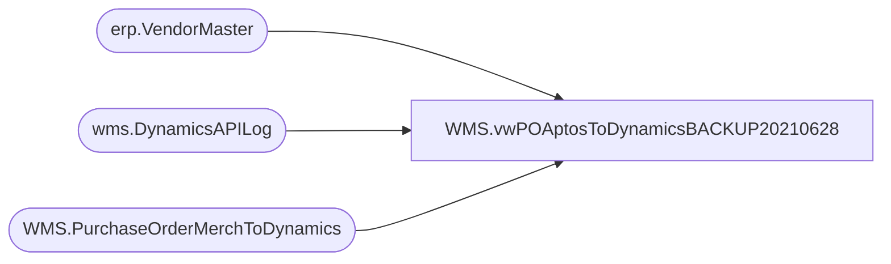

# WMS.vwPOAptosToDynamicsBACKUP20210628

**Database:** IntegrationStaging  
**Server:** STL-SSIS-P-01  

## Architecture Diagram



## Table Dependencies

| Referenced Table |
|---|
| erp.VendorMaster |
| wms.DynamicsAPILog |
| WMS.PurchaseOrderMerchToDynamics |

## View Code

```sql
create view [WMS].[vwPOAptosToDynamicsBACKUP20210628] 

as

with 
POHistory as
	(
		select concat(AptosDocumentNumber, '_', PO_OrderAccountNumber) as POVendorAccountForJoin
		from wms.DynamicsAPILog with (nolock)
		where IntegrationName = 'WMS_PurchaseOrderToDynamics'
		and ResponseBody like '%hasErrors%false%'
		group by concat(AptosDocumentNumber, '_', PO_OrderAccountNumber)
	)
select  --1200 PO
	po.PONumber,
	po.POLineNumber,
	po.ItemNumber,
	po.Quantity,
	'ea' as UnitOfMeasure,
	convert(varchar, isnull(po.DeliveryDate, po.UpdateDate), 101) as DeliveryDate,
	vm.VendorAccountNumber, 
	vm.InvoiceVendorAccountNumber as InvoiceAccount,
	po.UnitCost as ItemPrice,
	getdate() as TransmitDate,
	case when concat(po.PONumber, '_', vm.VendorAccountNumber) in (select POVendorAccountForJoin from POHistory) then 'Update' else 'Create' end as ActionFlag,
	--case 
	--	when po.PONumber in ('1073314','1074297')
	--		then 'Create'
	--	else 'Update'
	--end as ActionFlag,
	po.POMainLine,
	concat(po.PONumber, '_', po.POLineNumber) as POLineNumberForJoin,
	concat(po.PONumber, '_', vm.VendorAccountNumber) as POVendorAccountForJoin,
	po.NetFinalPrice
from WMS.PurchaseOrderMerchToDynamics po with (nolock)
join erp.VendorMaster vm with (nolock) 
	on vm.Entity = 1200
	and cast(po.VendorCode as nvarchar) =
		case 
			when vm.OrganizationPhoneticName like '%-%' 
			then substring(vm.OrganizationPhoneticName, 1, charindex('-',vm.OrganizationPhoneticName)-1) 
			else vm.OrganizationPhoneticName 
		end
	and po.FactoryCode =
		case 
			when vm.OrganizationPhoneticName like '%-%' 
			then substring(vm.OrganizationPhoneticName, charindex('-',vm.OrganizationPhoneticName)+1, 20) 
			else po.FactoryCode
		end
where 1=1
and po.ExportedToDynamicsDate is NULL
--and po.PoNumber = '1074354'
```

