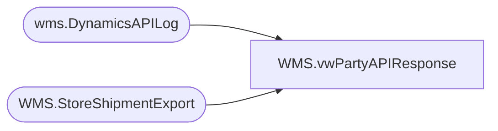

# WMS.vwPartyAPIResponse

**Database:** IntegrationStaging  
**Server:** STL-SSIS-P-01  

## Architecture Diagram



## Table Dependencies

| Referenced Table |
|---|
| wms.DynamicsAPILog |
| WMS.StoreShipmentExport |

## View Code

```sql
CREATE view [WMS].[vwPartyAPIResponse]

as


WITH MaxDate AS
(
	SELECT DISTINCT
	api.StoreShipmentNumber AS ShipmentId
	, MAX(api.InsertDate) AS APIDate
FROM wms.DynamicsAPILog api
WHERE 1=1
	AND api.IntegrationName in ('WMS_TransferOrderCreateFromAptos')
	AND api.InsertDate > DATEADD(day,-1,getdate())
	AND LEN(api.StoreShipmentNumber) < 8
GROUP BY api.StoreShipmentNumber 
)

SELECT DISTINCT
	sse.AptosShipmentNumber as PartyId
	, api.StoreShipmentNumber AS ShipmentId
	, case 
		when api.ResponseBody like '%Transfer order%was created successully%'
			then substring(api.ResponseBody, charindex('Transfer order ', api.ResponseBody, 1)+15, 12)
		when api.ResponseBody like '%Intercompany sales order%has been created%'
			then replace(substring(api.ResponseBody, charindex('Intercompany sales order ', api.ResponseBody, 1)+24, 16), ' ha', '')
		else NULL
	  end as OrderId
	, case 
		when api.ResponseBody like '%Transfer order%was created successully%' and api.ResponseBody not like '%"hasErrors":true%' then 1 
		when api.ResponseBody like '%Intercompany sales order%has been created%' and api.ResponseBody not like '%"hasErrors":true%' then 1
		when api.ResponseBody like '%"hasErrors":true%' then 0
		else 0 
	  end as APISuccess
	, api.InsertDate AS APIDate
FROM wms.DynamicsAPILog api
	JOIN WMS.StoreShipmentExport sse ON api.StoreShipmentNumber = sse.AptosShipmentNumber
	JOIN MaxDate m ON api.StoreShipmentNumber = m.ShipmentId AND api.InsertDate = m.APIDate
WHERE 1=1
	AND api.IntegrationName in ('WMS_TransferOrderCreateFromAptos')
	AND api.InsertDate > DATEADD(day,-1,getdate())
	AND LEN(sse.AptosShipmentNumber) < 8
```

