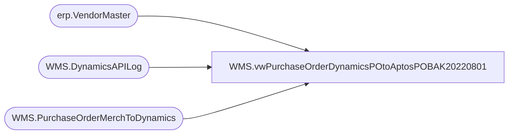

# WMS.vwPurchaseOrderDynamicsPOtoAptosPOBAK20220801

**Database:** IntegrationStaging  
**Server:** STL-SSIS-P-01  

## Architecture Diagram



## Table Dependencies

| Referenced Table |
|---|
| erp.VendorMaster |
| WMS.DynamicsAPILog |
| WMS.PurchaseOrderMerchToDynamics |

## View Code

```sql
create view [WMS].[vwPurchaseOrderDynamicsPOtoAptosPOBAK20220801]
as 
select 
	e.PONumber as AptosPONumber, 
	case 
			when substring(api.ResponseBody, charindex('Purchase order PO1200', api.ResponseBody, 1)+15, 11) like 'PO1200%' 
				then substring(api.ResponseBody, charindex('Purchase order PO1200', api.ResponseBody, 1)+15, 11) 
			else NULL
	end as Dynamics1200PO,
	case 
		when substring(api.ResponseBody, charindex('Purchase order PO1100', api.ResponseBody, 1)+15, 11) like 'PO1100%'
			then substring(api.ResponseBody, charindex('Purchase order PO1100', api.ResponseBody, 1)+15, 11)
		else NULL
	end as Dynamics1100PO,
	e.VendorCode,
	e.FactoryCode,
	vm.VendorAccountNumber,
	max(cast(ExportedToDynamicsDate as date)) as LastExportDate
from WMS.PurchaseOrderMerchToDynamics e with (nolock)
join erp.VendorMaster vm with (nolock) 
	on vm.Entity = 1200
	and cast(e.VendorCode as nvarchar) =
		case 
			when vm.OrganizationPhoneticName like '%-%' 
			then substring(vm.OrganizationPhoneticName, 1, charindex('-',vm.OrganizationPhoneticName)-1) 
			else vm.OrganizationPhoneticName 
		end
	and e.FactoryCode =
		case 
			when vm.OrganizationPhoneticName like '%-%' 
			then substring(vm.OrganizationPhoneticName, charindex('-',vm.OrganizationPhoneticName)+1, 20) 
			else e.FactoryCode
		end
join WMS.DynamicsAPILog api with (nolock)
	on api.IntegrationName='WMS_PurchaseOrderToDynamics'
	and e.BatchID=api.BatchID
	and e.PONumber=api.AptosDocumentNumber 
	and vm.VendorAccountNumber=api.PO_OrderAccountNumber
where api.ResponseBody NOT like '%hasErrors":true%'
group by 
	e.PONumber, 
	case 
			when substring(api.ResponseBody, charindex('Purchase order PO1200', api.ResponseBody, 1)+15, 11) like 'PO1200%' 
				then substring(api.ResponseBody, charindex('Purchase order PO1200', api.ResponseBody, 1)+15, 11) 
			else NULL
	end,
	case 
		when substring(api.ResponseBody, charindex('Purchase order PO1100', api.ResponseBody, 1)+15, 11) like 'PO1100%'
			then substring(api.ResponseBody, charindex('Purchase order PO1100', api.ResponseBody, 1)+15, 11)
		else NULL
	end,
	e.VendorCode,
	e.FactoryCode,
	vm.VendorAccountNumber
```

