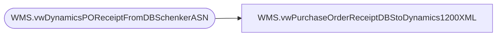

# WMS.vwPurchaseOrderReceiptDBStoDynamics1200XML

**Database:** IntegrationStaging  
**Server:** STL-SSIS-P-01  

## Architecture Diagram



## Table Dependencies

| Referenced Table |
|---|
| WMS.vwDynamicsPOReceiptFromDBSchenkerASN |

## View Code

```sql
CREATE view [WMS].[vwPurchaseOrderReceiptDBStoDynamics1200XML]

as

--====================================================================================================================
-- Dan Tweedie	-	2017-11-15	-	Created view for 1200 PO Receipt based on DB Schenker Full InGate / ASN file
--====================================================================================================================

with 
Receipts as
	(
		select 
			9900 as ReceiptLocation,
			ProductCode as ItemID,
			ShippedQty as Qty,
			InGateDate as ReceiptDate,
			'ea' as UnitOfMeasure,
			Dynamics1200PO as PurchaseOrderNumber
		from WMS.vwDynamicsPOReceiptFromDBSchenkerASN
	),
XMLStage (XML) as
	(
		select 
			'NO' as 'CloseForReceipt',
			r.ReceiptLocation as 'InventLocationId',
			r.ItemId,
			r.PurchaseOrderNumber as 'PurchId',
			sum(r.QTY) as Qty,
			r.ReceiptDate,
			concat(
			datepart(yyyy, getdate()), 
			datepart(mm, getdate()),
			datepart(dd, getdate()),
			datepart(hh, getdate()),
			datepart(mi, getdate()),
			datepart(ss, getdate()),
			datepart(ms, getdate()),
			cast(DENSE_RANK() OVER (ORDER BY r.ReceiptLocation, r.ITEMID, r.PurchaseOrderNumber, r.RECEIPTDATE) as varchar)
			) as ReceiptId,
			r.UnitOfMeasure
		from Receipts r 
		group by r.ReceiptLocation, r.ITEMID, r.PurchaseOrderNumber, r.RECEIPTDATE, r.UNITOFMEASURE
		order by r.ReceiptLocation, r.PurchaseOrderNumber, r.ITEMID
		for xml path('RSMWMSPurchaseReceiptEntity'), root('Document'), Type
	)
select XML as XMLData
from XMLStage
```

