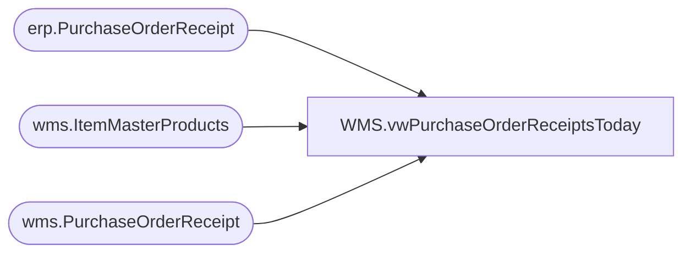

# WMS.vwPurchaseOrderReceiptsToday

**Database:** IntegrationStaging  
**Server:** STL-SSIS-P-01  

## Architecture Diagram



## Table Dependencies

| Referenced Table |
|---|
| erp.PurchaseOrderReceipt |
| wms.ItemMasterProducts |
| wms.PurchaseOrderReceipt |

## View Code

```sql
CREATE view [WMS].[vwPurchaseOrderReceiptsToday]

as


-- Aptos\Merchandise Receipts
select cast(dateadd(hh,0, r.MessageQueueDateUTC) as date) as 'Date', 
r.ItemID as ItemNumber, 
p.ProductDescription,
sum (r.ReceivedQty-r.CanceledQty) as Quantity,
r.AptosPONumber as PurchaseOrderNumber,
r.ASN 
from wms.PurchaseOrderReceipt r
join wms.ItemMasterProducts p on r.ItemID=right(p.productnumber,6) and p.Entity = '1100'
where Warehouse in ('9980','8175','0980')
--and datediff(dd,cast(dateadd(hh,0, MessageQueueDateUTC) as date),convert(varchar,getdate (),101)) < 11 -- For Testing
and datediff(dd,cast(dateadd(hh,0, MessageQueueDateUTC) as date),convert(varchar,getdate (),101)) = 0 -- For Daily
group by 
cast(dateadd(hh,0, r.MessageQueueDateUTC) as date), 
r.ItemID, p.ProductDescription,r.AptosPONumber, r.ASN 
union all 
-- Supply Receipts
select ReceiptDate as 'Date', 
right(ItemId,6) AS ItemNumber, 
p.ProductDescription,
sum(qty) as Quantity, 
PurchaseOrderNumber as PurchaseOrderNumber, 
BOL as ASN 
from erp.PurchaseOrderReceipt r
join wms.ItemMasterProducts p on right(r.ItemID,6)=right(p.productnumber,6) and p.Entity = '1100'
where ReceiptLocation in ('9980','8175','0980')
--and datediff(dd,r.ReceiptDate,convert(varchar,getdate (),101)) < 11-- For Testing 
and datediff(dd,r.ReceiptDate,convert(varchar,getdate (),101)) = 0 -- For Daily
group by r.ReceiptDate, 
right(r.ItemID,6), 
p.ProductDescription,
r.Qty, 
r.PurchaseOrderNumber, 
r.BOL 
--order by 1 desc, 5, 2, 6
```

