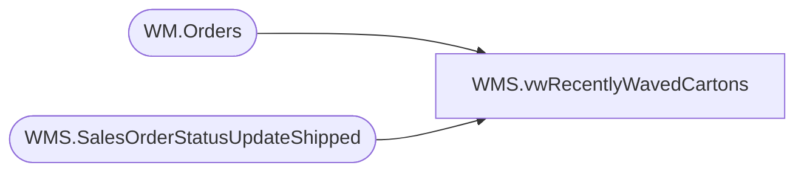

# WMS.vwRecentlyWavedCartons

**Database:** IntegrationStaging  
**Server:** STL-SSIS-P-01  

## Architecture Diagram



## Table Dependencies

| Referenced Table |
|---|
| WM.Orders |
| WMS.SalesOrderStatusUpdateShipped |

## View Code

```sql
CREATE VIEW [WMS].[vwRecentlyWavedCartons]
AS
SELECT [ContainerId] AS CARTON_NBR
      ,[DeckSalesOrderReferenceNumber] AS PKT_CTRL_NBR
	  ,[WaveId] AS SHIP_WAVE_NBR
	  ,[ItemId] AS STYLE
	  ,[MasterTrackingNumber] AS TRKG_NBR
	  ,CASE
	    WHEN o.ShippingMethod IN ('STND', 'INTERNATIONAL', 'W300', 'W350', 'GLOBALE STANDARD') THEN o.ShippingMethod
		ELSE  [ModeOfDelivery]
	   END AS SHIP_VIA
  FROM [IntegrationStaging].[WMS].[SalesOrderStatusUpdateShipped] s
  INNER JOIN [bearcluster01.sql.buildabear.com].[WebOrderProcessing].[WM].[Orders] o ON s.DeckSalesOrderReferenceNumber = o.OrderNum
  WHERE [ShipConfirmDateTime] >= DATEADD(dd, - 2, GETDATE())
```

