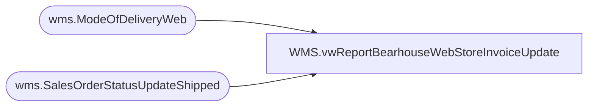

# WMS.vwReportBearhouseWebStoreInvoiceUpdate

**Database:** IntegrationStaging  
**Server:** STL-SSIS-P-01  

## Architecture Diagram



## Table Dependencies

| Referenced Table |
|---|
| wms.ModeOfDeliveryWeb |
| wms.SalesOrderStatusUpdateShipped |

## View Code

```sql
CREATE view [WMS].[vwReportBearhouseWebStoreInvoiceUpdate]

as

select  distinct s.DeckSalesOrderReferenceNumber,
case when m.SHIP_VIA = 'STND'
	then 'Standard'
	else m.SHIP_VIA_DESC end as ship_via_desc, 
s.ShipConfirmDateTime, -- Just for validation
convert (datetime, ShipConfirmDateTime At time Zone  'UTC' AT Time Zone  'Eastern Standard Time') as OhioShipConfirmDateTime
from wms.SalesOrderStatusUpdateShipped s (nolock) 
join wms.ModeOfDeliveryWeb m (nolock) on m.ModeOfDelivery=s.ModeOfDelivery 
										and m.SHIP_VIA not in ('W300','W350','INTERNATIONAL') -- International all fall under Standard, causing duplicates
where datediff(dd,
	convert (datetime, ShipConfirmDateTime At time Zone  'UTC' AT Time Zone  'Eastern Standard Time'),
	dateadd(hh,1,getdate())
) = 0 -- Integration Server is Central Time 
--order by 3, 1, 2
```

