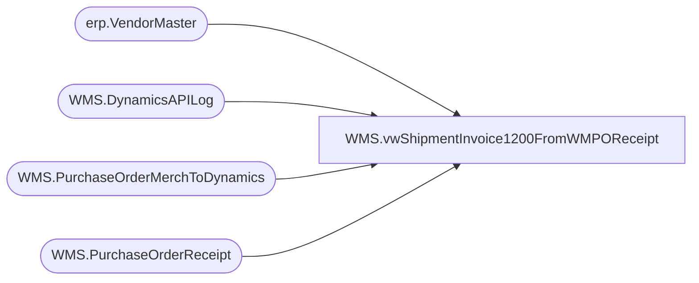

# WMS.vwShipmentInvoice1200FromWMPOReceipt

**Database:** IntegrationStaging  
**Server:** STL-SSIS-P-01  

## Architecture Diagram



## Table Dependencies

| Referenced Table |
|---|
| erp.VendorMaster |
| WMS.DynamicsAPILog |
| WMS.PurchaseOrderMerchToDynamics |
| WMS.PurchaseOrderReceipt |

## View Code

```sql
CREATE view [WMS].[vwShipmentInvoice1200FromWMPOReceipt]


as
-- =====================================================================================================
-- Name:  WMS.vwShipmentInvoice1200FromWMPOReceipt
--
-- Description:	Outputs Shipment Invoice XML 
--				 
-- Revision History
--		Name:			Date:			Comments:
--		Dan Tweedie		2019-10-16		Created viw
-- =====================================================================================================


with 
POCreated as
	(
		select distinct
			e.PONumber as AptosPONumber, 
			case 
					when substring(api.ResponseBody, charindex('Purchase order PO1100', api.ResponseBody, 1)+15, 11) like 'PO1100%' 
						then substring(api.ResponseBody, charindex('Purchase order PO1100', api.ResponseBody, 1)+15, 11) 
					else NULL
			end as Dynamics1100PO,
			e.ItemNumber,
			e.POLineNumber
		from WMS.PurchaseOrderMerchToDynamics e with (nolock)
		join erp.VendorMaster vm with (nolock) 
			on vm.Entity = 1200
			and cast(e.VendorCode as nvarchar) =
				case 
					when vm.OrganizationPhoneticName like '%-%' 
					then substring(vm.OrganizationPhoneticName, 1, charindex('-',vm.OrganizationPhoneticName)-1) 
					else vm.OrganizationPhoneticName 
				end
			and e.FactoryCode =
				case 
					when vm.OrganizationPhoneticName like '%-%' 
					then substring(vm.OrganizationPhoneticName, charindex('-',vm.OrganizationPhoneticName)+1, 20) 
					else e.FactoryCode
				end 
		join WMS.DynamicsAPILog api with (nolock)
			on api.IntegrationName='WMS_PurchaseOrderToDynamics'
			--and e.BatchID=api.BatchID
			and e.PONumber=api.AptosDocumentNumber 
			and vm.VendorAccountNumber=api.PO_OrderAccountNumber

		where 
			case 
				when substring(api.ResponseBody, charindex('Purchase order PO1100', api.ResponseBody, 1)+15, 11) like 'PO1100%' 
					then substring(api.ResponseBody, charindex('Purchase order PO1100', api.ResponseBody, 1)+15, 11) 
				else NULL
			end is not NULL
		--and e.PONumber = '1073553'
	),
POReceipts as
	(
		select 
			AptosPONumber,
			NULL as DlvMode,
			'9900' as InventLocationId,
			ItemID,
			ReceivedQty as Qty,
			convert(varchar, dateadd(hh, -5, MessageQueueDateUTC), 101) as ShipDate,
			POLineNumber
		from WMS.PurchaseOrderReceipt with (nolock)
		where 1=1
		and PostedToDynamics1200ShipmentDate is NULL
		and ReceivedQty>0
		--and cast(PostedToDynamics1200ShipmentDate as date) between '2021-3-17' and '2021-3-31'
		--group by 
		--	AptosPONumber,
		--	ItemID,
		--	convert(varchar, dateadd(hh, -5, MessageQueueDateUTC), 101)
	)
select
	pr.DlvMode,
	pr.InventLocationId,
	pr.ItemID,
	pr.Qty,
	pr.ShipDate,
	pc.Dynamics1100PO as OrderRef
from POReceipts pr
join POCreated pc 
	on pr.AptosPONumber=pc.AptosPONumber
	and pr.ItemID=pc.ItemNumber
	and pr.POLineNumber=pc.POLineNumber
--where pc.Dynamics1100PO not in ('PO110005446','PO110005470')
```

