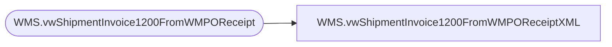

# WMS.vwShipmentInvoice1200FromWMPOReceiptXML

**Database:** IntegrationStaging  
**Server:** STL-SSIS-P-01  

## Architecture Diagram



## Table Dependencies

| Referenced Table |
|---|
| WMS.vwShipmentInvoice1200FromWMPOReceipt |

## View Code

```sql
CREATE view [WMS].[vwShipmentInvoice1200FromWMPOReceiptXML]


as
-- =====================================================================================================
-- Name:  WMS.vwShipmentInvoice1200FromWMPOReceipt
--
-- Description:	Outputs Shipment Invoice XML 
--				 
-- Revision History
--		Name:			Date:			Comments:
--		Dan Tweedie		2019-10-16		Created viw
-- =====================================================================================================


with
XMLStage (XML) as
	(
		select
			'' as DlvMode,
			pr.InventLocationId,
			pr.ItemId,
			concat('1100', pr.OrderRef) as OrderRef,
			pr.Qty,
			pr.ShipDate
		from WMS.vwShipmentInvoice1200FromWMPOReceipt pr
		for xml path('rsmBABWMShipmentEntity'), root('Document'), Type
	)
select XML as XMLData
from XMLStage
```

