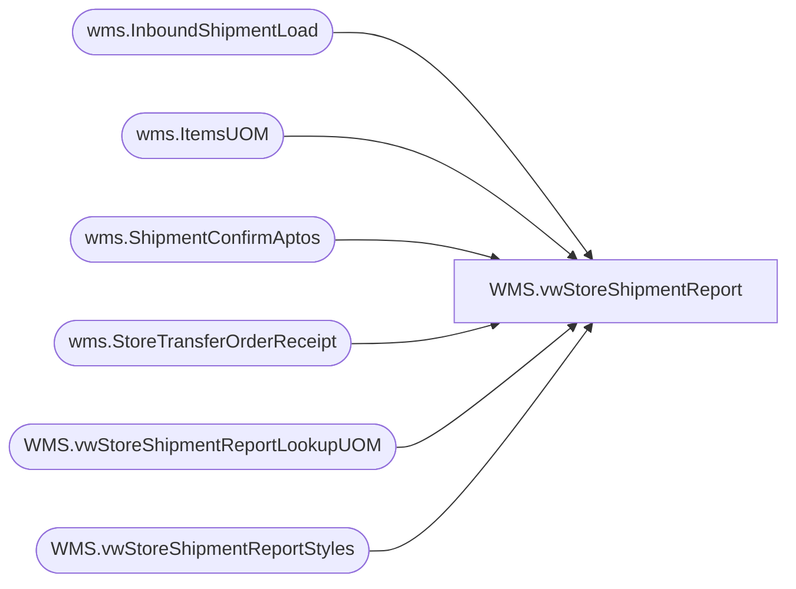

# WMS.vwStoreShipmentReport

**Database:** IntegrationStaging  
**Server:** STL-SSIS-P-01  

## Architecture Diagram



## Table Dependencies

| Referenced Table |
|---|
| wms.InboundShipmentLoad |
| wms.ItemsUOM |
| wms.ShipmentConfirmAptos |
| wms.StoreTransferOrderReceipt |
| WMS.vwStoreShipmentReportLookupUOM |
| WMS.vwStoreShipmentReportStyles |

## View Code

```sql
CREATE view [WMS].[vwStoreShipmentReport]

as
--------------------------------------------------------------------------------------------------------------------------
--	Ian Wallace	- 2023-01-03	 
--------------------------------------------------------------------------------------------------------------------------

/*   original code replaced on 10/26/2023 with new logic from  [WMS].[spStoreShipmentReport]

	 -- Ohio orders not received 
		-- select s.OrderNumber as 'Order Number' , s.ItemNumber as 'Item Number', p.StyleDescription as 'Product Name', s.Warehouse as 'Shipping Location', s.ToLocation as 'Receiving Location',
		--p.Subclass as 'Product hierarchy', cast(s.ShipConfirmDateTime as date) as 'Ship Date', sum(s.ShippedQuantity) as '# of items being shipped', count(s.ContainerID) as '# of cartons in shipment' 
		--from  wms.ShipmentConfirmAptos s
		--join papamart.dw.Azure.vwProducts p on s.ItemNumber = p.Style
		-- where 1=1 
		----and s.OrderNumber in ( 'TO0000174403','TO0000174492')
		--and  cast(s.ShipConfirmDateTime as date) >= '04/01/2023'  -- to prevent old orders not in new table StoreTransferOrderReceipt from being referenced
		-- and s.OrderNumber not in  
		-- (
		-- select SourceOrderNumber from IntegrationStaging.wms.StoreTransferOrderReceipt --   Stage --where SourceOrderNumber in ( 'TO0000174403','TO0000174492')
		-- )
		-- group by s.OrderNumber, s.ItemNumber, s.Warehouse, s.ToLocation, s.ShipConfirmDateTime, p.StyleDescription, p.Subclass
		 
		select s.OrderNumber as 'Order Number' ,s.ContainerID as 'License Plate', s.ItemNumber as 'Item Number', p.StyleDescription as 'Product Name', s.Warehouse as 'Shipping Location', s.ToLocation as 'Receiving Location',
		p.Subclass as 'Product hierarchy', cast(s.ShipConfirmDateTime as date) as 'Ship Date',
		--s.ShippedQuantity as '# of items being shipped', 
		sum((isnull(uom.Factor,1) * s.ContainerUnitsShipped)) as '# of items being shipped', 
		count(s.ContainerID) as '# of cartons in shipment' 
		--,sum((isnull(uom.Factor,1) * s.ContainerUnitsShipped)) as sent_qty
		from wms.ShipmentConfirmAptos s
		join papamart.dw.Azure.vwProducts p on s.ItemNumber = p.Style
		left join wms.ItemsUOM uom  on s.ItemNumber=uom.ProductNumber and s.ContainerUnitOfMeasure=uom.FromUnitSymbol and uom.ToUnitSymbol='ea' and uom.entity=1100
		 where 1=1 
		and  cast(s.ShipConfirmDateTime as date) >= '04/01/2023'
		--and datediff(dd, s.ShipConfirmDateTime, getdate()) <= @DateDiff
		 and s.OrderNumber not in  
		 (
		 select SourceOrderNumber from IntegrationStaging.wms.StoreTransferOrderReceipt --where SourceOrderNumber in ( 'TO0000174403','TO0000174492')
		 )
		 group by s.OrderNumber, s.ContainerID, s.ItemNumber, s.Warehouse, s.ToLocation, s.ShipConfirmDateTime, p.StyleDescription, p.Subclass, s.ShippedQuantity


		 union

		 -- 3PL orders not received 
		 select i.OrderId as 'Order Number' , i.ContainerID as 'License Plate', i.ItemNumber as 'Item Number',  p.StyleDescription as 'Product Name', i.FromWarehouse as 'Shipping Location', i.ToWarehouse as 'Receiving Location',
		  p.Subclass as 'Product hierarchy', convert(varchar(10), i.InsertDate, 101) as 'Ship Date', sum(i.TransferQuantity) as '# of items being shipped', count(i.ContainerID) as '# of cartons in shipment' 
		 from  [WMS].[InboundShipmentLoad] i
		 join papamart.dw.Azure.vwProducts p on i.ItemNumber = p.Style
		 where 1=1 
		 and i.BatchID <> 'Shipped Prior to Pilot Begin'
		 --and i.OrderId = 'TO0000174543'
		 --and datediff(dd, i.InsertDate, getdate()) <= @DateDiff
		 and i.OrderId not in  
		 (
		 select SourceOrderNumber from IntegrationStaging.wms.StoreTransferOrderReceiptStage --where SourceOrderNumber in ( 'TO0000174403','TO0000174492')
		 )
		 group by i.OrderId, i.ContainerID, i.ItemNumber, i.FromWarehouse, i.ToWarehouse, i.InsertDate, p.StyleDescription, p.Subclass


*/


with activePickCartons as
(
select ContainerID 
--into #ActivePickCartons
from wms.ShipmentConfirmAptos s
where 1=1 
	   and  cast(s.ShipConfirmDateTime as date) >= '04/01/2023' -- Retail Inventory Cutover Date
	 --  and  DATEDIFF(dd, s.ShipConfirmDateTime, getdate()) <= @DateDiff  
	  -- and s.ToLocation = @StoreNumber
group by ContainerID
having count (distinct ItemNumber) > 1 
union 
select 
i.LicensePlate as ContainerID 
from wms.InboundShipmentLoad i 
where 1=1 
	   and i.BatchID <> 'Shipped Prior to Pilot Begin' -- Pre Retail Inventory Cutover 
	  -- and  DATEDIFF(dd, i.ShipDate, getdate()) <= @DateDiff  
	 --  and i.ToWarehouse = @StoreNumber
group by 
i.LicensePlate
having count (distinct ItemNumber) > 1
)

--This is the Ohio Shipment Data Source - Note: Supply Data is not fed via this interface 
select 
s.OrderNumber as 'OrderNumber' ,
s.ContainerID as 'LicensePlate', 
s.ItemNumber as 'ItemNumber', 
p.Product_Desc as 'ProductName', 
s.Warehouse as 'ShippingLocation', 
s.ToLocation as 'ReceivingLocation',
p.Subclass as 'ProductHierarchy', 
cast(s.ShipConfirmDateTime as date) as 'ShipDate',
sum((isnull(uom.Factor,1) * s.ContainerUnitsShipped)) as 'QtyOfItemsBeingShipped', 
count(distinct s.ContainerID) as 'QtyOfCartonsInShipment', 
case 
	when apc.ContainerID is not null 
		then 'Yes'
	else 'No'
end as isActivePickCarton,
case when apc.ContainerID is not null and s.ContainerUnitOfMeasure = 'IP'
       then cast (s.ContainerUnitsShipped as varchar) + ' : Inner Packs'
	when apc.ContainerID is not null and s.ContainerUnitOfMeasure = 'EA'
	   then cast (s.ContainerUnitsShipped as varchar) + ' : Eaches'
	when apc.ContainerID is not null and s.ContainerUnitOfMeasure = 'CS'
		then cast (s.ContainerUnitsShipped as varchar) + ' : Cases'
	when apc.ContainerID is not null and s.ContainerUnitOfMeasure not in ('IP','EA','CS')
		then cast (s.ContainerUnitsShipped as varchar) + ' : ' + S.ContainerUnitOfMeasure
	else 'N\A' 
end as ActivePickDetails, 
s.ContainerUnitOfMeasure
from wms.ShipmentConfirmAptos s (nolock) 
--join papamart.dw.Azure.vwProducts p on s.ItemNumber = p.Style
join [WMS].[vwStoreShipmentReportStyles] p on p.ProductNumber=s.ItemNumber
left join wms.ItemsUOM uom  (nolock) on s.ItemNumber=uom.ProductNumber and s.ContainerUnitOfMeasure=uom.FromUnitSymbol and uom.ToUnitSymbol='ea' and uom.entity=1100
--left join #ActivePickCartons apc (nolock) on apc.ContainerID=s.ContainerID
left join activePickCartons apc (nolock) on apc.ContainerID=s.ContainerID
where 1=1 
and  cast(s.ShipConfirmDateTime as date) >= '04/01/2023'
--and  DATEDIFF(dd, s.ShipConfirmDateTime, getdate()) <= @DateDiff  -- Added for Performance
--and s.ToLocation = @StoreNumber
and NOT EXISTS (
				select SourceOrderNumber, Entity 
				from IntegrationStaging.wms.StoreTransferOrderReceipt  r
				where r.SourceOrderNumber = s.OrderNumber
				group by SourceOrderNumber, Entity
				) 
group by 
s.OrderNumber, 
s.ContainerID, 
s.ItemNumber, 
s.Warehouse, 
s.ToLocation, 
s.ShipConfirmDateTime, 
p.Product_Desc, 
p.Subclass, 
s.ShippedQuantity, 
case 
	when apc.ContainerID is not null 
		then 'Yes'
	else 'No'
end ,
case when apc.ContainerID is not null and s.ContainerUnitOfMeasure = 'IP'
       then cast (s.ContainerUnitsShipped as varchar) + ' : Inner Packs'
	when apc.ContainerID is not null and s.ContainerUnitOfMeasure = 'EA'
	   then cast (s.ContainerUnitsShipped as varchar) + ' : Eaches'
	when apc.ContainerID is not null and s.ContainerUnitOfMeasure = 'CS'
		then cast (s.ContainerUnitsShipped as varchar) + ' : Cases'
	when apc.ContainerID is not null and s.ContainerUnitOfMeasure not in ('IP','EA','CS')
		then cast (s.ContainerUnitsShipped as varchar) + ' : ' + S.ContainerUnitOfMeasure
	else 'N\A' 
End,
s.ContainerUnitOfMeasure

union 
-- This is 3PL Shipment Data Source (DDC and Clipper) 
select 
i.OrderId as 'OrderNumber',
i.LicensePlate,
i.ItemNumber as 'ItemNumber',  
p.Product_Desc as 'ProductName', 
i.FromWarehouse as 'ShippingLocation', 
i.ToWarehouse as 'ReceivingLocation',
p.Subclass as 'ProductHierarchy', 
convert(varchar(10), i.ShipDate, 101) as 'ShipDate', 
sum(i.TransferQuantity) as 'QtyOfItemsBeingShipped', 
count(i.ContainerID) as 'QtyOfCartonsInShipment' , 
case 
	when apc.ContainerID is not null 
		then 'Yes'
	else 'No'
end as isActivePickCarton, 
case when apc.ContainerID is not null
	then cast (i.TransferQuantity/isnull(u.UnitsInPack,1) as varchar)+ ' : Inner Packs 3PL'
	else 'N\A' 
end as ActivePickDetails, 
i.UOM as ContainerUnitOfMeasure
from  [WMS].[InboundShipmentLoad] i
--join papamart.dw.Azure.vwProducts p on s.ItemNumber = p.Style
--join papamart.dw.dbo.Product_Dim p on i.ItemNumber = p.style_code
join [WMS].[vwStoreShipmentReportStyles] p  on p.ProductNumber=i.ItemNumber
--left join #ActivePickCartons apc on 	i.LicensePlate = apc.ContainerID
left join activePickCartons apc on 	i.LicensePlate = apc.ContainerID
left join [WMS].[vwStoreShipmentReportLookupUOM] u on u.ProductNumber=i.ItemNumber
where 1=1 
and i.BatchID <> 'Shipped Prior to Pilot Begin'
and NOT EXISTS (
				select SourceOrderNumber, Entity 
				from IntegrationStaging.wms.StoreTransferOrderReceipt  r
				where r.SourceOrderNumber = i.OrderId --and r.Entity=i.Entity -- Entity Hurt Performance May Need to revisit
				group by SourceOrderNumber, Entity
				) 
--and  DATEDIFF(dd, i.ShipDate, getdate()) <= @DateDiff
--and i.ToWarehouse = @storeNumber
group by 
i.OrderId, 
i.LicensePlate,
i.ItemNumber, 
i.FromWarehouse, 
i.ToWarehouse, 
i.ShipDate, 
p.Product_Desc, 
p.Subclass, 
	case 
	when apc.ContainerID is not null 
		then 'Yes'
	else 'No'
end, 
case when apc.ContainerID is not null
	then cast (i.TransferQuantity/isnull(u.UnitsInPack,1) as varchar)+ ' : Inner Packs 3PL'
	 else 'N\A'  
end, 
i.UOM
```

