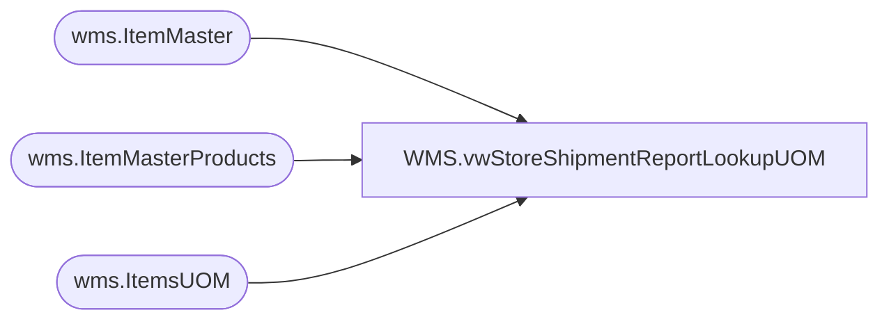

# WMS.vwStoreShipmentReportLookupUOM

**Database:** IntegrationStaging  
**Server:** STL-SSIS-P-01  

## Architecture Diagram



## Table Dependencies

| Referenced Table |
|---|
| wms.ItemMaster |
| wms.ItemMasterProducts |
| wms.ItemsUOM |

## View Code

```sql
CREATE view [WMS].[vwStoreShipmentReportLookupUOM]

as
--------------------------------------------------------------------------------------------------------------------------
--	Tim Callahan - 2023-06-013	 
--------------------------------------------------------------------------------------------------------------------------

with Items as 
(
	select
	imp.Entity, 
	imp.ProductNumber, 
	imp.ProductName, 
	im.NecessaryProductionWorkingTimeSchedulingPropertyId as ItemType

	from wms.ItemMasterProducts imp 
	join wms.ItemMaster im with (nolock) on imp.ProductNumber=im.ProductNumber
											and im.Entity=1100
	where 1=1
	--and imp.ProductNumber = '023396'
	group by 
	imp.Entity, 
	imp.ProductNumber, 
	imp.ProductName, 
	im.NecessaryProductionWorkingTimeSchedulingPropertyId
), 

UnitsInCase as (


select 
u.Entity,
u.ProductNumber, 
u.Factor as UnitsInCase

from wms.ItemsUOM u
where 1=1
and u.FromUnitSymbol = 'CS'
and u.ToUnitSymbol = 'EA'


),

UnitsInPack as (

select 
u.Entity,
u.ProductNumber, 
u.Factor as UnitsInPack
from wms.ItemsUOM u
where 1=1
and u.FromUnitSymbol = 'IP'
and u.ToUnitSymbol = 'EA'


) , 

PacksInCase as (

select 
u.Entity,
u.ProductNumber, 
u.Factor as  PacksInCase
from wms.ItemsUOM u
where 1=1
and u.FromUnitSymbol = 'CS'
and u.ToUnitSymbol = 'IP'

)

Select 
i.Entity,
i.ProductNumber, 
i.ProductName, 
i.ItemType, 
isnull(uic.UnitsInCase,1) as UnitsInCase, 
isnull(pic.PacksInCase,1) as PacksInCase, 
isnull(uip.UnitsInPack,1)  as UnitsInPack

from Items i
left join UnitsInCase uic on uic.Entity=i.Entity and uic.ProductNumber=i.ProductNumber
left join UnitsInPack uip on uip.Entity=i.Entity and uip.ProductNumber=i.ProductNumber
left join PacksInCase pic on pic.Entity=i.Entity and pic.ProductNumber=i.ProductNumber
where 1=1
--and ItemType = 'Merch'
```

