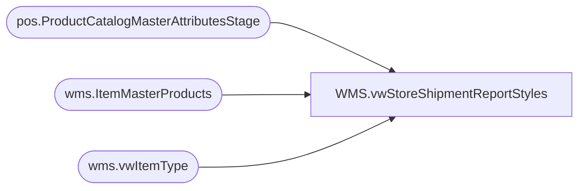

# WMS.vwStoreShipmentReportStyles

**Database:** IntegrationStaging  
**Server:** STL-SSIS-P-01  

## Architecture Diagram



## Table Dependencies

| Referenced Table |
|---|
| pos.ProductCatalogMasterAttributesStage |
| wms.ItemMasterProducts |
| wms.vwItemType |

## View Code

```sql
CREATE view [WMS].[vwStoreShipmentReportStyles]
as

select  a.ProductNumber, 
a.ProductDescription as Product_Desc, 
a.SubClass
from pos.ProductCatalogMasterAttributesStage a
union 
select 
imp.ProductNumber, 
imp.ProductName as Product_Desc, 
'Supplies' as SubClass
from wms.ItemMasterProducts imp 
join wms.vwItemType t on t.ItemNumber=imp.ProductNumber and t.Entity=imp.Entity
where t.ItemType = 'Supplies'
	and NOT EXISTS 
	(
		select a.ProductNumber
		from pos.ProductCatalogMasterAttributesStage a 
		where a.ProductNumber=imp.ProductNumber
	)
```

