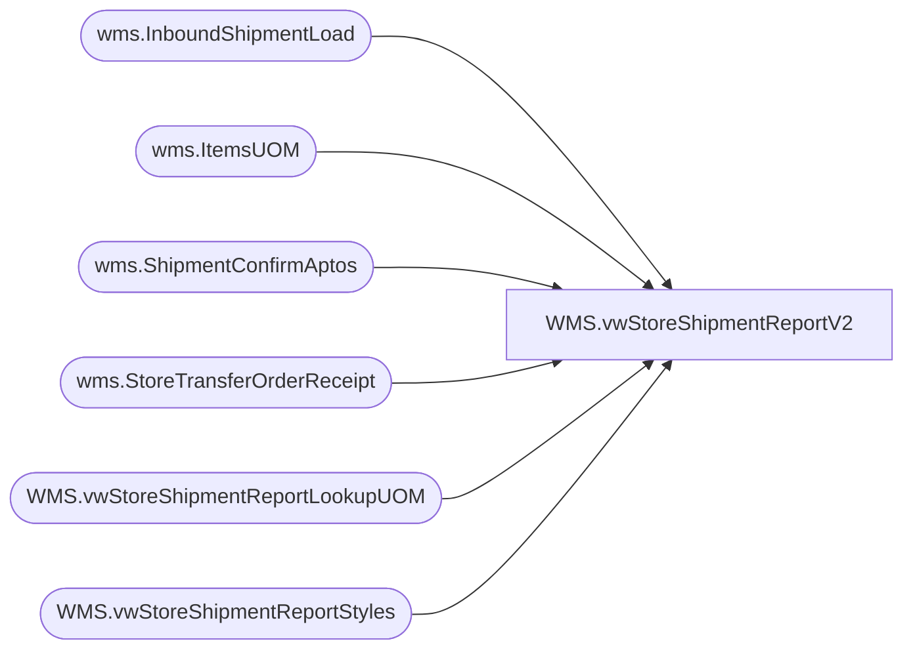

# WMS.vwStoreShipmentReportV2

**Database:** IntegrationStaging  
**Server:** STL-SSIS-P-01  

## Architecture Diagram



## Table Dependencies

| Referenced Table |
|---|
| wms.InboundShipmentLoad |
| wms.ItemsUOM |
| wms.ShipmentConfirmAptos |
| wms.StoreTransferOrderReceipt |
| WMS.vwStoreShipmentReportLookupUOM |
| WMS.vwStoreShipmentReportStyles |

## View Code

```sql
CREATE view [WMS].[vwStoreShipmentReportV2]

as
--------------------------------------------------------------------------------------------------------------------------
--	Tim Callahan	- 2023-06-01	 
-- Created per JIRA BIB-575 where Annie S of Store Ops asked for additional detail for "Active Pick Cartons" 
-- This  view used some base logic from [WMS].[vwStoreShipmentReport] created by Ian Wallace 
--------------------------------------------------------------------------------------------------------------------------

-- Need To Identify Active Picks Cartons\LPNs\Containers aka those that have more than 1 product number in the box 

with ActivePickCartons as 
(

	select ContainerID 
	from wms.ShipmentConfirmAptos s
	where 1=1 
		   and  cast(s.ShipConfirmDateTime as date) >= '04/01/2023' -- Retail Inventory Cutover Date
		   and  DATEDIFF(dd, s.ShipConfirmDateTime, getdate()) <= 14  -- Added for Performance
	group by ContainerID
	having count (distinct ItemNumber) > 1 
	union 
	select 
	i.LicensePlate as ContainerID 
	from wms.InboundShipmentLoad i 
	where 1=1 
		   and i.BatchID <> 'Shipped Prior to Pilot Begin' -- Pre Retail Inventory Cutover 
		   and  DATEDIFF(dd, i.ShipDate, getdate()) <= 14  -- Added for Performance
	group by 
	i.LicensePlate
	having count (distinct ItemNumber) > 1
)

--This is the Ohio Shipment Data Source - Note: Supply Data is not fed via this interface 
select 
s.OrderNumber as 'Order Number' ,
s.ContainerID as 'License Plate', 
s.ItemNumber as 'Item Number', 
p.Product_Desc as 'Product Name', 
s.Warehouse as 'Shipping Location', 
s.ToLocation as 'Receiving Location',
p.Subclass as 'Product hierarchy', 
cast(s.ShipConfirmDateTime as date) as 'Ship Date',
sum((isnull(uom.Factor,1) * s.ContainerUnitsShipped)) as '# of items being shipped', 
count(distinct s.ContainerID) as '# of cartons in shipment', 
case 
	when apc.ContainerID is not null 
		then 'Yes'
	else 'No'
end as isActivePickCarton,
case when apc.ContainerID is not null and s.ContainerUnitOfMeasure = 'IP'
       then cast (s.ContainerUnitsShipped as varchar) + ' : Inner Packs'
	when apc.ContainerID is not null and s.ContainerUnitOfMeasure = 'EA'
	   then cast (s.ContainerUnitsShipped as varchar) + ' : Eaches'
	when apc.ContainerID is not null and s.ContainerUnitOfMeasure = 'CS'
		then cast (s.ContainerUnitsShipped as varchar) + ' : Cases'
	when apc.ContainerID is not null and s.ContainerUnitOfMeasure not in ('IP','EA','CS')
		then cast (s.ContainerUnitsShipped as varchar) + ' : ' + S.ContainerUnitOfMeasure
	else 'N\A' 
end as ActivePickDetails, 
s.ContainerUnitOfMeasure
from wms.ShipmentConfirmAptos s (nolock) 
--join papamart.dw.Azure.vwProducts p on s.ItemNumber = p.Style
join [WMS].[vwStoreShipmentReportStyles] p on p.ProductNumber=s.ItemNumber
left join wms.ItemsUOM uom  (nolock) on s.ItemNumber=uom.ProductNumber and s.ContainerUnitOfMeasure=uom.FromUnitSymbol and uom.ToUnitSymbol='ea' and uom.entity=1100
left join ActivePickCartons apc (nolock) on apc.ContainerID=s.ContainerID
where 1=1 
and  cast(s.ShipConfirmDateTime as date) >= '04/01/2023'
and  DATEDIFF(dd, s.ShipConfirmDateTime, getdate()) <= 14  -- Added for Performance
and NOT EXISTS (
				select SourceOrderNumber, Entity 
				from IntegrationStaging.wms.StoreTransferOrderReceipt  r
				where r.SourceOrderNumber = s.OrderNumber
				group by SourceOrderNumber, Entity
				) 
group by 
s.OrderNumber, 
s.ContainerID, 
s.ItemNumber, 
s.Warehouse, 
s.ToLocation, 
s.ShipConfirmDateTime, 
p.Product_Desc, 
p.Subclass, 
s.ShippedQuantity, 
case 
	when apc.ContainerID is not null 
		then 'Yes'
	else 'No'
end ,
case when apc.ContainerID is not null and s.ContainerUnitOfMeasure = 'IP'
       then cast (s.ContainerUnitsShipped as varchar) + ' : Inner Packs'
	when apc.ContainerID is not null and s.ContainerUnitOfMeasure = 'EA'
	   then cast (s.ContainerUnitsShipped as varchar) + ' : Eaches'
	when apc.ContainerID is not null and s.ContainerUnitOfMeasure = 'CS'
		then cast (s.ContainerUnitsShipped as varchar) + ' : Cases'
	when apc.ContainerID is not null and s.ContainerUnitOfMeasure not in ('IP','EA','CS')
		then cast (s.ContainerUnitsShipped as varchar) + ' : ' + S.ContainerUnitOfMeasure
	else 'N\A' 
End,
s.ContainerUnitOfMeasure

union 
-- This is 3PL Shipment Data Source (DDC and Clipper) 
select 
i.OrderId as 'Order Number',
i.LicensePlate,
i.ItemNumber as 'Item Number',  
p.Product_Desc as 'Product Name', 
i.FromWarehouse as 'Shipping Location', 
i.ToWarehouse as 'Receiving Location',
p.Subclass as 'Product hierarchy', 
convert(varchar(10), i.ShipDate, 101) as 'Ship Date', 
sum(i.TransferQuantity) as '# of items being shipped', 
count(i.ContainerID) as '# of cartons in shipment' , 
case 
	when apc.ContainerID is not null 
		then 'Yes'
	else 'No'
end as isActivePickCarton, 
case when apc.ContainerID is not null
	then cast (i.TransferQuantity/isnull(u.UnitsInPack,1) as varchar)+ ' : Inner Packs 3PL'
	else 'N\A' 
end as ActivePickDetails, 
i.UOM as ContainerUnitOfMeasure
from  [WMS].[InboundShipmentLoad] i
--join papamart.dw.Azure.vwProducts p on s.ItemNumber = p.Style
--join papamart.dw.dbo.Product_Dim p on i.ItemNumber = p.style_code
join [WMS].[vwStoreShipmentReportStyles] p  on p.ProductNumber=i.ItemNumber
left join ActivePickCartons apc on 	i.LicensePlate = apc.ContainerID
left join [WMS].[vwStoreShipmentReportLookupUOM] u on u.ProductNumber=i.ItemNumber
where 1=1 
and i.BatchID <> 'Shipped Prior to Pilot Begin'
and NOT EXISTS (
				select SourceOrderNumber, Entity 
				from IntegrationStaging.wms.StoreTransferOrderReceipt  r
				where r.SourceOrderNumber = i.OrderId --and r.Entity=i.Entity -- Entity Hurt Performance May Need to revisit
				group by SourceOrderNumber, Entity
				) 
and  DATEDIFF(dd, i.ShipDate, getdate()) <= 14  -- Added for Performance
group by 
i.OrderId, 
i.LicensePlate,
i.ItemNumber, 
i.FromWarehouse, 
i.ToWarehouse, 
i.ShipDate, 
p.Product_Desc, 
p.Subclass, 
	case 
	when apc.ContainerID is not null 
		then 'Yes'
	else 'No'
end, 
case when apc.ContainerID is not null
	then cast (i.TransferQuantity/isnull(u.UnitsInPack,1) as varchar)+ ' : Inner Packs 3PL'
	 else 'N\A'  
end, 
i.UOM
```

